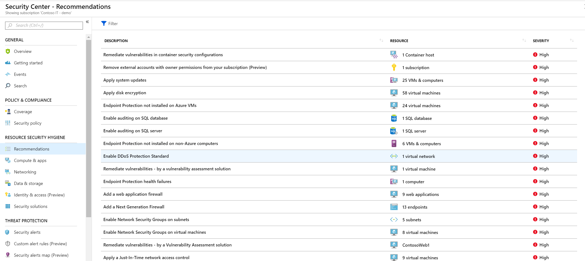
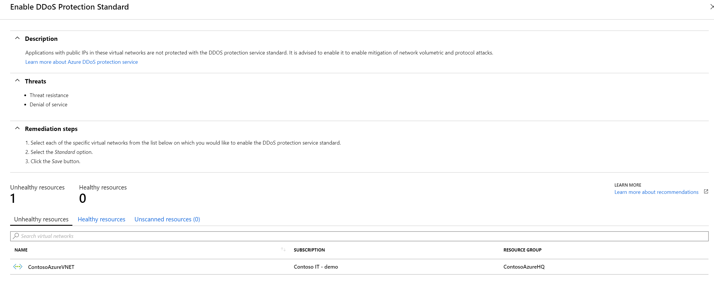

Security is top of mind for most Azure customers. To have peace of mind when it comes to security for assets running on Azure, Microsoft continuously works to improve on the security recommendations Azure Security Center provides:

Recommendation details and affected resources
Starting now Azure Security Center in the Standard pricing tier will recommend [Azure DDoS Protection for virtual networks](https://docs.microsoft.com/en-us/azure/virtual-network/ddos-protection-overview) as an additional layer of protection against attacks.

)](images/image.png)
