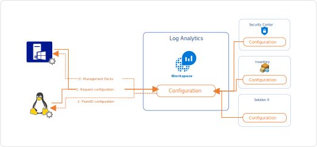
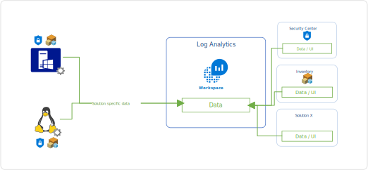

I've had a question today coming from a colleague that has no prior experience in System Center Operations Manager (SCOM). He wanted to know how data flows from connected agents (regardless of Windows or Linux) to Log Analytics and subsequently to Azure Security Center.

There are certain components that play together in this scenario. There is the agent. [The agent for Windows](https://docs.microsoft.com/en-us/azure/log-analytics/log-analytics-agent-windows), or Microsoft Monitoring Agent (MMA), behaves differently than the agent for Linux, or [OMS Agent for Linux](https://github.com/Microsoft/OMS-Agent-for-Linux).

Then you have the Log Analytics workspace where data flows into. Log Analytics has an ingestion pipeline. This is basically the way how data gets from the endpoint where the agent dumps it to it showing up in Log Analytics and is available for querying.

Then you have services/solutions on top of that stack like [Azure Security Center](https://docs.microsoft.com/en-us/azure/security-center/) that work with data that is ingested into Log Analytics.

But let's take it step by step. Take a look at the following diagram which shows how the configuration of a workspace is defined by solutions that are added to the workspace and how this configuration is applied to both Windows and Linux based agents:

## The Windows agent

The MMA is basically a dumb shell which contains no monitoring logic by itself. It has interfaces to run scripts, query the registry, look at files and much more but when you install the agent on a box and do not connect it to either Log Analytics or SCOM that agent will basically sit idle and do nothing.

When connecting the agent to a workspace, the configuration of that workspace instruments the agent. Instrumentation comes in the form of [Management Packs](https://technet.microsoft.com/en-us/library/ff381312.aspx). If you have been working with SCOM in the past, the concept Management Packs should be quite familiar. Management Packs contain logic (scripts, queries, ....) that are running on the agent to generate data which in turn is sent to Log Analytics. With Log Analytics you will not see the actual Management Pack and this process is totally transparent.

What kind of logic is applied to each agent is determined by what solutions are added to the workspace. 

## The Linux agent

The OMS Agent for Linux is based on the open source stack of [FluentD](https://www.fluentd.org/) and behaves a little differently than the MMA (actually totally different...). Where the MMA can receive Management Packs containing scripts and other logic, this capability is very limited on Linux. This means that all required extension (e.g. for Docker, Apache, MySQL) are shipping with the agent or are already available as part of the FluentD stack and only plumbing the execution of the extensions on the right sources is required in the form of configuration.

As with MMA the configuration flows from the Log Analytics workspace to the agent when connecting that agent to the workspace. The configuration is applied through PowerShell DSC (which comes as part of the agent) and then activated.

## The workspace

The workspace not only holds the configuration for all connected agents but also the data that flows from the agent to the workspace. [Unless configuration scopes are used](https://docs.microsoft.com/en-us/azure/monitoring/monitoring-solution-targeting) all agents receive the same configuration and send the same data given that the agent has data (imagine a server that does not have a certain service/application installed).

The configuration that is applied to agents (regardless of Windows or Linux) is determined by the solutions that are added to the workspace. Take Azure Security Center for instance, which adds a few Management Packs on its own to instrument the security Event Log, collects data for installed AV products and does vulnerability scanning on the system. [Another example would be Inventory which lists software packages installed on the system and checks for running services](https://docs.microsoft.com/en-us/azure/automation/automation-vm-inventory).

# Putting it together

Coming back to the diagram from the beginning of this post, which shows the configuration flow of how the configuration for a workspace is determined and subsequently applied to the agent:

When an agent has applied the current configuration it will start to collect data based on this. This data is sent to Log Analytics, which in turn is then used by the solutions (that make up the configuration of the workspace) to provide targeted dashboards and visualization based on that data:

