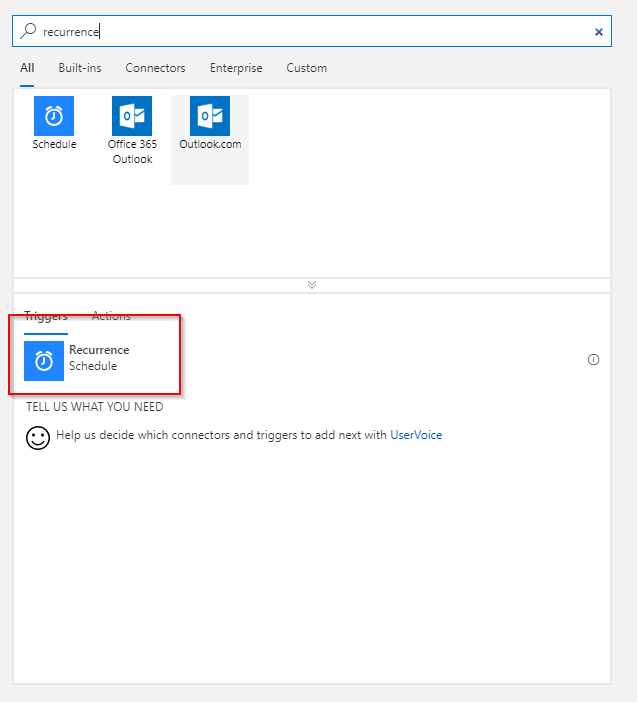
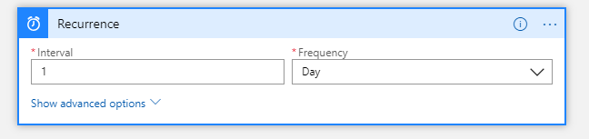
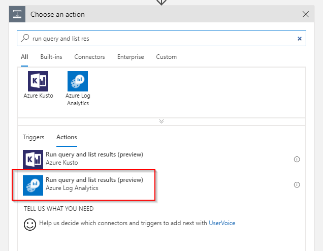
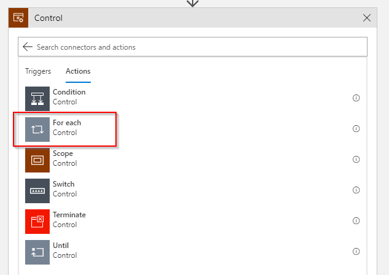
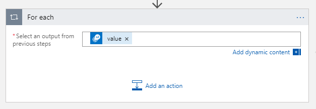
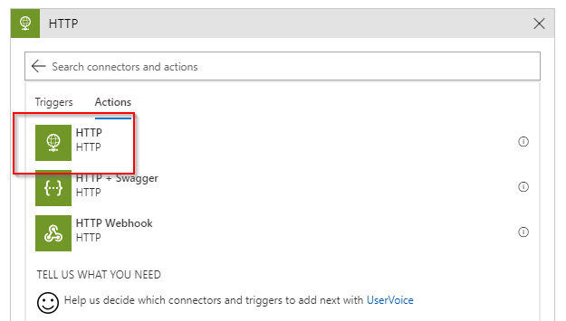
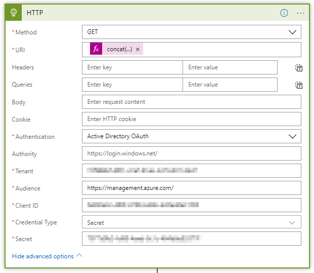
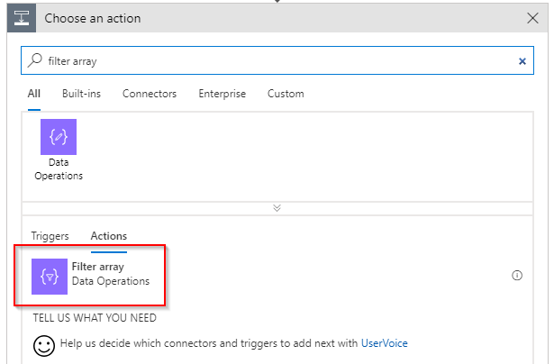
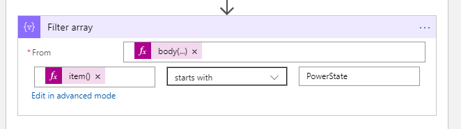
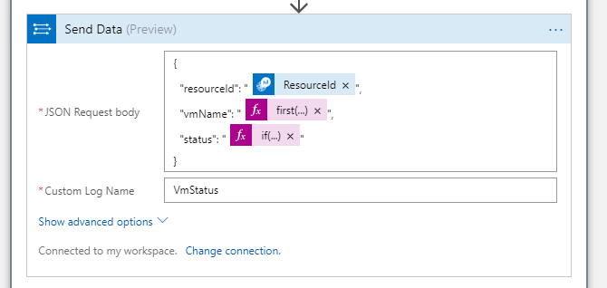

This problem is probably as old as there are monitoring tools on the market. **"How can I exclude legitimately deallocated VMs from alerting"** is a question that I've heard many times.

Where most monitoring tools such as System Center Operations Manager have tooling around the concept of maintenance mode where all alerts are suppressed for a duration of time; Azure Monitor has no provisions at this point.

This article series consisting of three articles walks through how to build a mechanism that automatically tracks VM events (start, deallocation) and provides this as a means to extend log based alerts with Azure Monitor and Log Analytics.

**This is the second part of a 3-post series:**

* 1/3: [Track VM state](/excluding-deallocated-vms-from-availability-alerting-1o3/)
* **2/3: [Validate VM state](/excluding-deallocated-vms-from-availability-alerting-2o3/)**
* 3/3: [Alert rule excluding deallocated VMs](/excluding-deallocated-vms-from-availability-alerting-3o3/)

## Architecture

As lined out in the first post in this series, we need to consider the following requirements:

* Log Analytics data retention may affect the result if a VM is offline for longer than the retention.
* Data written to Log Analytics stays there until the retention has been reached. This means we need to cover a scenario where a VM is first deallocated and then started within the retention time of the workspace.

The overall design looks something like the following diagram:


The upper part describes how near-real time events that happen on VMs flow into Log Analytics so that this data within a reasonable timeframe (<= 5 minutes) available for querying.

The lower part takes care of the problem with the data retention of the workspace. A Logic App that runs on a schedule queries Log Analytics to get all the VMs that are currently in a deallocated state, validates that status against the actual state in Azure and updates the data. This makes sure that if a VM was deleted we do not carry over old data in our status table.

## Logic App to validate VM states

To workaround the problem that Log Analytics may lose its state, when a VM is deallocated for longer than the retention time of the workspace, we need a process that validates the state for the deallocated VMs currently listed in Log Analytics with the actual state and write this state back to Log Analytics.

You may wonder why it is necessary to validate the state against the VM itself instead of just reading the data from the workspace and write it back to the workspace directly. 

There is one scenario where the VM was deleted which would lead to a scenario that data is copied while the VM does not exist anymore. While doing it as described above will check if the VM actually exist and not write the state if it was deleted in the meantime.

### Trigger

This Log App is triggered by a schedule. It should be sufficient to run this once a day or even less frequently. 

Start with a blank Logic App template and add a Recurrence trigger:



Set the interval to a value you're comfortable with. For this scenario once daily should be sufficient:



### Retrieve data from Log Analytics

We start off by getting all the VMs that are currently in a deallocated state from Log Analytics. To this end we add a *Run query and list results* action:



You need to point this action to the correct workspace, where the data is stored and provide a query that selects the appropriate data:


The query is a tricky one. In principle we could have multiple records for a single VM for this query. We only want to consider the latest record for each VM. Log Analytics has a special function called `arg_max()` which will filter our table to only the latest record for each VM.

The query should look something like:

```
VmStatus_CL
| where TimeGenerated >= ago(32h)
| summarize arg_max(TimeGenerated, *) by vmName_s
| where status_s == "deallocate"
```

Make sure to adapt the parameter to `ago()` based on the schedule of your Logic App. The value should be **larger **than the interval the Logic App runs at to make sure no records are missed.

Executing this action returns records that look something like the following:

```json
[
  {
    "vmName_s": "blog3",
    "TimeGenerated": "2018-09-06T09:49:56.484Z",
    "TenantId": "(..)",
    "SourceSystem": "RestAPI",
    "MG": "",
    "ManagementGroupName": "",
    "Computer": "",
    "ResourceId": "/subscriptions/(..)/resourceGroups/blog/providers/Microsoft.Compute/virtualMachines/blog3",
    "status_s": "start",
    "Type": "VmStatus_CL"
  },
  {
    "vmName_s": "blog2",
    "TimeGenerated": "2018-09-06T09:50:01.94Z",
    "TenantId": "(..)",
    "SourceSystem": "RestAPI",
    "MG": "",
    "ManagementGroupName": "",
    "Computer": "",
    "ResourceId": "/subscriptions/(..)/resourceGroups/blog/providers/Microsoft.Compute/virtualMachines/blog2",
    "status_s": "start",
    "Type": "VmStatus_CL"
  },
  {
    "vmName_s": "blog1",
    "TimeGenerated": "2018-09-06T09:50:18.452Z",
    "TenantId": "(..)",
    "SourceSystem": "RestAPI",
    "MG": "",
    "ManagementGroupName": "",
    "Computer": "",
    "ResourceId": "/subscriptions/(..)/resourceGroups/blog/providers/Microsoft.Compute/virtualMachines/blog1",
    "status_s": "deallocate",
    "Type": "VmStatus_CL"
  }
]
```

### Validate VM state

The result set can contain 0..n records. That means we need to iterate over each element by using a *For each*control:




For each element in the list we need to get the state. [To get the current runtime state of a VM we can invoke a Azure Resource Manager operation](https://docs.microsoft.com/en-us/rest/api/compute/virtualmachines/instanceview).

Sounds easy but unfortunately there is a small hick-up: [There is a Azure Resource Manager action to trigger an operation on a resource](https://docs.microsoft.com/en-us/connectors/arm/#invoke-resource-operation). Unfortunately this action only supports POST and the operation we need to call only supports GET.

Lucky for us the HTTP action supports OAuth against Azure Active Directory. But for this to work we need a service principal that has access to the VMs. [To create the service principal please refer to the appropriate documentation](https://docs.microsoft.com/en-us/cli/azure/ad/sp?view=azure-cli-latest#az-ad-sp-create-for-rbac) and provide at least *Reader* permissions on the VMs this Logic App should act on.

Within the *For each* control add another action *HTTP:*



The configuration for this action is pretty easy. We need to provide the HTTP method, the URI and some authentication specifics that are located within the **Show advanced options** section of the configuration.

The method is GET. The URI needs to be constructed from data we retrieve from Log Analytics as this is the resurce uri with the endpoint and the operation we want to execute: `concat('https://management.azure.com', item()?['ResourceId'], '/instanceView?api-version=2017-12-01')` . The authentication fields need to be populated with the service principle details. The audience is the scope for which this authentication is valid and is the root for ARM: `https://management.azure.com/` .



When the Logic App executes this action it returns something akin to this:

```json
{
  "computerName": "blog3",
  "osName": "ubuntu",
  "osVersion": "18.04",
  "vmAgent": {
    "vmAgentVersion": "2.2.31",
    "statuses": [
      {
        "code": "ProvisioningState/succeeded",
        "level": "Info",
        "displayStatus": "Ready",
        "message": "Guest Agent is running",
        "time": "2018-09-06T10:28:15+00:00"
      }
    ],
    "extensionHandlers": []
  },
  "disks": [
    {
      "name": "blog3_OsDisk_1_0fb87523228941008ba723bb99af7fb6",
      "statuses": [
        {
          "code": "ProvisioningState/succeeded",
          "level": "Info",
          "displayStatus": "Provisioning succeeded",
          "time": "2018-09-06T09:32:53.0312589+00:00"
        }
      ]
    }
  ],
  "statuses": [
    {
      "code": "ProvisioningState/succeeded",
      "level": "Info",
      "displayStatus": "Provisioning succeeded",
      "time": "2018-09-06T09:49:24.1879706+00:00"
    },
    {
      "code": "PowerState/running",
      "level": "Info",
      "displayStatus": "VM running"
    }
  ]
}
```

### Filter VM status

As you can see from the data that is returned from the HTTP call more than one status is returned and the sequence is not ensured. Thus we need to filter for the where the `code` attribute starts with `PowerState` .

Lucky for us there is a *Filter array* action that can be used for exactly this purpose.


As input to the *Filter array* action we select the `statuses` array from the HTTP call: `body('HTTP')['statuses']` . As the filter criteria we select the current item of the array and from that the `code` field: `item()?['code']` :



### Send data to Log Analytics

Now we get only the relevant data. Only one more problem to tackle. In the first article in this series we simply stored the action name ( `start` , `deallocate` ) as the state to Log Analytics. The operation that we executed on the VM returns different codes and we need to map those.

Fortunately this can be done inline with a small if-expression when we send data to Log Analytics. By now you should be familiar with the *Send data *action:


Among with the name of the custom log where the data should go you need to specify the JSON payload that should be stored in Log Analytics:

```json
{
  "resourceId": "@{items('For_each')?['ResourceId']}",
  "vmName": "@{first(skip(split(item()?['ResourceId'], '/'), 8))}",
  "status": "@{if(equals(first(body('Filter_array'))['code'], 'PowerState/running'), 'start', 'deallocate')}"
}
```



## Conclusion

The Logic App that you built following this article will iterate over all VMs that are currently flagged as deallocated in Log Analytics and validate that status (and the existence of the VM). The screenshot below shows the data in Log Analytics:


If the VM still exists the current state is written back to Log Analytics. The Logic App might run into an error if the VM does not exist anymore and this could be handled by adding another condition.

Make sure to also read the other articles in this 3-post series.
