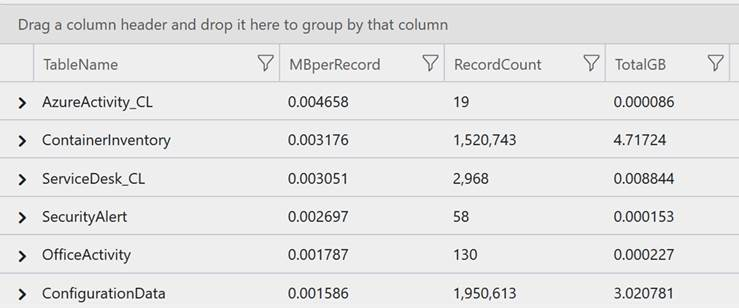

**[UPDATE 02/12/2019] There has been changes to the way Log Analytics tracks usage data. [Check out the post on the updated mechanisms](/data-and-cost-estimation-for-log-analytics/).**

One favorite question I hear: "How can we plan for Log Analytics?" or "How much data will be transmitted?"

"It depends.". My favorite answer. But in this case it could not be truer. Determining the volume sent to Log Analytics depends on a variety of factors: amount of connected systems, level of instrumentation, activated solutions.

As most customers run some kind of proof-of-concept or pilot - at least that would be my strong recommendation - there is a way to get a feeling for the amount of data that is sent to Log Analytics.

To calculate the data volume we make use of the telemetry that Log Analytics writes to each workspace where we can find the usage information for each data type. We then do some join magic and out comes a nice view that can be used to estimate volume (credit for this improved version goes to my colleague [Clive Watson](https://www.linkedin.com/in/clive-watson-3008734/)).

```
let daystoSearch = 31d;
let tables = search *
| where TimeGenerated >= ago(daystoSearch)
| summarize  RecordCount=count() by $table
| project leftName=$table, RecordCount, Clause=1 ;

Usage
| where TimeGenerated >= ago(daystoSearch)
| where IsBillable == true
| where DataType !="" 
| summarize TotalSize=sum(Quantity) by DataType
| project rightName=DataType, TotalSize, Clause=1
| join kind=leftouter (tables) on Clause 
| where leftName == rightName
| project TableName=leftName , MBperRecord=round(TotalSize / RecordCount,6), RecordCount, TotalGB = round(TotalSize/1024, 6) 
| sort by MBperRecord desc
```

[Take that query for a spin in the Log Analytics playground](https://portal.loganalytics.io/Demo?q=H4sIAAAAAAAAA5VSQU7DMBC8V%2BoflopDgiKVAuoFmUOLVHEACRoesI2X1sWJI3sjFMTjsWOapr1xsazdmZ2dsTUxSGwdmzWhLXYg4HYm78cj7RuMG03Ol1zsXY1HP%2FC1I0uQq5JWVJFFJgkPAnBrkuGgNGBdU5Zo1TcBvFFhrFyapmJRhDNJYdPCZacRsLU1eyoYNH3wC5YkYisbMjNYamwciRn4Fd8dbum%2FK0Xsk1sorcN8EALYNoM5j8iYtzXBhZhM4NRGbhj12t%2BEryWvDVasuO2cHGhDL1Ztd9HMoZsdRxzNBMreqAo%2BVSVFCMA0TBaS%2BAApmOoPC8c1DzkFA73OUDwP5E68h2bwvKjJxkSF9ZHKpN8HpidRz9Oz6DvgauG%2FwxlxOru%2BuctgnsawjOWQx0AJJLniF2FywDJqAgAA) and you'll turn up with something similar to this picture:


