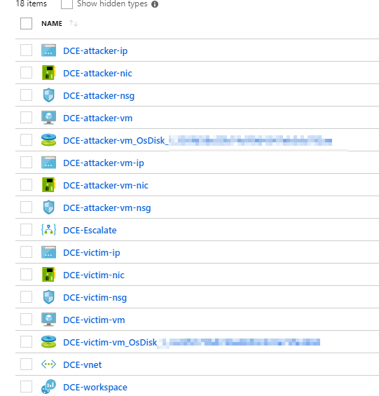
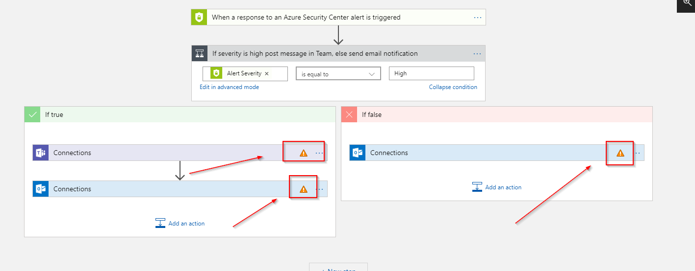
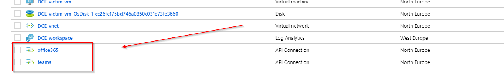
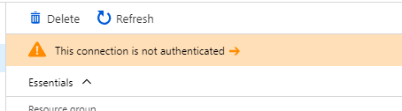

In February I had the chance to attend a session by [Yuri Diogenes](https://twitter.com/yuridiogenes), Program Manager at Microsoft, on how Azure Security Center works and how to demo it in a real life scenario.

The session he gave ended up as one of the excellent Azure Security Center Playbooks [that are available for download on Microsoft TechNet Gallery](https://gallery.technet.microsoft.com/Azure-Security-Center-f621a046).

After the talk I needed to prepare a few demos myself. As I'm notoriously lazy and a proponent of automation, I wrote a ARM template and PowerShell DSC resources that will prep the environment for demo. The only thing you need to do is deliver the demo according to the script.

## Usage

[You can find the resources in my GitHub repository](https://github.com/peterschen/blog/tree/master/azure/samples/hunting-threats-with-asc). [You can also deploy this directly to a subscription you have access to](https://portal.azure.com/#create/Microsoft.Template/uri/https%3A%2F%2Fraw.githubusercontent.com%2Fpeterschen%2Fblog%2Fmaster%2Fazure%2Fsamples%2Fhunting-threats-with-asc%2Fazuredeploy.json).

Once the deployment is completed you will have a set of resources deployed to your environment:

Among those resource is a Logic App that can be used as a playbook to react to alerts in Azure Security Center. Before this Logic App can be used you need to re-establish the authorization (this can't be serialized to the template).

To re-authenticate select the respective API connection in the list of resources:

When you click on the resource you'll be presented with a toast that this connection is not authenticated:

Hit that notification to authorize the connection against your Office 365/Teams tenant.
