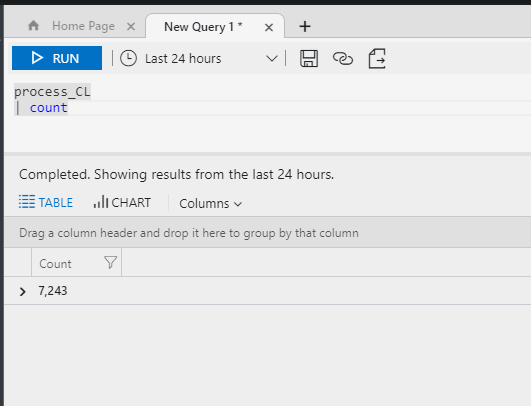
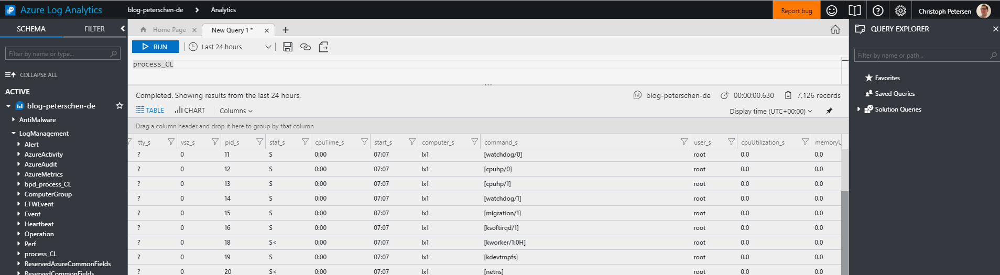
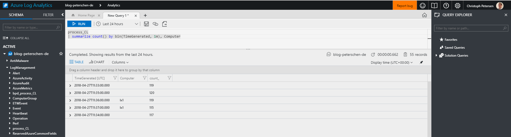
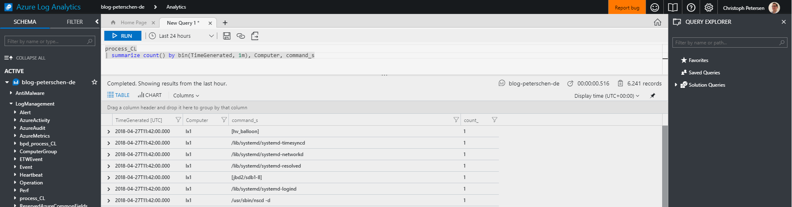
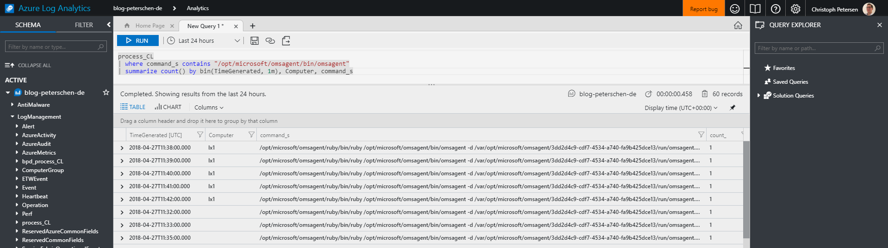
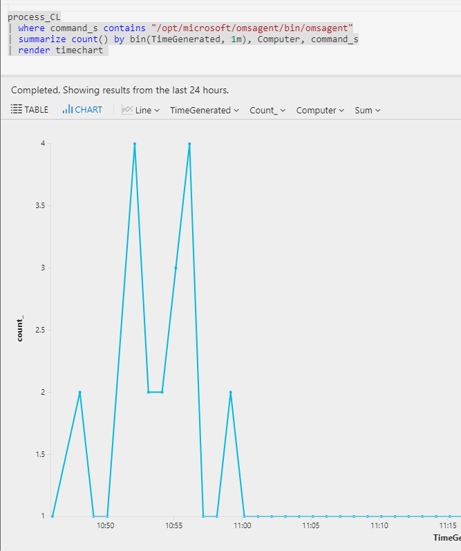
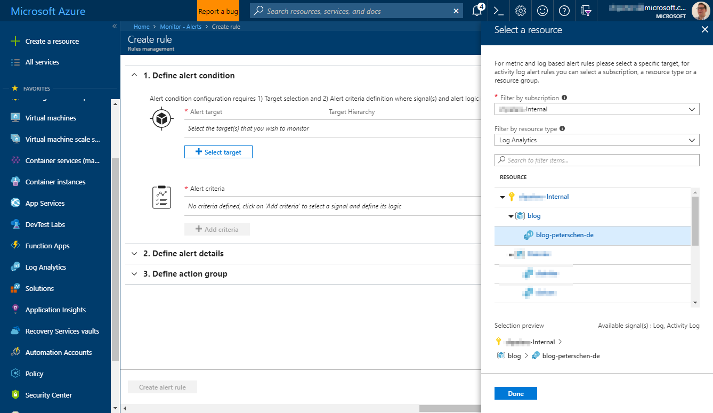
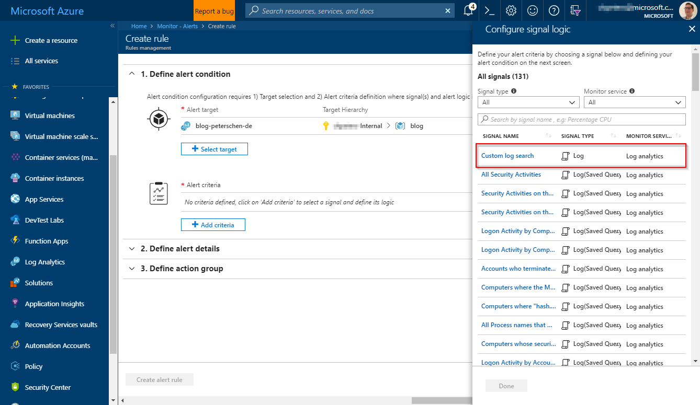
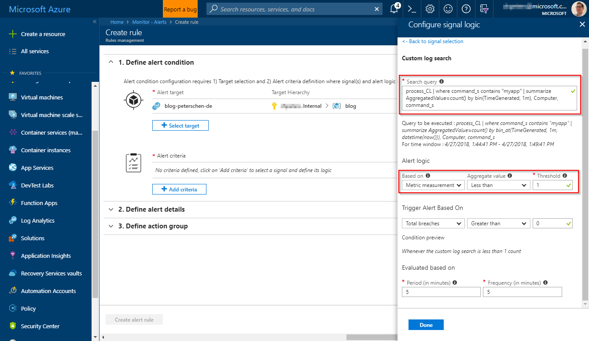

Nearly every customer I talk to about Azure management asks me this: "How can I do process monitoring?". As there is currently no way to directly instrument either the Windows or the Linux agent to do explicit process monitoring another way need to be found.

In this post I'll talk about a possible solution to setup process monitoring on Linux based systems which have been instrumented with the Log Analytics agent.

## Approach

Every route leads to Rome. Or so they say. There are a gazillion ways to implement this. I've chosen a generic approach that will enumarate the proccesses on the instrumented servers on a regular basis and sends the data to Log Analytics. With that data stored in Log Analytics we can use Alerts in Azure Monitor to do specific process monitoring.

## 1. Instrumenting the Linux Agent

The Linux agent is based on Fluentd and can be extended through plugins. Fluentd already ships with a bunch of plugins and Microsoft adds some more that are specific to Log Analytics. One of the plugins that ships with Fluentd is the [exec Input Plugin](https://docs.fluentd.org/v0.12/articles/in_exec). That plugin will execute a command on a set interval and puts the output into the Fluentd pipeline for further processing.

That is how the data will flow into Fluentd but how do we get the process list? I've written a fairly simple Python script that executes a `ps ax` and puts the results into a JSON output so that we can actually use it. This needs to be placed on each server where the monitoring shall take place. In my environment this is `/opt/scripts/getprocess.py` :

Now to the configuration of the agent. We need to instrument Fluentd to execute the script on a regular basis and upload the data to Log Analytics. The following configuration will do just that and pushes it out to Log Analytics through the [HTTP Data Collector](https://docs.microsoft.com/en-us/azure/log-analytics/log-analytics-data-collector-api). This file goes in `/etc/opt/microsoft/omsagent/conf/omsagent.d/process.conf` . If you changed the path of `getprocess.py` , you need to make sure to update the configuration accordingly:

Finalize the configuration by restarting the agent. This can be done through issuing `/opt/microsoft/omsagent/bin/service_control restart` . You can check whether the configuration is in effect by checking the log file for the agent which is located at `/var/opt/microsoft/omsagent/log/omsagent.log` . This should show the configuration we just made as part of the overall configuration.

## 2. Exploring the Data & Building an Alert Query

Now that data is flowing from the agent to Log Analytics a new custom log table will show up in Log Analytics:

We can use the Advanced Analytics portal to explore the data and build interesting queries around the data we are gathering. As we are looking to do process monitoring we want to check if a certain process is actually running. One way to do this is to count the number of instances per host over time.

Let's start from the beginning and get all processes:
 `process_CL`

Lets group by computer and put it in time buckets:
 `process_CL | summarize count() by bin(TimeGenerated, 1m), Computer`

Almost there. We should also include the process name:
 `process_CL | summarize count() by bin(TimeGenerated, 1m), Computer, command_s`

This of course now lists all processes by computer and the command. For proper monitoring we would then drill it down to a specific process:

Tabular view is very user unfriendly so let's render a chart:

## 3. Adding a Metric Alert

Adding alerts is actually pretty easy. Since end of March the new Azure Alert platform as part of Azure Monitor is GA and it has never been easier to setup alerts based on metrics or Log Analytics queries.

When doing alerts on Log Analytics queries two different methods can be applied. One to alert on the number of results. Given the data in our table we would need to create alerts based on every single computer and every single process. That can be a bit tedious.

The second option is to create a metric alert. A metric alert needs an aggregated value which is time bound but it can differ between all the instances that are part of the result. That means we can use a single query to do alerting for all computers at the same time and the alert will only fire for those instances that are violating the set threshold. Pretty neat.

In order to to metric alerts we need to change the query a little bit as the alert engine needs a predefined column name to find the aggregation:
 `process_CL | where command_s contains "myapp" | summarize AggregatedValue=count() by bin(TimeGenerated, 1m), Computer, command_s`

### 3.1 Select the Target

First step is to select the target to which this alert applies. The new alert platform that was GA'ed in March makes this very easy:

### 3.2 Choose the Signal & it's Logic

The target and the scope of the alert defines which signals are available. For Log Analytics which was chosen as the target we have Log and Activity Log signals available. We will make use of the Log signal to perform a log search agains Log Analytics:

The signal logic is basically the configuration for the signal. In this case the query and the logic it adheres to (either Number of Results or Metric Measurement). As the query we've defined can be used for a Metric Measurement logic we use just that:

## Conclusion

The steps outlined in this post are manual steps. Managing this at scale of course requires some sort of automation. A few options come to mind: you could use PowerShell DSC, Chef or Puppet to manage the required files at scale. The monitoring pieces can be automated through ARM templates. When you are instrumenting systems that are running in Azure you could also have a single template automate the whole process including the files through the [Azure Desired State Configuration extension](https://docs.microsoft.com/en-us/azure/virtual-machines/windows/extensions-dsc-overview).
