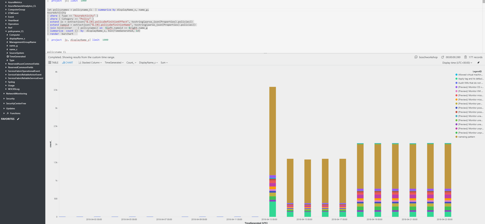

[Azure Policy](https://azure.microsoft.com/en-us/services/azure-policy/) is a great tool to define governance controls in Azure. With addition of the compliance pieces this feature which was part of Azure for quite some time finally had it's appearance on main stage ([deep dive on implementing governance at scale in this video from Ignite 2017 by Joseph Chan and Liz Kim](https://myignite.microsoft.com/videos/54781))

Events that pertain to policy are logged to the Azure Activity Log. The Activity Log can be shipped to Log Analytics to run analytics on the logs or even implement alerting with Azure Monitor.

Policy related alerts reference the policy objects that were created under the hood when defining policy. That means there is a missing link between the event in Activity Log and what policy it pertains to. No very handy when trying to do analytics or monitoring ontop of it.

My esteemed colleague [Ivan McKinley](https://github.com/ivanthelad) has [written a script/docker image](https://github.com/ivanthelad/policyloaderoms) that takes the policy objects from the API and writes them to a custom log in Log Analytics. With a query magic it is now possible to correlate the events to the actual policy:

