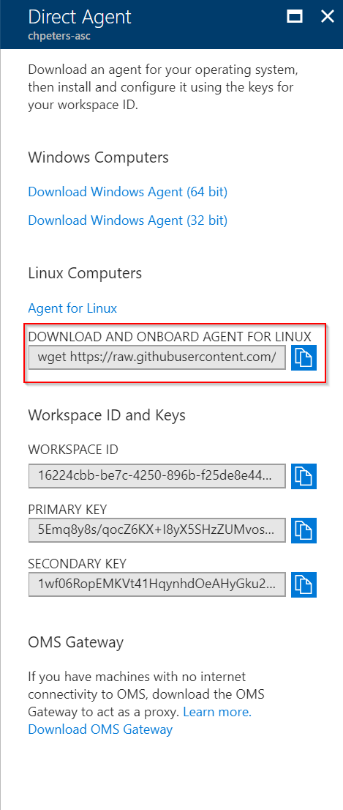
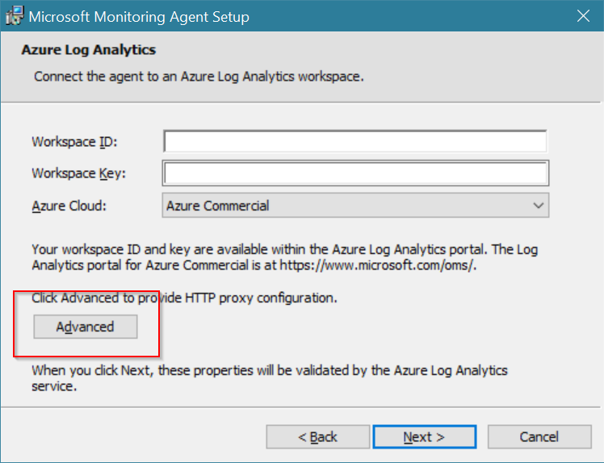

Almost all Azure management services run in/for any cloud. Among them is Update Management which automates OS patching for both Linux and Windows machines whether they are running on-premises, in Azure or in other clouds.

Security is an essential item for most customers. Different strategies are employed to secure environments and make sure assets are kept secure. One of those strategies is to isolate the network where the assets are placed and allow communication only through a proxy. This comes with it's own challenges - I'll highlight some of them with regards to Update Management.

## Proxy Whitelisting

Before you can deploy the agent proxy whitelisting needs to be taken care of. There are two things that needs to be taken care of: Whitelisting for Update Management/Azure backend services and whitelistings for the underlying patching infrastructure be it Windows Update or Linux repositories.

### Azure Backend

The following endpoints need to be whitelisted:

* https://*.ods.opinsights.azure.com
* https://*.oms.opinsights.azure.com
* https://*.blob.core.windows.net
* https://*.azure-automation.net

### Patching Infrastructure

For Windows updates refer to the [documentation](https://technet.microsoft.com/en-us/library/bb693717.aspx) and set your whitelisting accordingly. For my tests I have whitelisted the following endpoints:

* [http://windowsupdate.microsoft.com](http://windowsupdate.microsoft.com)
* http://*.windowsupdate.microsoft.com
* https://*.windowsupdate.microsoft.com
* http://*.update.microsoft.com
* https://*.update.microsoft.com
* http://*.windowsupdate.com
* [http://download.windowsupdate.com](http://download.windowsupdate.com)
* [http://download.microsoft.com](http://download.microsoft.com)
* http://*.download.windowsupdate.com
* [http://test.stats.update.microsoft.com](http://test.stats.update.microsoft.com)
* [http://ntservicepack.microsoft.com](http://ntservicepack.microsoft.com)

For Linux updates it depends on your distribution and the configured repositories in you VM. Check your `yum` , `zypper` or `apt-get` configuration to identify the endpoints for whitelisting.

## Deploy the Agent

There are plenty of options to deploy the agent: Azure VM extension, DSC automation (PowerShell DSC, Chef, Puppet) or manual deployment. While all these options are feasible I will focus on the manual deployment option.

### Linux

The current release (amon the source code) is available through [GitHub](https://github.com/Microsoft/OMS-Agent-for-Linux/releases). [Version 1.6.0-42](https://github.com/Microsoft/OMS-Agent-for-Linux/releases/tag/OMSAgent_v1.6.0-42) adds support for OpenSSL 1.1.x and Debian 9 among other things.

If the server you want to put under management has internet access (trough proxy) to GitHub (and AWS S3 where the files are located) you can use the onboarding script that downloads the latest release automatically and onboards it directly to your workspace. In this scenario you do **not** need to onboard the agent.



If these destinations are not whitelisted/accessible then you need to download the agent and copy it to the target machine manually (e.g. scp, sftp, or some other means). To install and connect a manually installed agent to a workspace you need to run installation process:

```bash
chmod +x omsagent-1.6.0-42.universal.x64.sh
./omsagent-1.6.0-42.universal.x64.sh --install -w <workspace id> -s <workspace key> -p http://your.proxy:port
```

### Windows

Installing the Windows agent is very similar to the Linux installation. The Windows agent can also be deployed through different means: Azure VM extension, DSC automation and manual deployment.

For manual deployment [download the latest version of the agent](http://go.microsoft.com/fwlink/?LinkId=828603) and copy it to the VM. This is an MSI installer and will guide you through the installation. Important is to configure the proxy configuration so that the agent can communicate with the Azure backend infrastructure:


