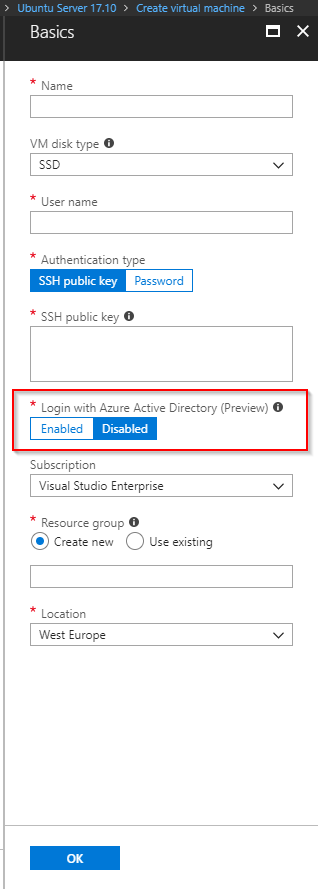

Centralized integration with an identity provider is a common ask. It provides increased security and removes the reliance on out-of-band managed user accounts.

It is now possible to configure Azure Active Directory login for Ubuntu-based VMs (16.04 LTS & 17.10) through the Device Flow authentication process. This is currently in preview and only available in the South Central US region.

To enable this feature you need to switch it on when deploying a new VM:

For users requiring access to a VM through this authentication type [RBAC policies need to be set accordingly](https://docs.microsoft.com/en-us/azure/virtual-machines/linux/login-using-aad#configure-rbac-policy-for-the-linux-virtual-machine).
