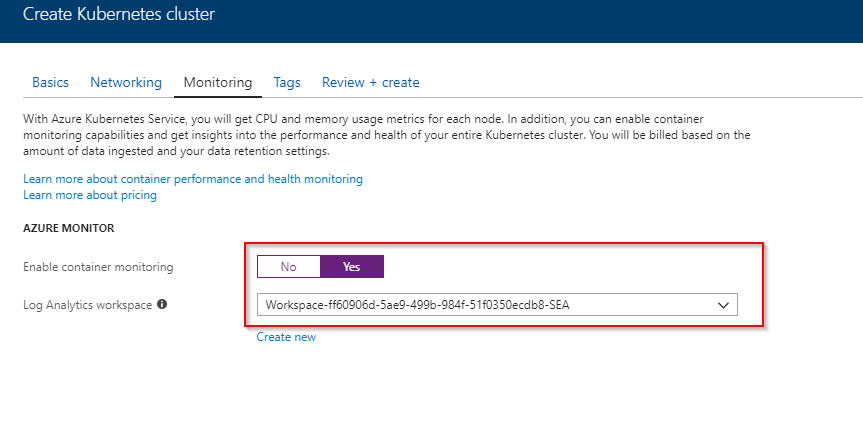

Photo by [frank mckenna](https://unsplash.com/@frankiefoto?utm_source=ghost&amp;utm_medium=referral&amp;utm_campaign=api-credit) / [Unsplash](https://unsplash.com/?utm_source=ghost&amp;utm_medium=referral&amp;utm_campaign=api-credit)

Monitoring the container infrastructure which is running your applications is important. With the emergence of managed Kubernetes such as Aure Container Service (AKS) this becomes more tricky as part of the infrastructure is managed by somebody else.

This is why Microsoft released Container Health as a public preview as part of the Azure Monitor offering which helps you manage and monitor your AKS clusters at scale. Providing near-realtime performance metrics and container logs from a centralized location.

Raw data such as logs, metrics and inventory are also exposed through Log Analytics for custom queries or reporting through other means such as Power BI.

For more information check out [the blog post by Keiko Harada](https://azure.microsoft.com/en-us/blog/monitoring-azure-kubernetes-service-aks-with-azure-monitor-container-health-preview/).

## Deploy a New Cluster

When deploying a new cluster through the portal you can opt-in to automatically add Container Health to your deployment. Just make sure to select the appropriate option:

If you are deploying through other means (PowerShell, CLI, ARM Template) read on.

## Add Container Health to an Existing Cluster

If you want to add Container Health to an existing cluster you can use the template which we provide as part of [the documentation](https://docs.microsoft.com/en-us/azure/monitoring/monitoring-container-health). My colleague [Daniel Neumann](https://www.danielstechblog.info/) has written [an excellent template](https://github.com/neumanndaniel/armtemplates/blob/master/container/aksEnableMonitoring.json) which provides the same functionality but works with the name of the cluster instead of the resource id.
