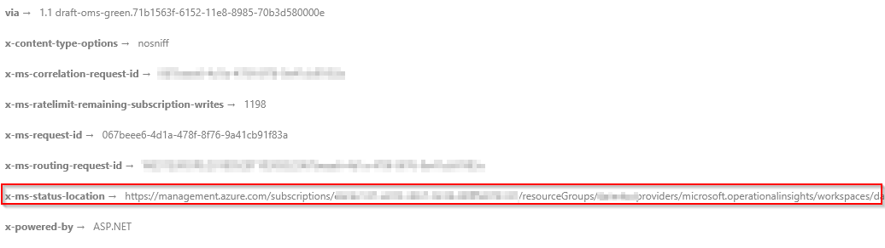



Since Friday May 25th 2018 the General Data Protection Regulation (GDPR) took effect across Europe. It governs how data should be processed and provides extensive rights to the person which data is used.

One of these rights is the right to erasure ("right to be forgotton"). If a customer or consumer requests for data deletion this needs to be fulfilled in a reasonable amount of time across all systems.

Until now it was not possible to delete data once it was written to either Log Analytics or Application Insights and one needed to wait until the retention period was reached for data to be groomed/purged. With the emergence of GDPR, Microsoft has intruduced two API paths for both Log Analytics and Application Insights to explicitly create purge requests which will be fulfilled within 30 days. Detailed information on the data management can be found in our documentation for [Log Analytics](https://docs.microsoft.com/en-us/azure/log-analytics/log-analytics-personal-data-mgmt) and [Application Insights](https://docs.microsoft.com/en-us/azure/application-insights/app-insights-customer-data).

## Permissions & Provider registration

In order to submit purge requests a special RBAC role needs to be assigned: Data Purger. This role is not assigned by default and not even the resource owner has this right.

In some scenarios you might get an error indicating that for your subscription the resource provider needs to be registered. If that is the case run the following (I used [Azure Cloud Shell](https://shell.azure.com/)):

```bash
az provider register -n Microsoft.LogAnalytics
```

## Issue purge request

To issue the purge you need the subscription, resource group and the name of the Log Analytics workspace or Application Insights app. We provide documentation for the purge API path for [Log Analytics](https://docs.microsoft.com/en-us/rest/api/loganalytics/workspaces%202015-03-20/purge) and [Application Insights](https://docs.microsoft.com/en-us/rest/api/application-insights/components/purge).

All purges require at least a single filter. A filter is nothing more than a Log Analytics query. Take a look at the following sample:

```
AzureDiagnostics
| where SourceSystem == "Azure"
``` 

corresponds to the following JSON payload for the purge request:

```json
{
    "filters": [{
        "column": "SourceSystem",
        "operator": "==",
        "value": "Azure"
    }],
    "table": "AzureDiagnostics"
}
```

If the request was sucessfully accepted you'll see something like the wollowing:

```json
{
    "operationId": "purge-7d7cf277-9113-4ab3-8359-d0364b74d01d"
}
```

Microsoft provides an SLA of 30 days until the data is purged from the backend systems. To track the status of the purge request you can use this id. As part of the response you'll see a field `x-ms-status-location` . Submitting a GET request with a valid Bearer token will provide you with the status of the deletion request:


