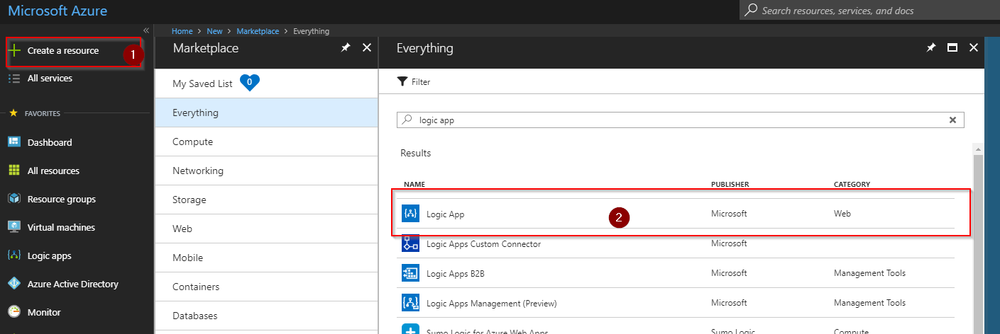
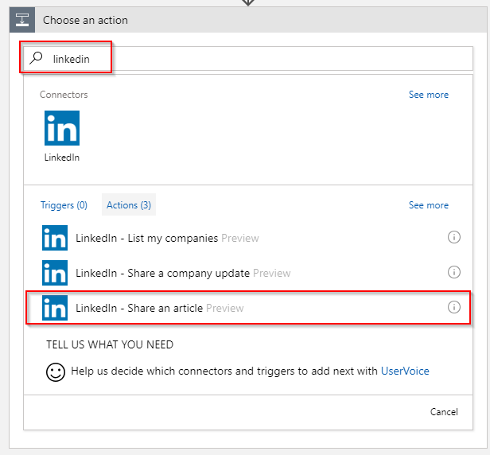



I like to share on LinkedIn and asked myself why I'm not sharing the articles I write for my blog. The you-just-have-to-do-it factor, plain laziness and lack of time are the primary reasons why I have not posted links to LinkedIn so far.

This is especially hard as I've spent the better part of the last seven years telling my customers to invest in automation to scale and focus energy on important things (like writing new articles).

Today I set out to create a Logic App to react on a new article I publish on my blog and post that to LinkedIn. Should be easy enough. I'll guide through the process of creating the Logic App through the portal. Of course the same process is available through ARM which I've [published on GitHub](https://github.com/peterschen/blog/tree/master/samples).

## Create the Logic App

First we create a new Logic App:



Provide a name for the Logic App (I've chosen `Blog2Linkedin` ), a subscription, a resource group and the location (in which DC it should run). Lastly you can enable Log Analytics integration so that telemetry about the runtime of this Logic App will directly be sent to Log Analytics (for this example I've not opted for Log Analytics integration but this can be added later as well).


This is it. Now you have a new Logic App that needs to be filled with live eehm. Logic.

## Add a trigger

When you start designing your Logic App you can start by using a template provided by Microsoft or start with a blank slate. For this example I opted to start from scratch.


First thing we want to add is a trigger provided by a connector. A connector provides access to all kinds of systems that might be running in Azure or provided by 3rd parties such as Salesforce or Twitter.

For our purposes there is a RSS connector.


This connector provides a handy trigger that starts off when a new feed item is published (e.g. a new article is published).


Configuring the trigger is pretty easy. Put in the URL of the feed and the frequency that you want the feed to be checked (I've opted for every 2 hours as I'm not posting too frequently) and you're good to go.


## Add actions

We now have a trigger that will kick-off the Logic App when a new item turns up in the feed. Now we need to post that information to LinkedIn.

For LinkedIn we have another connector available (who would have guessed...). The LinkedIn connector conveniently provides an action to share an article.



In order to be able to use the connector. You need to sign in to LinkedIn. Hit the button and you'll be taken throgh an OAuth flow which will grant Logic Apps access to post on your behalf.


The action requires two parameters: Content URL and Visibility. We need to fill them with the content that we have taken from the RSS feed. Now the power of Logic Apps come to play. We can subscribe to dynamic content from a previous action or trigger and use it subsequently.


Done. This Logic App now does what it's supposed to do. You can start a test run by hitting run in the designer which would override the poll setings in the trigger you have made so that you get immediate and interactive feedback.

## Loops, variables and functions

There are some additional optional parameters in the action available, you can use to increase the fidelity of the post (e.g. add tags). This depends on the data that are available as part of the feed.

I'm using Ghost and it puts the tags or categories in the feed. I want to add the tags I use in my blog to add hashtags to the posts that are made to LinkedIn. This requires a little more logic.

A record from the RSS trigger looks similar to this:

```json
{
  "id": "5b0fe077818bdf00013a2b30",
  "title": "Test#3",
  "primaryLink": "https://blog.peterschen.de/test-3/",
  "links": [
    "https://blog.peterschen.de/test-3/"
  ],
  "updatedOn": "0001-01-01 00:00:00Z",
  "publishDate": "2018-05-31 11:46:18Z",
  "summary": "<div class=\"kg-card-markdown\"><p>Test</p>\n</div>",
  "copyright": "",
  "categories": [
    "GDPR",
    "Blog",
    "OSS"
  ]
}
```

As you can see, the categories are passed as an array. But to post them we need them as a single string. In addition we need to add the # before the string and remove any blanks.

First things first. In a Logic App we have [several looping functions available](https://docs.microsoft.com/en-us/azure/logic-apps/logic-apps-control-flow-loops). One of them is [Foreach](https://docs.microsoft.com/en-us/azure/logic-apps/logic-apps-control-flow-loops#foreach-loop).


This will add a container in which we can place additional actions that should act on the data for the loop. First we have to select the element we want to loop over.


Now we can add a new action to the loop so that we can add the current category (or tag) to a string and also add the #. The best way to store the data is a variable. And there is a connector available for that too! It has an action "Append to string variable" which we can use here.


The only problem: We don't have a variable declared yet. So we need to add an action before we go into the loop (so that we do not reset the variable every time we iterate).


The variable connector has an action "Initialize variable" which takes care of creating the variable so that it can be used as a dynamic value subsequently.


Give it a name and select `String` as the type. The value can be left empty. We will set that as part of the loop.


Now we can finish to configure the loop. Open up the "For each" block again and go to the "Append to string variable" action where we are missing some parameters.


Ready? Let's take it for a test spin. Works for most cases but you might see two problems: Blanks in the tag coming from Ghost are not removed and there is no blank between the hashtags (which I as a nit-pick find annoying).

Let's use a function to fix those problems. When adding dynamic content there is another tab called "Expressions" which provides a [list of functions that Log Apps provide](https://docs.microsoft.com/en-us/azure/logic-apps/workflow-definition-language-functions-reference) to do string manipulation, work with date/times and much more.

So instead of directly using the dynamic content provided by the loop. We use the following expression: `concat('#', concat(replace(item(), ' ', ''), ' '))` This will add the #-sign, replace blanks and adds a blank at the end of the string.


## Result

And this is how it looks like in action. I've let the designer run for a test drive which provides interactive feedback so I can see what data passes through the Logic App.


And of course I now have a new post on LinkedIn.


