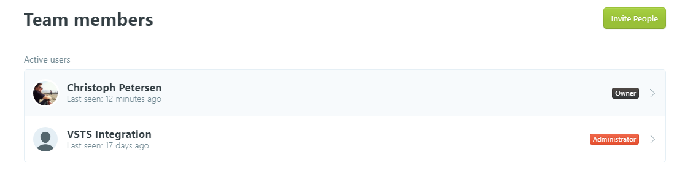
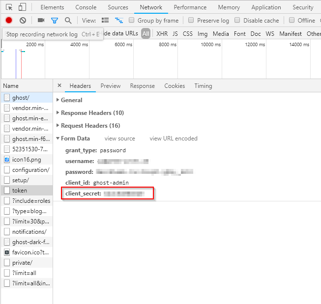
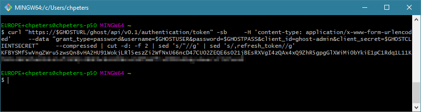



To automate the pipeline of the theme I use for my blog to be built and automatically deployed it is required to interact with the Ghost API. Nothing fancy.

This writeup explains how to retrieve the Bearer token through the Ghost API with cURL.

## Service principal

It makes sense to delegate the permissions to a different user account which can be locked independently if the automation is compromised in some way. In addition this puts the user account used for automation in a complete separate life-cycle as your regular user.

The first step is to create a new user in Ghost:



You may ask why the integration user in this screenshot has administrative rights! I'm using it to automatically deploy the theme I use from a build pipeline out of Visual Studio Team Services and this requires administrative rights.

## Retrieve client secret

Each Ghost installation creates a unique client secret to put additional security in place. There are multiple strategies to get the client secret. You can take a look at the Ghost database or capture browser traffic. I've found that the easiest way is to capture browser traffic. Make sure you're signed out of Ghost, hit F12 in your favorite browser, track the requests going to you Ghost backend, sign into Ghost and look for a `token` request:



Make a note of that static client secret.

## Retrieve bearer token

Now we have everything in place to retrieve the Bearer token from Ghost. The following cURL command will issue a sign-in request against the token service and give back the token:

```bash
GHOSTURL=your.blog.url
GHOSTUSER=me
GHOSTPASS=secret
GHOSTCLIENTSECRET=copyfrompreviousstep

curl "https://$GHOSTURL/ghost/api/v0.1/authentication/token" -sb \
    -H 'content-type: application/x-www-form-urlencoded' \
    --data "grant_type=password&username=$GHOSTUSER&password=$GHOSTPASS&client_id=ghost-admin&client_secret=$GHOSTCLIENTSECRET" \
    --compressed | cut -d: -f 2 | sed 's/"//g' | sed 's/,refresh_token//g'
```

This will output the bearer token:


