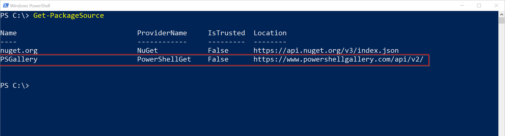

Photo by [rawpixel](https://unsplash.com/@rawpixel?utm_source=ghost&amp;utm_medium=referral&amp;utm_campaign=api-credit) / [Unsplash](https://unsplash.com/?utm_source=ghost&amp;utm_medium=referral&amp;utm_campaign=api-credit)

When setting up Azure File Sync one of the requirements is to have the Azure PowerShell Cmdlets (AzureRM) installed. Many customers have proxies deployed which control internet egress. Many of these also use authentication to secure internet access.

In order to tunnel the installation of packages from PowerShell Gallery through a proxy the configuration for that package source needs to be updated to include the proxy. As far as I know the system proxy settings are NOT respected.

Follow the following steps to enable package management to use a proxy when downloading packages:

## Configuring proxy (w/o auth)

```powershell
Set-PackageSource -Name PSGallery -Proxy http://my.proxy.local:3128
```

## Configuring proxy (w/ auth)

```powershell
$credential = Get-Credential
Set-PackageSource -Name PSGallery -Proxy http://my.proxy.local:3128 -ProxyCredential $credential
```

## Change default source location

During installation of Windows the default `PSGallery` package source is added. This source has a default address which can't be overriden manually. During registration of this source the location is internally looked up. If this call is intercepted by a proxy or other network device and redirected to an other location you need to re-register the package source.

The output of `Get-PackageSource` should be similar to this:



### Re-register package source (w/o auth)

```powershell
Unregister-PackageSource -Name PSGallery
Register-PackageSource -Name PSGallery -ProviderName PowerShellGet -Proxy http://my.proxy.local:3128
``` 

### Re-register package source (w/ auth)

```powershell
$credential = Get-Credential
Unregister-PackageSource -Name PSGallery
Register-PackageSource -Name PSGallery -ProviderName PowerShellGet -Proxy http://my.proxy.local:3128 -ProxyCredential $credential
```
