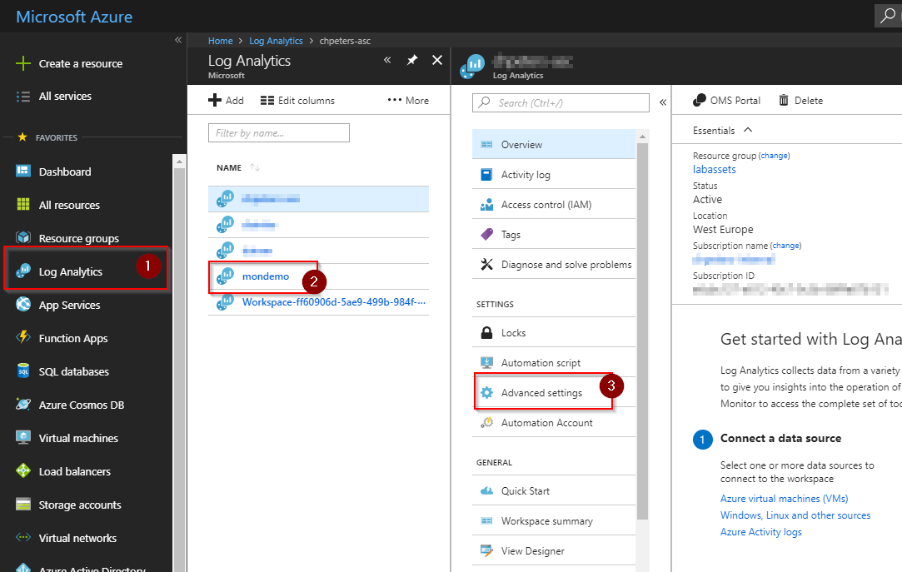
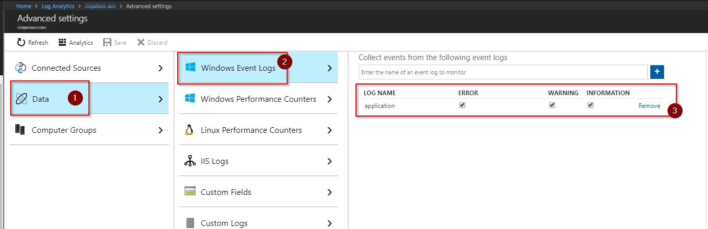
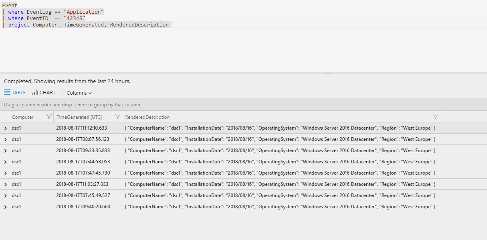



In many scenarios there is the requirement to enrich or lookup data with meta information from the infrastructure. In this scenario a file with machine, location and other meta information was placed during deployment on the VM for both Azure and AWS.

First attempts to use the [Custom logs feature](https://docs.microsoft.com/en-us/azure/log-analytics/log-analytics-data-sources-custom-logs) were not sucessful as this method looks for changes to a file. If the file is static no changes are sent to Log Analytics and when the retention time of the workspace has been reached the information is lost.

In order to tackle this problem some kind of scheduling mechanism is required. Scheduled tasks or cron is out of the question as the VMs are spinning up and going down in an automated fashion and interactive access to these machines is not possible.

Enter PowerShell DSC. With a simple configuration and the LCM configured to run once or twice a day we can make this scenario work. Event better: the dependency on the Custom log feature has gone as we can directly instrument the Event Log to gather the information.

## PowerShell DSC configuration

This is the very simple LCM configuration that runs the consistency check every 12 hours.

The following PowerShell DSC configuration using the `Script` resource will take care of reading the inventory file and writing it to the Event Log. This specific implementation will make sure that a custom source for the Event Log exists before writing the entry.

## Azure & PowerShell DSC

This configuration can be bootstrapped to every server in the fleet wheter the server runs in [Azure](https://docs.microsoft.com/en-us/azure/virtual-machines/extensions/dsc-overview) or [AWS](https://docs.aws.amazon.com/quickstart/latest/powershell-dsc/cfn.html).

Adding a PowerShell DSC configuration to a server deployment is just a matter of adding the [PowerShell DSC extension](https://docs.microsoft.com/en-us/azure/virtual-machines/extensions/dsc-overview) to either the template or the deployment through the Portal or CLI. The following template adds the extension and the sample script to a pre-existing VM.

## Log Analytics

To run analytics or orchestration with the meta data that has been written to the Event Log on the VM it needs to be under management by Log Analytics. This can be automated by policy or Azure Security Center to ensure that all VMs are under management.

To collect the Application Event Log used in this sample, the agent needs to be instrumented to do so. This can be set for the workspace by accessing the data instrumentation: `Log Analytics \ <workspace> \ Advanced settings` :



In the advanced configuration screen select `Data \ Windows Event Logs` and add the appropriate log to the instrumentation. Once you've hit save this configuration will automatically be applied to all connected agents and data will flow to Log Analytcs:



Now that data is available in Log Analytics queries can be run against the data. The following simple sample returns all data for all computers. More specific filters or only selecting the newest records could also applied to this:

```
Event
| where EventLog == "Application"
| where EventID  == "12345"
| project Computer, TimeGenerated, RenderedDescription 
```


