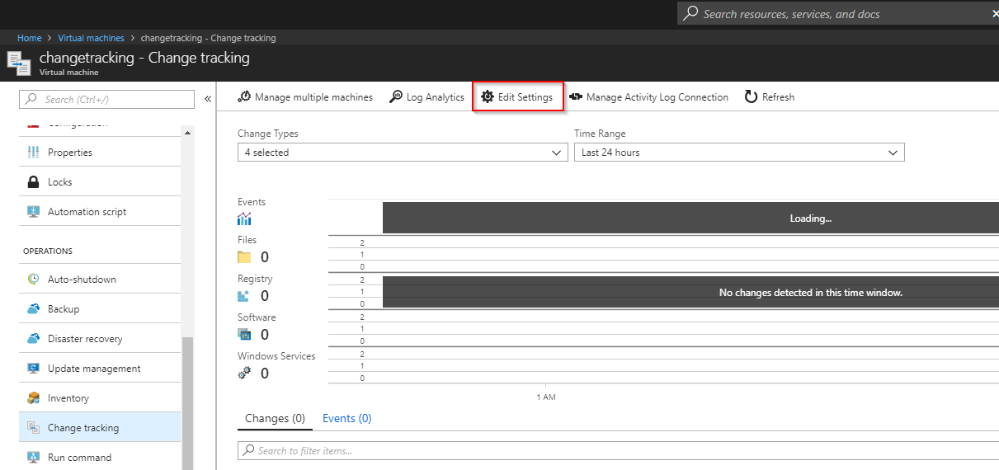
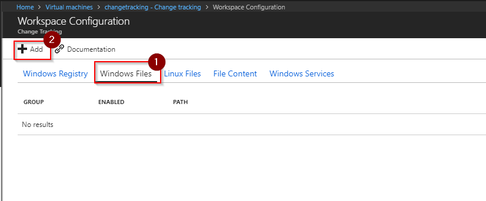
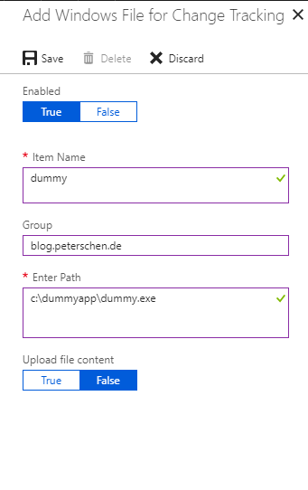
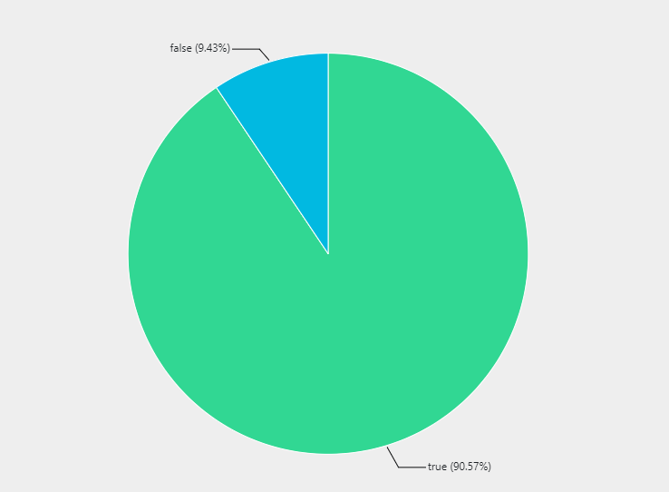

Photo by [Ilya Pavlov](https://unsplash.com/@ilyapavlov?utm_source=ghost&utm_medium=referral&utm_campaign=api-credit) / [Unsplash](https://unsplash.com/?utm_source=ghost&utm_medium=referral&utm_campaign=api-credit)

Change Tracking is a versatile feature that allows to monitor changes on a system (both Windows and Linux). Change tracking covers software installation, changes to services, daemons, Registry and the file system. This is available for both cloud based (Azure, AWS, GCP), on-premises and service provider hosted systems (given network connectivity to Azure).

One scenario is to monitor the deployment of a certain file across a fleet of servers. Assume we want to distribute `dummy.exe` across our Windows systems due means that are not important for this article and we want to provide a central dashboard that shows the progress of deployment.

Change Tracking and Log Analytics can help here. Change Tracking itself will collect the data from each individual system and with Log Analytics we can build some dashboards to track the deployment status.

## Change Tracking

Before we can monitor a certain file the agent needs to know that it should instrument it. This can be configured through the Change Tracking solution. Go to a VM for which you want to enable monitoring (this will then apply to all VMs that are connected to that Log Analytics Workspace) by clicking on `Change tracking` in the VM blade:



Select `Windows Files \ Add` to open the wizard:



Add the path and an description for the file you want to monitor:



Done. Change Tracking / Log Analytics will now monitor this file.

## Log Analytics / Dashboard

The Log Analytics query needs to first select all distinct systems that are onboarded to this Log Analytics workspace:

```
Heartbeat
| distinct Computer 
```

We want to track across the fleet of Windows machines so we need to narrow our selection to only those systems as otherwise the final result is skewed:

```
Heartbeat
| where OSType == "Windows"
| distinct Computer
```

Now we need to join the Change Tracking data specifically for the file we want to monitor. We use an left outer join to also retain entries where that file is not yet available to that we can later render a nice graph:

```
Heartbeat
| where OSType == "Windows"
| distinct Computer 

| join kind=leftouter ( 
    ConfigurationData
    | where ConfigDataType == "Files"
    | where FileSystemPath contains "explorer.exe"
    | project Computer, FileSystemPath 
) on Computer
```

We can now get rid of the duplicate computer attribute that was created by the join and create a new field `HasFile` depending on whether the system has that file or not:

```
Heartbeat
| where OSType == "Windows"
| distinct Computer 

| join kind=leftouter ( 
    ConfigurationData
    | where ConfigDataType == "Files"
    | where FileSystemPath contains "explorer.exe"
    | project Computer, FileSystemPath 
) on Computer
| project Computer, HasFile=iif(FileSystemPath == "", "false", "true")
```

Finally we summarize the whole thing (for dashboarding purposes seeing each individual system is not really useful) and render a nice pie chart:

```
Heartbeat
| where OSType == "Windows"
| distinct Computer 

| join kind=leftouter ( 
    ConfigurationData
    | where ConfigDataType == "Files"
    | where FileSystemPath contains "explorer.exe"
    | project Computer, FileSystemPath 
) on Computer
| project Computer, HasFile=iif(FileSystemPath == "", "false", "true")
| summarize Number=count() by HasFile
| render piechart
```

The results look something like this:

