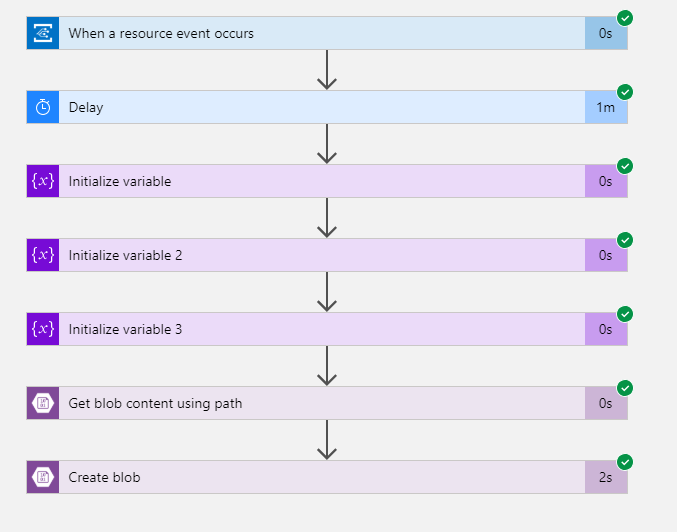
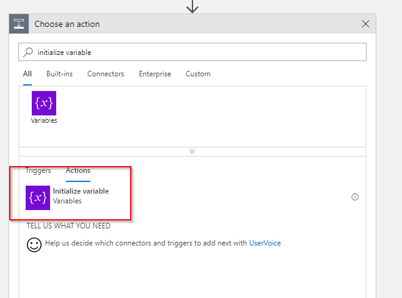

When using Azure Backup to manage (geo-)distributed backups across a company you may find that the [Azure Backup Reports with Power BI](https://docs.microsoft.com/en-us/azure/backup/backup-azure-configure-reports) is limited to a single storage account. Unfortunately the reporting telemetry coming from Azure Backup needs to be written to a storage account that is in the same region as the Recovery Services Vault.

Luckily with a few Logic Apps (one per region/storage account) the data can be merged in a single account which then can be used with the Azure Backup Reports content pack in Power BI.

The following steps guide through the process of creating the Logic App(s). The Azure Backup configuration is [described in much detail in the Azure documentation](https://docs.microsoft.com/en-us/azure/backup/backup-azure-configure-reports).

## Storage Account

First you need a new storage account where we merge all the telemetry data. This can be an existing account. Be aware that there might be egress charges when copying data from one region to another. As the volume is minimal this should rather be minimal - just being fully transparent.

When creating the storage account make sure to also create a container with the name `insights-logs-azurebackupreport` . This is required as otherwise the Logic App respectively the action is not able to write data to this storage account as the container is not automatically created.
Required blob container

## Logic App

This Logic App consists of a trigger that listens for notification flowing through [Azure Event Grid](https://docs.microsoft.com/en-us/azure/event-grid/overview). Secondly we create some variables to temporarily store metadata coming from Event Grid. Then we get the content of the blob and finally create a new blob in the other storage account. The overall flow looks something like this:
Logic App flow
During my tests I noticed that some writes of the blob were failing due to concurrent uploads. It seems to me that Azure Monitor writes the telemetry data at the exact same time leading to a collision at the storage account. For this reason I've added a delay after the trigger was fired which randomly waits between 1 and 120 seconds.

### Trigger

Select the `When a resource event occurs` trigger. 


Configure the trigger to your subscription and the originating storage account in that specific region. Make sure that the Event Type Item is set to `Microsoft.Storage.BlobCreated` .


### Delay

As mentioned before this is to stagger the writes to the central storage account. I'm using a random delay but it might also be a valid approach to use a static delay depending on the region.


### Variables

The trigger returns data like this:

```json
{
    "topic": "/subscriptions/--/resourceGroups/backup/providers/Microsoft.Storage/storageAccounts/backupeus",
    "subject": "/blobServices/default/containers/some/blobs/path/todo.txt",
    "eventType": "Microsoft.Storage.BlobCreated",
    "eventTime": "2018-08-21T10:25:01.3239276Z",
    "id": "(..)",
    "data": {
        "api": "PutBlob",
        "clientRequestId": "(..)",
        "requestId": "d3179a7f-c01e-0081-3239-39037a000000",
        "eTag": "--",
        "contentType": "text/plain",
        "contentLength": 220,
        "blobType": "BlockBlob",
        "url": "https://stuff/some/path/todo.txt",
        "sequencer": "(..)",
        "storageDiagnostics": {
            "batchId": "(..)"
        }
    },
    "dataVersion": "",
    "metadataVersion": "1"
}
```

In order to work with the blob account actions later on we need to extract the full path to the item that was written (e.g. `/some/path/todo.txt` ), the file name of the blob that was written (e.g. `todo.txt` ) and the path to the file without the filename (e.g. `/some/path/` )

This can be done inline in other actions but I prefer to be a little more explicit and thus I use variables and expressions to do the necessary string operations.

The following action needs to be added three times with the following configuration:

* Name: `FullPath`\
Value: `replace(triggerBody()['data']['url'], concat('https://', split(triggerBody()['data']['url'], '/')[2]), '')`

* Name: `FileName`\
Value: `last(split(variables('FullPath'), '/'))`

* Name: `Path`\
Value: `replace(variables('FullPath'), concat(variables('FileName')), '')`




### Blob operations

With the variables covered we can simply read the blob from the originating storage account and then write it to the new one.

To read the blob the `Get blob content using path` comes in handy. This will read a blob with a path reference which we just extracted into a variable!


In the configuration for this action you can just use the variable `FullPath` we created earlier.


The last step is to create a new blob in the other storage account. This is done with the `Create blob` action.


Just as before use the variables created earlier and the output of the `Get blob content using path` action. **Make sure that you change the connection to the appropriate storage account which is in turn connected to Power BI.**


