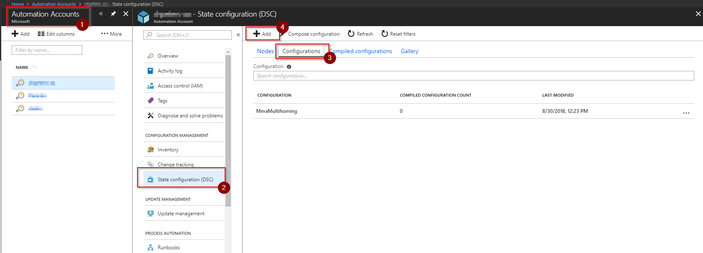
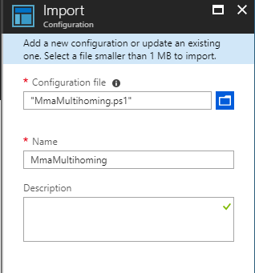
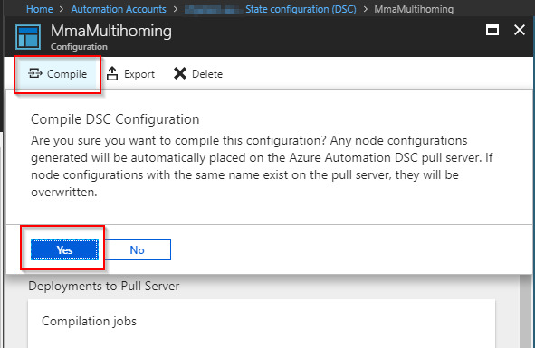
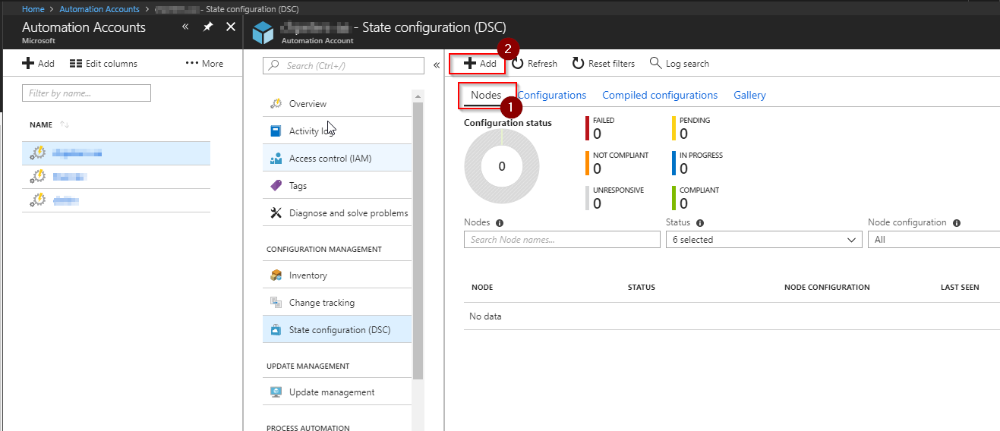
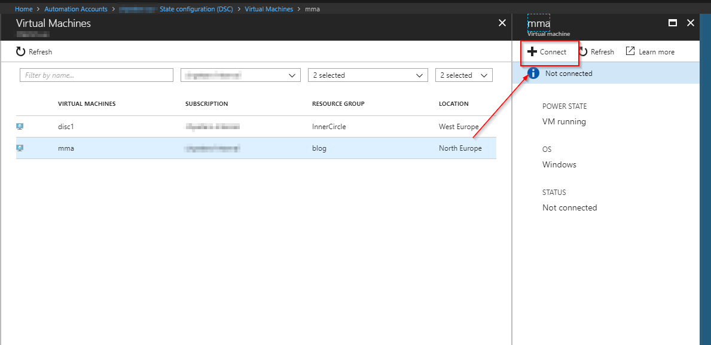
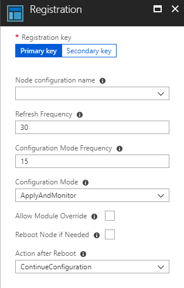
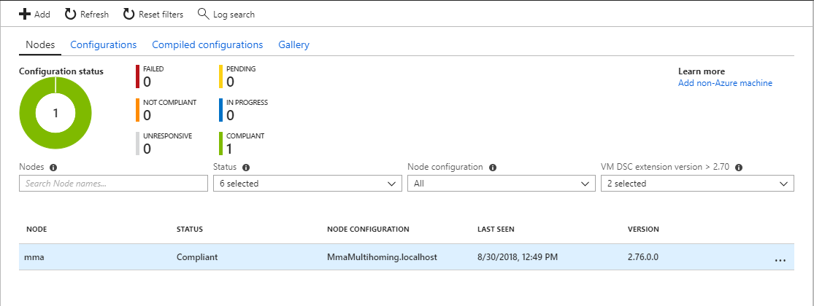

The Microsoft Monitoring Agent is able to send data to more than one workspace at the same time. Unfortunately only a single workspace at a time can be configured through the Azure Portal.

You can [either manually access the agents and configure it yourself](https://docs.microsoft.com/en-us/azure/log-analytics/log-analytics-agent-windows) through the Control Panel or use [some kind of automation](https://docs.microsoft.com/en-us/azure/log-analytics/log-analytics-agent-manage). The following PowerShell DSC configuration which can be used with Azure Automation DSC and/or PowerShell DSC downloads the appropriate agent, installs it and configures workspaces defined in the document:

The following steps walk through the setup of Azure Automation DSC to setup MMA multi-homing for a fleet of Windows based machines.

## Create configuration

If you do not already have an Automation Account, go ahead an create one. I suspect you already have one that is connected to your Log Analytics workspace. Within the Automation Account select `State Configuration (DSC) > Configurations > Add` to open the wizard that lets you import a new configuration.

In the following screen just select the .ps1 file which contains the DSC configuration and hit `Ok` .

Next we need to compile the configuration so it can be assigned to nodes. Simply open up the configuration and hit `Compile` :

## Add node(s)

Just like when using a DSC pull server you need to tell the individual nodes that it now needs to get its configuration from Azure Automation DSC. This can be done comfortable through the portal:

Select your node from the list and hit `Connect` :

This opens the registration wizard. This is basically the DSC meta configuration that will be sent to the client: which node configuration should be applied, which refresh frequency configured and how often the configuration should take place. You can also set the configuration mode, if DSC should reboot the node and what should happen after the reboot. [You can find more details about the DSC meta configuration in the documentation.](https://docs.microsoft.com/en-us/powershell/dsc/metaconfig)

## Result

Once the node is connected the configuration will be applied and the configuration results will be sent to Azure Automation DSC and can be visualized there:

