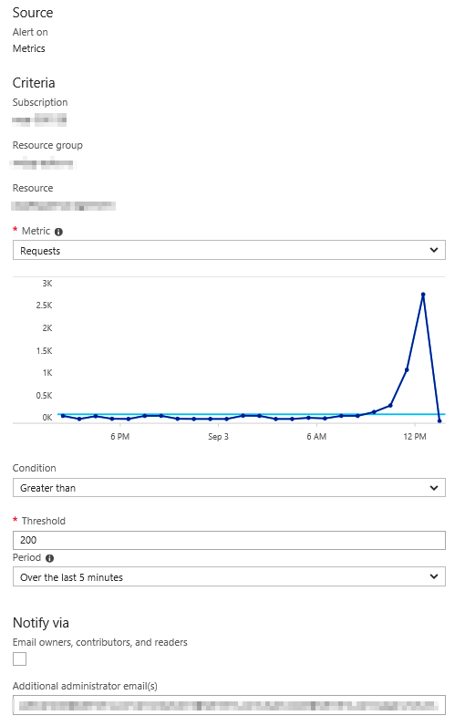
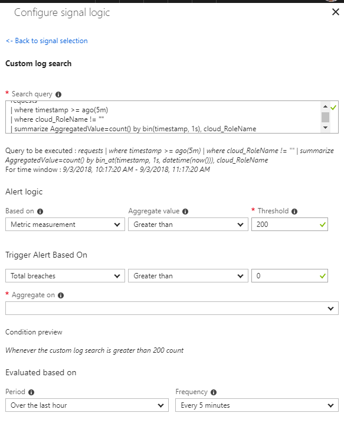

A customer of mine had the following rule configured:



It was his expectation that this rule would be triggered when in the last five minutes at some point more that 200 requests/s were being made to the App Service. Unfortunately this is not the case. The rule will sum the number of requests for the last five minutes and if that number is > 200 the rule will trigger.

There is an easy solution for this though. With a simple log alert running in Application Insights we can build a bucket with the requests for the last five minutes by second. In the following example I've added the `cloud_RoleName` as an option. [This is only required if more than one microservice or application writes to the same Application Insights instance.](https://docs.microsoft.com/en-us/azure/application-insights/app-insights-monitor-multi-role-apps#use-cloudrolename-to-separate-components)

```
requests
| where timestamp >= ago(5m)
| where cloud_RoleName != "" 
| summarize AggregatedValue=count() by bin(timestamp, 1s), cloud_RoleName
```

Metric alerts for App Services are not yet onboarded to the new Alert experience in Azure Monitor. By following the guide you can work around that and create a metric alert in the new alert experience:

