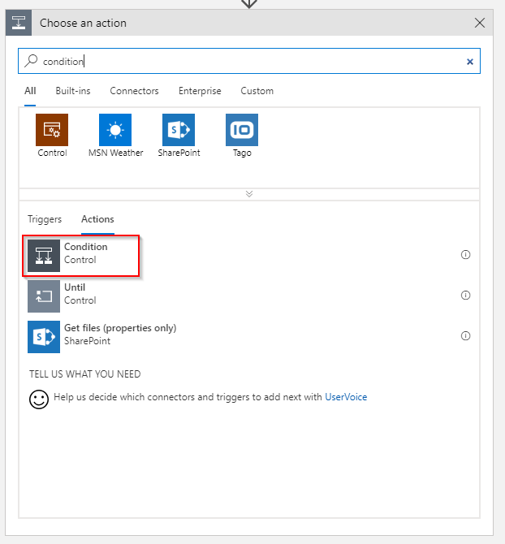

This problem is probably as old as there are monitoring tools on the market. *"How can I exclude legitimately deallocated VMs from alerting"* is a question that I've heard many times. 

Where most monitoring tools such as System Center Operations Manager have tooling around the concept of maintenance mode where all alerts are suppressed for a duration of time; Azure Monitor has no provisions at this point.

This article series consisting of three articles walks through how to build a mechanism that automatically tracks VM events (start, deallocation) and provides this as a means to extend log based alerts with Azure Monitor and Log Analytics.

**This is part one of a 3-post series:**

* **1/3: [Track VM state](/excluding-deallocated-vms-from-availability-alerting-1o3/)**
* 2/3: [Validate VM state](/excluding-deallocated-vms-from-availability-alerting-2o3/)
* 3/3: [Alert rule excluding deallocated VMs](/excluding-deallocated-vms-from-availability-alerting-3o3/)

## Architecture

We need to consider the following requirements:

* Log Analytics data retention may affect the result if a VM is offline for longer than the retention.
* Data written to Log Analytics stays there until the retention has been reached. This means we need to cover a scenario where a VM is first deallocated and then started within the retention time of the workspace.

The overall design looks something like the following diagram:


The upper part describes how near-real time events that happen on VMs flow into Log Analytics so that this data within a reasonable timeframe (<= 5 minutes) available for querying.

The lower part takes care of the problem with the data retention of the workspace. A Logic App that runs on a schedule queries Log Analytics to get all the VMs that are currently in a deallocated state, validates that status against the actual state in Azure and updates the data. This makes sure that if a VM was deleted we do not carry over old data in our status table.

## Logic App to track VM change events

The following section walks through how to create the Logic App that tracks changes (start, deallocate) to VMs in a certain resource group. 

The overall design looks similar to the following screenshot:


Start with creating a new blank Logic App:


### Trigger

Select the *When a resource event occurs* trigger for the Azure Event Grid Connector.


Configure the connection to the right Azure tenant (if you have more) and select the correct subscription. The resource type we want to listen for changes to is the resource group itself. Thus select `Microsoft.Resources.ResourceGroup` as the resource type. The resource name is then the resource group you want to monitor. Make sure to also set the event type item to `Microsoft.Resources.ResourceWriteSuccess` so that we have a first filter in the trigger and discard events before they reach our Logic App.


### Variables

Throughout the Logic App we will need to access data that came from Event Grid. To make this more convenient we add **three **variable definitions:

* Name: `OperationName`\
Value: `triggerBody()?['data']['operationName']`

* Name: `ResourceUri`\
Value: `triggerBody()?['data']['resourceUri']`

* Name: `VmStatus`\
Value: `last(split(replace(triggerBody()?['data']['operationName'], '/action', ''), '/'))`


### Filter for VM start/deallocate events

We need to filter the events that flow in from Event Grid as we listen for all successful write operations for that resource group. We want to concern ourselfs only with two distinct operations: `Microsoft.Compute/virtualMachines/start/action` and   `Microsoft.Compute/virtualMachines/deallocate/action` .

This means we add a condition that will take core of this and exits the Logic App if the operations are neither those two.



As stated above we want to filter for two distinct operations. We created a variable that holds the operation name earlier and can check this variable against the list we want to allow:


Make sure that the operator is set to `or` two select both operations. Next add a row to the condition and last add the two operations: `Microsoft.Compute/virtualMachines/start/action` and   `Microsoft.Compute/virtualMachines/deallocate/action` .

If the event does not match either action, we just exit the Logic App:


### Send data to Log Analytics

In case the event is indeed of interest to us we want to send data to Log Analytics. We need to differ between a start action and a deallocate action. Before we take any further action though we want to extract the name of the VM and store it in a variable we created earlier:

* Name: `VmName`\
Value: `last(split(triggerBody()?['data']['resourceUri'], '/'))`


Now we have everything in place so that we can send the data to Log Analytics. Add a **Send Data **action to the *If true*section of the condition:


Among with the name of the custom log where the data should go you need to specify the JSON payload that should be stored in Log Analytics:

```json
{
  "resourceId": "@{variables('ResourceUri')}",
  "vmName": "@{last(split(triggerBody()?['data']['resourceUri'], '/'))}",
  "status": "@{variables('VmStatus')}"
}
```


## Conclusion

The Logic App that you built following this article will make sure you track changes to all VMs in a certain resource group. This is the first piece that is required to satisfy the design considerations. See the following screenshot how the data shows up in Log Analytics:


Make sure to also read the other articles in this 3-post series.
