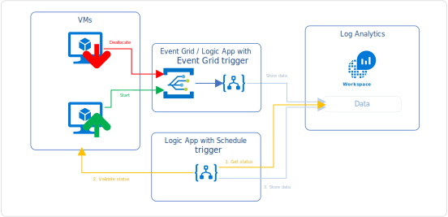
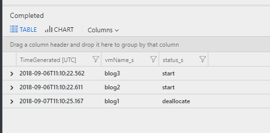
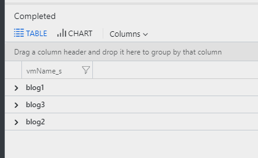
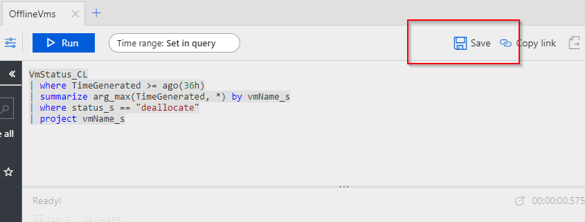
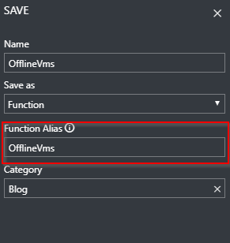

This problem is probably as old as there are monitoring tools on the market. **"How can I exclude legitimately deallocated VMs from alerting"** is a question that I've heard many times.

Where most monitoring tools such as System Center Operations Manager have tooling around the concept of maintenance mode where all alerts are suppressed for a duration of time; Azure Monitor has no provisions at this point.

This article series consisting of three articles walks through how to build a mechanism that automatically tracks VM events (start, deallocation) and provides this as a means to extend log based alerts with Azure Monitor and Log Analytics.

**This is the second part of a 3-post series:**

* 1/3: [Track VM state](__GHOST_URL__/excluding-deallocated-vms-from-availability-alerting-1o3/)
* 2/3: [Validate VM state](__GHOST_URL__/excluding-deallocated-vms-from-availability-alerting-2o3/)
* **3/3: [Alert rule excluding deallocated VMs](__GHOST_URL__/excluding-deallocated-vms-from-availability-alerting-3o3/)**

## Architecture

As lined out in the first post in this series, we need to consider the following requirements:

* Log Analytics data retention may affect the result if a VM is offline for longer than the retention.
* Data written to Log Analytics stays there until the retention has been reached. This means we need to cover a scenario where a VM is first deallocated and then started within the retention time of the workspace.

The overall design looks something like the following diagram:



The upper part describes how near-real time events that happen on VMs flow into Log Analytics so that this data within a reasonable timeframe (<= 5 minutes) available for querying.

The lower part takes care of the problem with the data retention of the workspace. A Logic App that runs on a schedule queries Log Analytics to get all the VMs that are currently in a deallocated state, validates that status against the actual state in Azure and updates the data. This makes sure that if a VM was deleted we do not carry over old data in our status table.

## Alert rule excluding deallocated VMs

The previous two articles focus on how to store the current VM state to Log Analytics and provide means to persist this state longer than the retention of Log Analytics. The data looks something like the following:



This article will concentrate on building a query which will ignore VMs that are currently deallocated and should not emit any alerts.

### Query

The magic of the exclusion lies in the query. Let's start by getting all VMs that are deallocated:

```
VmStatus_CL
| where TimeGenerated >= ago(36h)
| summarize arg_max(TimeGenerated, *) by vmName_s
| where status_s == "deallocate"
| project vmName_s 
```

I've selected a time windows of 36 hours as my Logic App that I created in the second part of this article series runs once a day and I want to make sure that all VMs are accounted for.

Now I have a list of VMs I can cross-reference:



Depending on your scenario the query to determine the health state of a VM might differ. I rely on the heartbeat data that is sent by the VM agent and signifies that both networking and OS are in working order:

```
Heartbeat
| summarize arg_max(TimeGenerated, *) by Computer
| where TimeGenerated < ago(5m)
```

This query selects the last event sent by the agent and will return that event if it is older than five minutes.

Now this needs to be correlated with the VMs that are currently not running:

```
let vms=VmStatus_CL
| where TimeGenerated >= ago(36h)
| summarize arg_max(TimeGenerated, *) by vmName_s
| where status_s == "deallocate"
| project vmName_s;

Heartbeat
| summarize arg_max(TimeGenerated, *) by Computer
| where TimeGenerated <= ago(5m)
| where Computer !in (vms)
```

I've used the [ `let` statement](https://docs.loganalytics.io/docs/Language-Reference/Query-statements/Let-statement) to build a table which contains all the VMs that are not running and filter the results of the heartbeat query against that. We can streamline this even more if we store the first part as a function.

Open up the Advanced Analytics portal and copy over the following query:

```
VmStatus_CL
| where TimeGenerated >= ago(36h)
| summarize arg_max(TimeGenerated, *) by vmName_s
| where status_s == "deallocate"
| project vmName_s
```

Hit *Save* in the top right corner and store it as a function, providing a function alias accordingly:




Once the function has been saved this simplifies the original query to the following:

```
Heartbeat
| summarize arg_max(TimeGenerated, *) by Computer
| where TimeGenerated <= ago(3m)
| where Computer !in (OfflineVms)
```

If you receive an error this means that the function was not registered yet. Give it a few moments for the function to fully propagate.

Armed with this query you can start building your alert rules. For guidance on how to do that, [follow the Azure documentation for creating an alert rule with the Azure Portal.](https://docs.microsoft.com/en-us/azure/monitoring-and-diagnostics/monitor-alerts-unified-usage#create-an-alert-rule-with-the-azure-portal)

## Conclusion

In this article series I've shown how to use Logic Apps to track the state of a VM when a status change occurs and keep track of that state over time. This article focused on building a query that can be used to exclude VMs that are deallocated from alerting.
