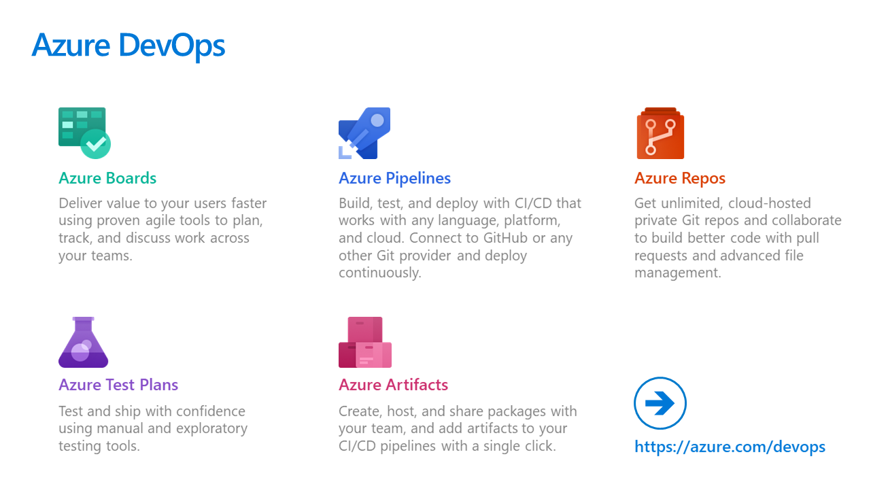
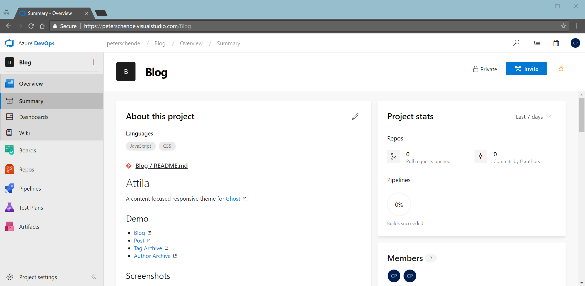

Yesterday Microsoft announced the evolution of DevOps. Or rather the evolution of DevOps tooling from Microsoft known as Visual Studio Team Services: Azure DevOps. 

Azure DevOps represents 15 years of engineering in services to help developers turn an idea into production code. Azure DevOps offers Pipelines, Boards, Artifacts, Repos and Test Plans to cover all aspects of modern software engineering.

Azure DevOps comes with a [major overhaul in the UI experience](https://blogs.msdn.microsoft.com/devops/2018/06/19/new-navigation/) that will be enabled by default for new projects. Existing projects continue to use the old UI unless this setting is explicitly set. The new experience will be enabled for existing users by default in the coming months.

[Open Source projects can now use Azure Pipelines as part of Azure DevOps for free CI/CD](https://azure.microsoft.com/pricing/details/devops/azure-pipelines/). Public projects can be used to fuel Open Source projects with committers around the world working on the same shared project.
