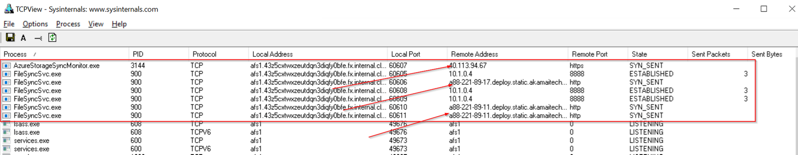
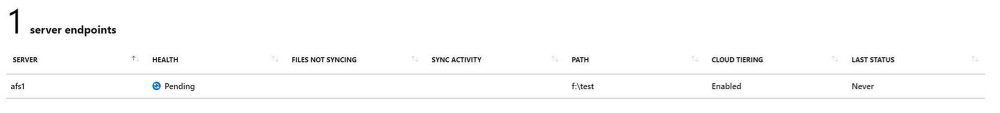
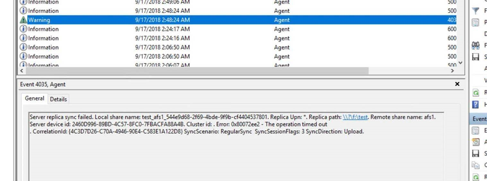
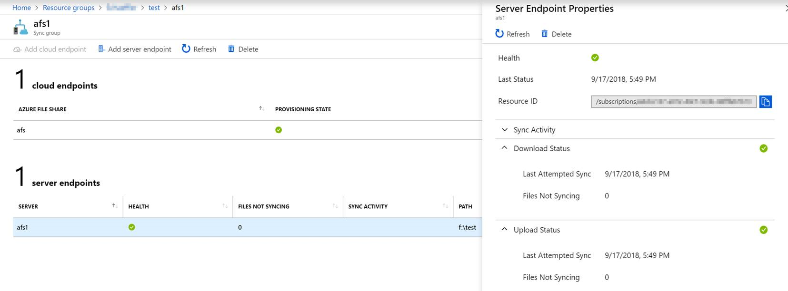

[Azure File Sync](https://docs.microsoft.com/en-us/azure/storage/files/storage-sync-files-planning) lets you tier data from on-premises systems to a cloud share based on Azure File. Local nodes can act as hot-caches, caching data based on access and modification patterns. Azure File Sync supports multi-master sync so that you can deploy those caches to multiple offices and replicate data across your organization.

Many organizations employ proxies to control egress traffic to the internet. Azure File Sync is pretty easy from a networking point of view as all connections are tunneled through HTTPS.

Still if you use proxies this needs to be taken into consideration and there is a **(big)** caveat. [Although Azure File Sync supports application specific proxy settings](https://docs.microsoft.com/en-us/azure/storage/files/storage-sync-files-firewall-and-proxy#proxy) (which can be set during setup of any node or later through PowerShell) this **is not applied to all connections and connections that are not proxy aware fail silently**.

This leads to a multitude of problems. Initial configuration can't be completed. Warnings are logged to the Event Log and the state of the Sync Group in the Azure Portal is stuck in **pending**.

In order to ensure that Azure File Sync is working correctly the proxy needs to be set server-wide. [Follow the instructions from the Azure File Sync deployment documentation](https://docs.microsoft.com/en-us/azure/storage/files/storage-sync-files-firewall-and-proxy#proxy) and make sure to follow the instructions to set the **machine-wide proxy**.

Once the steps have been completed all connections are going through the proxy and Azure File Sync starts working as intended.

