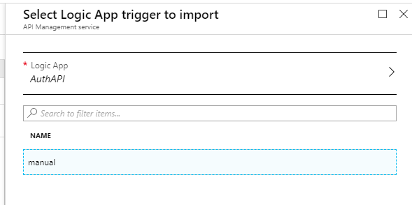

This is why my job is so much fun. I have been working with the CISO of a large retailer that operates multiple independent web portals (some with shopping functions enabled).

As the CISO his primary concern is security. And one of the first steps they are taking is to take a look at the authentication patterns that arrive at the individual user stores.

The team of the CISO is pretty small and they do not have the capacity to build a specialized application themselves. But not to worry: Azure provides the necessary building blocks to build the API, data store and reporting.

## Architecture

The overall architecture looks something like this:


The solution makes use of a few Azure components. API Management is used to provide the central ingest and authentication to incoming requests. This allows to later change the backbone architecture without having to modify the request path the client calls.

Incoming requests are taken up by a Logic App. The Request trigger is hidden behind the API Management facade and can be changed independently. In the first version of the solution the Logic App simply applies the appropriate formatting and stores the data in the data store.

We've opted to use Log Analytics as a data store. Log Analytics provides data storage and analytics with a SaaS model that does not require scaling or operations of the underlying infrastructure. Given the limited amount of resources the CISO has this is ideal for their needs. In terms of data retention Log Analytics can store the data for up to two years if required.

While dashboarding can be done with Log Analytics proper management reporting is a task better delegated to Power BI. This also enables aggregated reports that span longer than the retention of Log Analytics and reports can be sent offline and independent of access to the underlying data structures.

## Log Analytics

Let's start at the end and provision the Log Analytics workspace where the data received through the API will be stored. Make sure not to select `Free` as a pricing tier as this is the old pricing model and impacts data retention. With the `Per GB` pricing model [you'll receive 5 GB of ingested data free of charge](https://azure.microsoft.com/en-us/pricing/details/monitor/).


Once the workspace has been created we need to get the ID and the key so that we can store data to it from the Logic App. Open the workspace by clicking on the name and in the opening blade copy the workspace ID:


Then hit `Advanced settings` in the left pane:


And then copy the primary key for your workspace in the blade that opens:


Note the ID and the primary key somewhere as we need that later on for the configuration of the write action within the Logic App.

## Logic App

Now we create a Logic App that takes data from an incoming HTTP request and stores the data into Log Analytics.


Once the initial creation process has finished we can start adding triggers and actions to the Logic App. We can use the common trigger `When a HTTP request is received` to get started:


To make the trigger work and pass data along for processing we need to provide a JSON schema. The requirements for this scenario were pretty simple: in the first version the customer wanted to track the originating site and whether the authentication request was succesfull or failed. The leads to the following schema:

```json
{
    "type": "object",
    "properties": {
        "portalName": {
            "type": "string"
        },
        "loginStatus": {
            "type": "boolean"
        }
    }
}
```

Additionally we want to limit the possible request types to POST. The final configuration of the Request trigger looks like this:


Now that we have the data in our Logic App pipeline the next step is to write them to Log Analytics. The HTTP Data Collector interface allows to store arbitrary data to Log Analytics (as long as it is key/value based and in JSON). Fortunately there is a Logic App connector available that we can use. Add the `Send Data (preview)` action to the Logic App:


For this action to work you need to connect it to your previously created workspace. Pull out the workspace ID and primary key that you've noted elsewhere and add them to the connection settings for the action:


Once the connection has been created we can configure the action. We simply pass a JSON body and the log name (table in Log Analytics). As the customer wants to segregate data between the portals the table is the name of the portal. The JSON body is created from the parameters we have received through the HTTP request.

One caveat we've found out during testing: The Request trigger will convert the property `loginStatus` to a boolean internally. The string representation for said property is either `True` or `False` (note the capital first letter). The HTTP Data Collector expects boolean to be either `true` or `false` (lower case first letter). This means we need to apply logic to convert the string to lower case characters. The expression to do that looks like this: `toLower(string(triggerBody()['loginStatus']))`

The final configuration for this action looks similar to the following screenshot:


## API Management

Now the final piece. Let's go ahead and create an instance of API Management. Make sure to select a pricing tier that fits your expected traffic. [You can start small and scale later depending on your needs](https://docs.microsoft.com/en-us/azure/api-management/upgrade-and-scale).


As for the configuration of the API Management instance this article will be limited to the actual configuration required to make the API work. API Management offers a wide range of possibilities that would exceed the the bounds of this article.

Once the instance has been created proceed to create a new API. From the overview blade of the API Management instance select `APIs` from the left action pane:


Although there is a template available that lets you create an API definition for a Logic App, I'm going through the steps manually to exert more control what settings and policies are applied to the API.

Start the process by seleting `Add API` on the left action pane:


Select `Blank API` to start with an empty API definition:


In the dialog that opens select `Full` to see all available options for that API. Then specify the options you need for your API. I recommend to add an URL suffix and turn on versioning. Versioning will help you later to manage new releases of the API while providing backward-compatibility to the users. The final configuration looks something like the following:


Now we can create the first operation that our API provides. For this use-case the API will only have one operation but that may change later on. Select `Add operation` from the left hand side action panel:


Give that operation a name, set the request type to `POST` and provide a URL. I have used telemetry in this case. Combined with the API suffix and versioning this will result in a URL akin to `https://blogpeterschende.azure-api.net/auth/v1/telemetry` .


Select the responses tab on the bottom of the screen and add a `200 OK` response status code:


Hit save to create the operation. Once the operation has been saved, give a few moments as some background work needs to be done. Refresh and then we can configure the backend system (our Logic App). Hit the edit button for the backend:


Select `Azure resource` , hit `Browse` and select the Logic App that we have previously created:

Select **Azure resource** and then **Browse**



Finish the configuration by clicking on `Save` . Once the configuration has been saved, the configuration for inbound processing of the API has automatically been amended by all kinds of rewrites and parameters that are required for the Logic App to function properly:


We are almost done. The last thing that we need is to add the API to a product. This is how APIs are surfaced to developers. [More information about products can be found in the API Management documentation](https://docs.microsoft.com/en-us/azure/api-management/api-management-key-concepts#a-nameproducts-a-products). Open the API settings by selecting `Settings` on the top of the API definition:


Add the desired products to the `Products` property of the API definition. By default API Management comes with two products called `Starter` and `Unlimited` .


Once products are added hit save and it is time to test the API

## Testing

There are multiple ways to test the API. You can use remote tooling such as [Postman](https://www.getpostman.com/), command-line utilities such as PowerShell or cURL. API Management offers a very convenient test function built-in to the definition experience of the API. 

Hit the `Test` tab in the API definition to open the test console. On the left side you can see all operation that this API supports. and on the right side you can configure the request itself. To successfully test our API we need to add a header `Content-Type` with the value `application/json` to indicate to the backend (our Logic App) that we are sending JSON data. In addition we need to add the JSON data structure with the same schema that we have defined in the Logic App:

```json
{
    "portalName": "blogpeterschende",
    "loginStatus": "true"
}
```

That's it. Hit send and check if it works.


The rest result should look something like this:


## Conclusion

Once the test was successful data will pop up in Log Analytics:


With data in place and a little query magic we can produce a graph that gives us the ration of failed authentication requests to total authentication requests:

```
let timeRange=7d;
let binInterval=5m;
blogpeterschende_CL
| where TimeGenerated >= ago(timeRange)
| summarize TotalRequests=count() by bin(TimeGenerated, binInterval)
| join kind=fullouter (
    blogpeterschende_CL
    | where TimeGenerated >= ago(timeRange)
    | where loginStatus_b == false
    | summarize FailedRequests=count() by bin(TimeGenerated, binInterval)
) on TimeGenerated
| project TimeGenerated, TotalRequests, FailedRequests=iif(FailedRequests > 0, FailedRequests, 0)
| project TimeGenerated, FailureRatio = todouble(FailedRequests) / todouble(TotalRequests) * 100
| render timechart
```

This lets us render nice graphs for close monitoring:


Of course now we can apply active monitoring with alerting and management reporting with Power BI based on this data.
