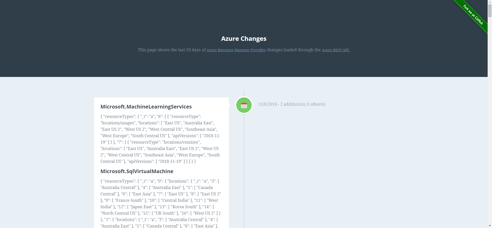

A colleague of mine, [Tyler Ayers](https://github.com/tyayers), has written a pretty neat [Azure Function that tracks changes made to Azure Resource Manager Providers (ARM) and show these changes in a timeline](https://azure-changes.azurewebsites.net/). 

The details will give you a clear overview what has been changed and where (which region) that change is available. This helps to see changes to resource providers and adapt existing ARM templates if required.

