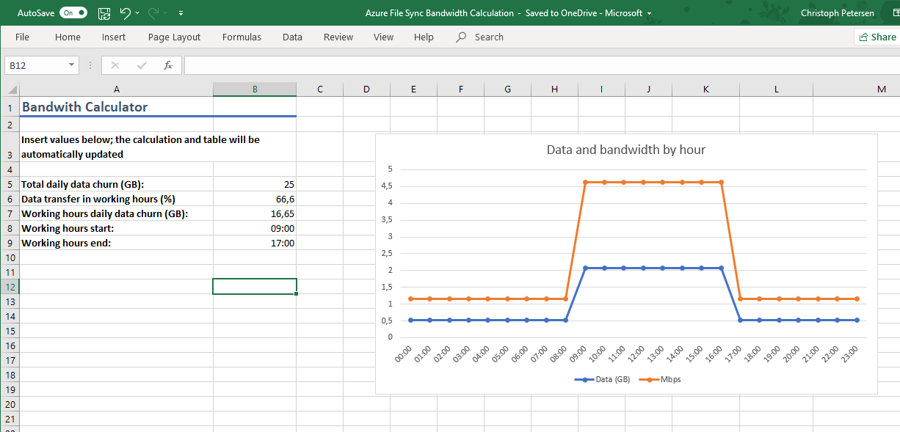

When deploying Azure File Sync one question many customers routinely ask is how the network bandwidth required can be calculated. This depends of course on a variety of factors.

The most prominent factor is churn rate. How much data is changed over time. It is best to look at this rate with an hourly resolution so that seasonality can be accounted for (user-centric shares will have much more churn throughout working hours).

One other question that needs to be answered is sync time: would it be okay if data is not directly synced as the line is saturated or does data needs to be synced immediately? This question is also important when defining throttling limits.

With these parameters at hand you can build a simple calculator that spits out the required bandwidth to transfer data directly.

Event better: I have built that calculator for you. As most customers do not have churn data based on hourly measurements the calculator takes a parameter for the distribution of data for the working hours pre-set to ~66.6%.

[Download Azure File Sync bandwidth calculator.xlsx](https://blogpterschende.blob.core.windows.net/uploads/Azure%20File%20Sync%20bandwidth%20calculator.xlsx).
