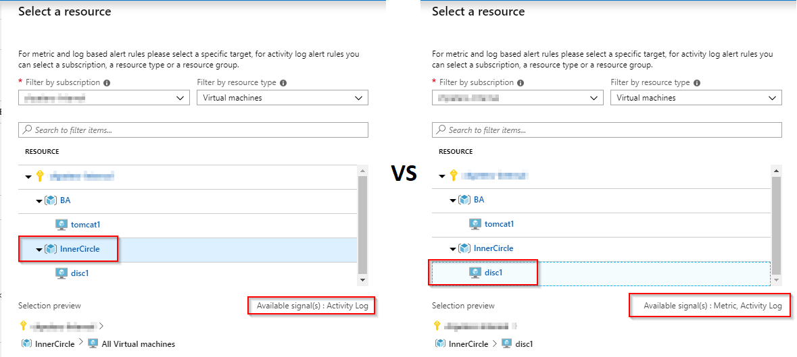
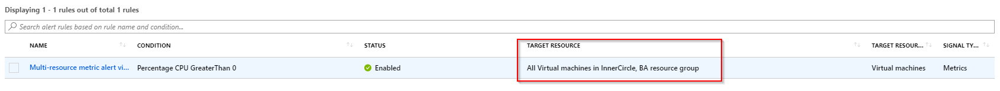

In most enterprise environments governance dictates how alerting for a certain resource needs to look like. Until just recently Azure Monitor only supported to configure alerts based on individual resources and this had to be replicated throughout the organization.



Duplication of alert rules requires continued effort to maintain correct alert rules and ensure that all necessary alerting is configured for each project.

Until now. Microsoft recently exposed the REST API to configure alerts for Resource Group scopes. This has not yet surfaced in the UX but that is simply a matter of time before that will be added. To make use of creating alerts at scale today, you can use an ARM template (**the following is an excerpt from the full template**):

```json
{
    "name": "[parameters('alertName')]",
    "type": "Microsoft.Insights/metricAlerts",
    "location": "global",
    "apiVersion": "2018-03-01",
    "tags": {},
    "properties": {
        "description": "[parameters('alertDescription')]",
        "severity": "[parameters('alertSeverity')]",
        "enabled": "[parameters('isEnabled')]",
        "scopes": "[parameters('targetResourceGroup')]",
        "targetResourceType": "[parameters('targetResourceType')]",
        "targetResourceRegion": "[parameters('targetResourceRegion')]",
        "evaluationFrequency": "[parameters('evaluationFrequency')]",
        "windowSize": "[parameters('windowSize')]",
        "criteria": {
            "odata.type": "Microsoft.Azure.Monitor.MultipleResourceMultipleMetricCriteria",
            "allOf": [
                {
                    "name": "1st criterion",
                    "metricName": "[parameters('metricName')]",
                    "dimensions": [],
                    "operator": "[parameters('operator')]",
                    "threshold": "[parameters('threshold')]",
                    "timeAggregation": "[parameters('timeAggregation')]"
                }
            ]
        },
        "actions": [
            {
                "actionGroupId": "[parameters('actionGroupId')]"
            }
        ]
    }
}
```

[The product group has published the full template to the documentation for your reference.](https://docs.microsoft.com/en-us/azure/azure-monitor/platform/alerts-metric-create-templates#template-for-metric-alert-that-monitors-multiple-resources)

Once deployed this will affect the rule to all resources in the specified resource groups:


