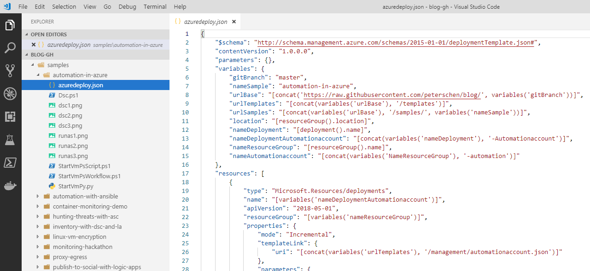
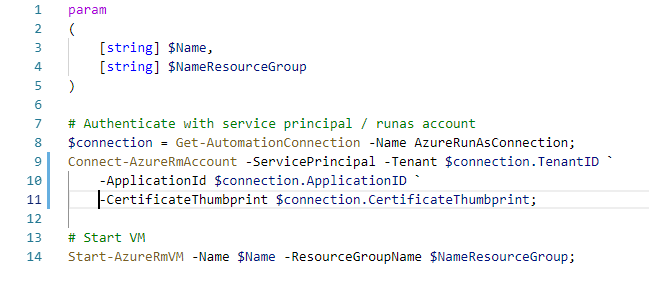
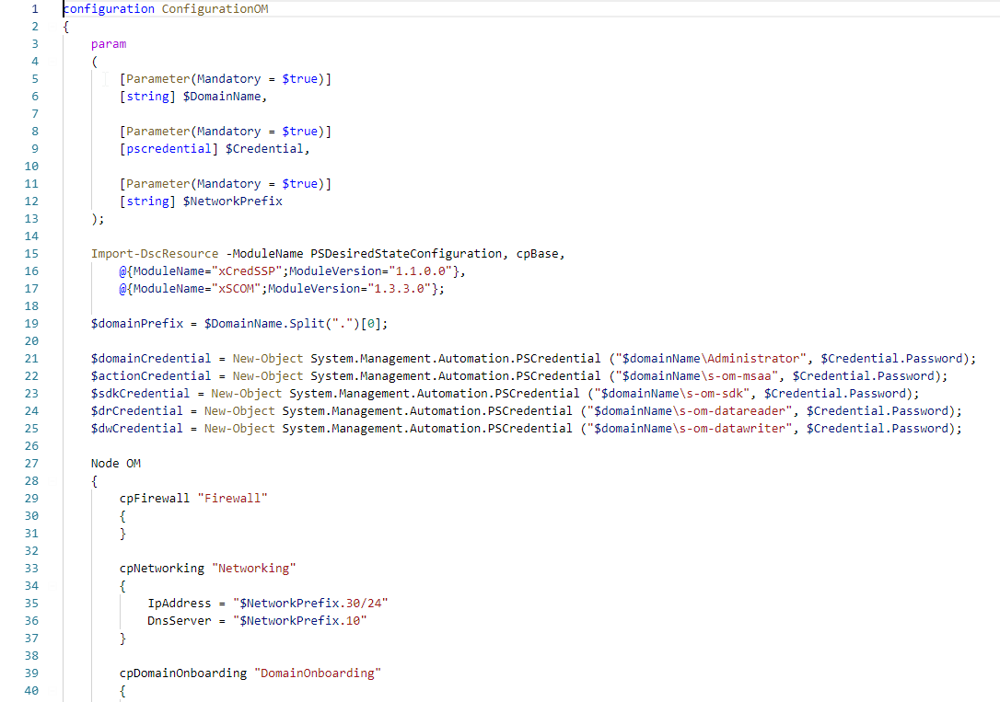
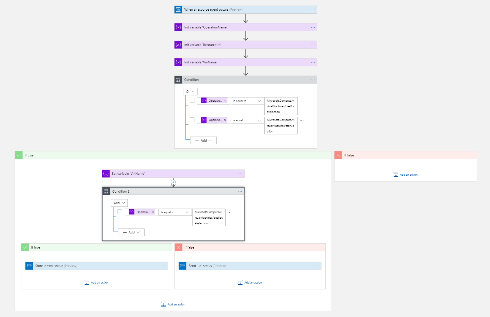

Deploying resources and workloads at scale requires a healthy amount of automation. Automation helps to deliver consistent and repeatable results. I've tried to categorize some of the technology and provide some pointers to areas of application and pros and cons.

**Note:** this is not an exhaustive list but tries to cover a range of technologies.

## TL; DR

The following sections provide an overview of automation technologies that are available on Azure or can be used to automate Azure. I have bundled some of the samples in a [ARM template that is published on GitHub](https://github.com/peterschen/blog/tree/master/azure/samples/automation-in-azure).

## Infrastructure

This category describes technologies that can be used for infrastructure deployments. 

* Scripting ([Azure CLI](https://docs.microsoft.com/en-us/cli/azure/?view=azure-cli-latest), [Azure PowerShell](https://docs.microsoft.com/en-us/powershell/azure/overview?view=azps-1.0.0), [REST](https://docs.microsoft.com/en-us/rest/api/azure/))
* Templates ([Azure Resource Manager (ARM) Templates](https://docs.microsoft.com/en-us/azure/azure-resource-manager/resource-group-authoring-templates), [Terraform](https://www.terraform.io/docs/providers/azurerm))

### Scripting

Deploying resources through scripts is a powerful way as every aspect can be coded individually.

One of the disadvantages is that if you want to achieve idempotency this has to be explicitly accounted for which adds a lot of overhead to the script. In most cases (especially in complex scripts) the resulting infrastructure configuration is not declarative. Furthermore, dependencies have to be managed manually.

**Recommendation: **I'd recommend to use scripts in scenarios where templates can't be used (specific configuration, deployments where coding is required, options that can be only set through scripts, ...). If scripts are required you should check if you can combine them with templates (deploy templates first and run scripts with specific configuration afterwards).

### Templates

Templates contain a declarative representation of the infrastructure configuration regardless of the employed technology. They represent a coherent deployment and provide idempotency. [Dependencies are managed automatically by the template](https://docs.microsoft.com/en-us/azure/azure-resource-manager/resource-group-define-dependencies).

Template deployments also provide some kind of state management. For ARM templates state is managed implicitly in the platform; Terraform manages state either [local ](https://www.terraform.io/docs/state/index.html)or [remote](https://www.terraform.io/docs/state/remote.html).

Templates can easily become complex and harder to maintain. There are strategies (splitting/linking templates) but this still imposes additional complexity. On the other hand this allows to re-use template components.

**Recommendation: **I recommend to prefer template deployments over sequential scripting. Templates present a coherent collection of resources, idempotency and state management. They are more easily readable as compared to scripts and declaratively describe the resulting configuration.

## Workload

In most cases infrastructure is not deployed because it's cool but because there is a business need to run some kind of solution or workload. When infrastructure has been deployed; apps and workload components need to be deployed and setup.

* Scripting (PowerShell Remoting, SSH)
* Runbooks (Azure Automation)
* Desired State Configuration (PowerShell DSC, Azure Automation DSC, Ansible, Chef, Puppet)

### Scripting

Scripting is a very powerful method of installing and configuring workloads. The challenge with scripting is to find an execution platform (where is the origin of the script execution) and how to reach the target system. The target system might be behind a firewall or a private network that can't be reached over the internet or the authentication provider is just available from the closed network. 

Another challenge you are facing when using scripting is the idempotency. This can be accounted for when writing scripts but adds complexity and required effort.

**Recommendation:** Employing script-based workload automation where is a tough choice. In most scenarios I'd recommend against it unless you have a defined execution platform and the target systems are reachable.

### Runbooks

Runbooks (especially managed solutions such as Azure Automation) solve the problem of finding the execution platform as they provide a managed environment for executing scripts.

Runbooks can be triggered on a schedule and can also be associated with a webhook to trigger them remotely which increases the versatility of runbooks.

**Recommendation:** Runbooks could of course be used for workload automation. Similar to scripts the target system needs to be reachable. Idempotency needs to be implemented manually.

### Desired State Configuration

With desired state configuration the target state of a system is described. The tooling then uses means to ensure that this state is reached. There are multiple implementations available: PowerShell DSC, Azure Automation DSC (managed PowerShell DSC pull server), Ansible, Chef, Puppet.

They differ in their philosophy: Ansible is push only (configuration is kept on a system and actively set from the outside to target systems) whereas PowerShell DSC also supports pull (the system periodically checks a repository if new configuration is available).

One of the big advantages using DSC is the declarative configuration that can be easily understood. Most DSC systems support idempotency and will correct configuration drift. Furthermore, dependencies can be managed across systems and resource configuration be delayed until other components have been provisioned.

**Recommendation:** I prefer using DSC over scripting or runbooks when deploying workloads. With idempotency, drift correction and cross-node dependencies DSC is the ideal tool to automate complex workload deployments.

## Integration

Last but not least in most scenarios there is the need to connect components together. I have categorized this as integration automation.

* Runbooks (Azure Automation)
* Serverless (Azure Functions, Azure Logic Apps)

### Runbooks

Runbooks is an excellent tool to provide integration between components. Azure Automation even allows to run scripts on-premises through the Hybrid runbook worker. This allows to automate traditional IT systems such as VMware or integrate with components that are located within the corporate network.

Runbooks also provide a neat way to periodically run against a set of resources to ensure a certain state or collect telemetry (totally constructed example: collect current active remote session on Linux hosts) and provide this data to other systems.

**Recommendation:** I'd use runbooks to automate recurring tasks that collect telemetry or set state to resources that require a high degree of customization or specialized commands.

### Serverless

This is a very interesting category with Azure Functions and Logic Apps. Functions are in essence code that run in a managed environment. They require coding skills and specific knowledge of the APIs they interact with. On the other hand this allows to write highly efficient and specific integrations between components. A good example can be a service that creates thumbnails of images that are uploaded to a storage account. 

Logic Apps on the other hand require (almost) no coding skills. Processes can be implemented by chaining triggers, actions and workflow controls. There are already many integrations to prominent systems available that allow quick integration across a variety of components. In many cases when integrating components the output of one needs to be adapted to the input of the other; [Logic Apps provide integrated expressions](https://docs.microsoft.com/en-us/azure/logic-apps/workflow-definition-language-functions-reference#functions-in-expressions) to do [string manipulations](https://docs.microsoft.com/en-us/azure/logic-apps/workflow-definition-language-functions-reference) among many others.

**Recommendation:** If low-level access to APIs or the underlying runtime is required, Azure Functions is the tool of choice. If the task at hand is to forward input of one component to another Logic Apps can absolutely used for the task. Even [more complex scenarios can be automated by using Logic Apps](https://docs.microsoft.com/en-us/azure/logic-apps/logic-apps-examples-and-scenarios).
