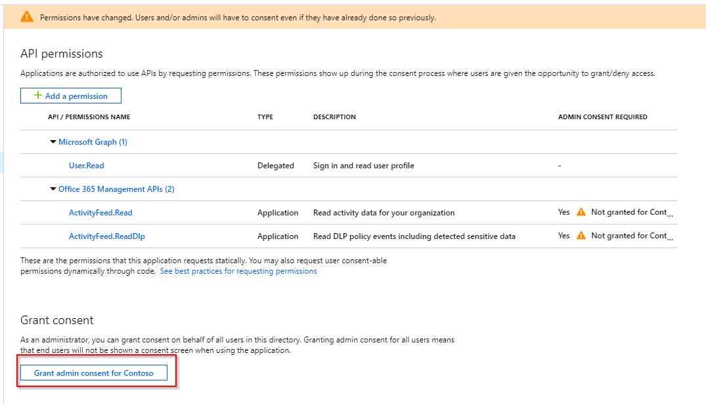
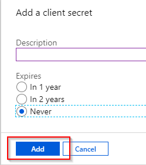
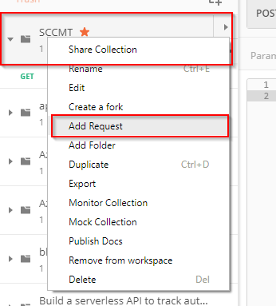

The data available through the Office 365 Security & Compliance Center contains data for all entities stored in that particular Office 365 / Azure Active Directory tenant.

Many customers have different business entities that work with the same tenant but have roles within their subordinate companies that needs to access or ingest the compliance pertaining to their entity. 

This is something that today is not possible with the Security & Compliance center and the data has to be processed and split manually. Luckily the data is available for consumption through the [Office 365 Management APIs](https://docs.microsoft.com/en-us/office/office-365-management-api/office-365-management-apis-overview).

**This is the first part of a 2-post series on how to retrieve and process the data:**

* 1/2: [Subscribe to data](/office-365-security-compliance-multi-tenancy-1o2/)
* 2/2: [Process data](/office-365-security-compliance-multi-tenancy-2o2)

In this article I walk through the process of subscribing to Office 365 Management API data, consuming it with a Logic App and storing it in a Storage Queue.

## Architecture

For the architecture we need to take a few requirements into consideration:

* Depending on the business entity they might use their own SIEM system and want to ingest data there. We need to provide a way for them to just ingest the data pertaining to that entity.
* If a business entity does not use its own SIEM solution the data is send to a custom log in a Log Analytics workspace.
* The solution needs to be scalable, serverless and easily maintainable

The overall solution design is pictured in the following diagram:


The Office 365 Management API creates subscriptions for the workloads that a user is interested in. This subscription supports webhooks. Instead of polling the API at regular intervals the API calls a webhook. For convenience this endpoint is a Logic App in my solution design.

The payload of the webhook just carries a reference to a content URI. That URI is put on a Storage Queue and a Function with a Queue trigger listens for new items in the queue.  The function retrieves the content, identifies the business entity and decides based on its configuration if the data should go to Log Analytics or a custom Storage Queue for individual consumption.

## App registration (a.k.a. service principal)

Before we can actually subscribe to the Office 365 Management API, we need to create a Service Principle. We use it to authenticate against Azure Active Directory to obtain a Bearer token which grants access to the Office 365 Management API.

Select *Azure Active Directory > App registrations (Preview) > New registration* within the Azure portal:


Provide a name for this application and hit *Register*:


Once the application has been created, make a note of the *Application ID* and the *Directory ID*. These are also referred to as *client id* and *tenant 
id* and will be required later when we authenticate with this service principal. Then select *View API Permissions*:


Select *Add a permission*:


This will allow you to add additional permissions to this application. You can chose between APIs that are Microsoft owned, organizational APIs and APIs you own yourself. Select *Office 365 Management APIs:*


There are two options on how to assign permissions to an application. Either they can be delegated or for application usage. Select *Application permissions*, then under the category *ActivityFeed* the two options *ActivityFeed. Read* and *ActivityFeed. ReadDlp*. The first permission grants this application access to read the activity feed but not (possibly sensitive) data loss prevention related data. The second permission allows the application to read the data loss prevention data:


Now an administrator needs to consent that this application is actually allowed to access this data. This is to ensure that only users with the correct permissions can create applications that may access sensitive data. Hit *Grant admin consent for <Organization>*:



With the permissions set, we need to create a password (or certificate) so that we can actually authenticate this application against Azure Active Directory. Select *Certificates & secrets* then *New client secret*:


Select the lifetime of that secret and click *Add*:



Once the secret has been created it is shown in the list. The secret will only be shown during this session - as soon as the page is refreshed it will no longer be visible on this page. Make a note of the secret (or better yet, store it in a password safe):


## Logic App handling Office 365 Management APIs webhooks

Before we start diving into the Office 365 Management APIs we create the Logic App that will respond to the webhooks initiated by the Office 365 Management APIs. The Logic App in this example is very simple. The following screenshot shows the complete implementation:


But let's take it step by step and break down the components we need to address:

* When creating a subscription in Office 365 Management APIs there will be a validation request against the endpoint
* When content is available the Office 365 Management APIs will do a POST with a JSON payload against the endpoint
* The endpoint should answer with a HTTP 200 return code in case of sucess

The validation request is simply to check if the endpoint responds. There is no further process needed. But we should make sure that nothing is put on the Queue that is not a content URI so that our processing will not break later.

Create a new Logic App and then select the *When a HTTP request is received* template:


### Trigger

The template already places the required trigger into the Logic App. We need to configure it. Add the following JSON schema to the trigger:

```json
{
    "items": {
        "properties": {
            "clientId": {
                "type": "string"
            },
            "contentCreated": {
                "type": "string"
            },
            "contentExpiration": {
                "type": "string"
            },
            "contentId": {
                "type": "string"
            },
            "contentType": {
                "type": "string"
            },
            "contentUri": {
                "type": "string"
            },
            "tenantId": {
                "type": "string"
            }
        },
        "required": [
            "tenantId",
            "clientId",
            "contentType",
            "contentId",
            "contentUri",
            "contentCreated",
            "contentExpiration"
        ],
        "type": "object"
    },
    "type": "array"
}
```

This is the content that is sent by the Office 365 Management APIs when new content is available.

Hit *Save* and copy the *POST URL* for this trigger. We need this later when we create Office 365 Management API subscriptions:


### Filter validation requests

The Office 365 Management APIs will perform a validation request when the subscription for a workload is created. We need to filter this request so that it does not end up on the Queue.

Add a *Condition *controlactivity to the Logic App:


For the first condition to check add the following expression: `indexOf(string(triggerBody()), 'validationCode')` :


Complete the condition by setting the value to `-1` :


### Queue messages

For non-validation requests we need to put the content URI on the Queue. Within the *If true* branch of the condition add *Put a message on a queue* activity:


Then you need to create a storage account connection so that the Logic App knows to which Storage Account the data should go. Provide a name and select a Storage Account from the list or enter the connection details manually:


Select a existing Queue in that Storage Account and then for the *Message* property select *contentUri* from the dynamic content publish by the trigger:


Once you've selected *contentUri* the Logic App will create a *For each* container around the activity as there might be more than one item in the data set:


### Responses

The final step is to return the proper status code depending on the outcome of the previous action. 

Add a *Response* activity to the canvas:


Keep the settings as they are. This activity will return a 200 HTTP status code when the previous activity completed successfully (default behavior of all activties):


On the connection between *Condition* and *Response* select *Add a parallel branch*:


Add another *Response* activity:

Add another *Response *activity to the canvas

Change the *Status Code* property to 500, then select the ellipsis (...) and select *Configure run after*:


Change the *Run after configuration *for this activity to only run in case the previous acitvity (*Condition)* has failed or has timed out:


## Create Office 365 Management API subscriptions

To create the subscriptions for Office 365 Management APIs I'll use [Postman](https://www.getpostman.com/). You could also use PowerShell with `Invoke-WebRequest` or some other tooling.

Create a new C*ollection *for all the requests against the Office 365 Management API:


Give the collection a name then select the *Variables* tab and create the following variables (with the values from your environment of course):


### Login request

Once the collection is created, hit the ellipsis menu (...) and select *Add Request*:


Name that request *Login* and hit *Save to <collection>*:


Change the request type to *POST *and add the following request URL: `https://login.windows.net/{{tenantDomain}}/oauth2/token?api-version=1.0` :


Select the *Body* tab change the type to *form-data* and add the parameters the following parameters:

* Key: `grant_type`\
Value: `client_credentials`

* Key: `resource`\
Value: `https://manage.office.com`

* Key: `client_id`\
Value: `{{clientId}}`

* Key: `client_secret`\
Value: `{{clientSecret}}`


Finally switch to the *Tests* tab. This is JavaScript based code that is run after the request has completed to be able to test or post-process the result. This is exactly what we are doing now.

Add the following code to the tests ([shamelessly stolen from the Postman blog](https://blog.getpostman.com/2014/01/27/extracting-data-from-responses-and-chaining-requests/)):

```js
let response = pm.response.json();
let token = response.access_token;
pm.globals.set("token", token);
```


Time to test. Hit *Send* and then you should see a reply similar to this:


With the code added to the test, the token received from Azure Active Directory is stored as an environment variable and we can now create subsequent requests using this token. 

### Start subscription

Add another request by right-clicking your collection and selecting *Add Request*:



Save the request as *Start subscription* and select *Save to <collection>*:


Change the request type to *POST *and add the following request URL: `https://manage.office.com/api/v1.0/{{tenantId}}/activity/feed/subscriptions/start?contentType=Audit. AzureActiveDirectory&PublisherIdentifier={{tenantId}}` :


Switch to the *Authorization* tab, change the *Type *to *Bearer Token* and set the token value to `{{token}}` . This value will automatically be provided by Postman once you have executed the login request created earlier.

**Note:** Bearer tokens have a limited lifetime. If you get a 403 Forbidden reply be sure to fetch a new token by executing the login request.


Finally set the body to include the URL for the webhook to the following snippet:

```json
{
    "webhook" : {
        "address": "<URL noted earlier (see Logic App trigger)>",
        "authId": "SCCMT",
        "expiration": ""
    }
}
```

Set the type to *raw* and the select *JSON (application/json)* as the content-type:


Hit *Send* and you should see something the following reply:


[The Office 365 Management API supports different workloads](https://docs.microsoft.com/en-us/office/office-365-management-api/office-365-management-activity-api-reference#working-with-the-office-365-management-activity-api) which need to be subscribed to individually. You can re-use the same request by changin the `contentType` parameter on the *Params* tab:


## Conclusion

We have successfully built a mechanism that receives data from the Office 365 Management APIs and puts it on a Queue. This can be confirmed by checking the Queue:


In the next installment of this series I'll lay out the setup and configuration of a Function that processes the Queue.
