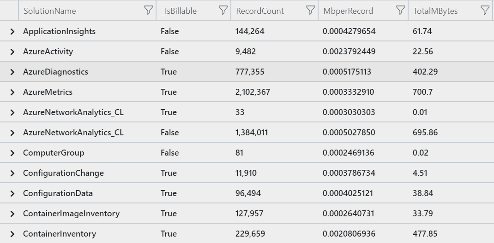

[A while ago I wrote an article on how to estimate data consumption for Log Analytics.](/data-volume-estimation-for-log-analytics/) Since then there were changes to the way that Log Analytics tracks the volume and the cost associated with data flowing into the workspace. 

The d[ocumentation on standard properties in Log Analytics records](https://docs.microsoft.com/en-us/azure/azure-monitor/platform/log-standard-properties) now lists two new attributes that are of interest: `_isBillable` and `_BilledSize`.

[Clive Watson](https://social.msdn.microsoft.com/profile/CliveW) went out and built queries that are very handy to answer questions that are commonly asked such as *Which solution is free?* or *How much data is stored for a certain solution?* or even *How much data are my Network Security Groups generating?* [I recommend to take a look at his blog post to easily answer these questions.](https://blogs.msdn.microsoft.com/ukhybridcloud/2019/02/08/azure-log-analytics-looking-at-data-and-costs/)

In my original post I built a query that presents the data volume by solution. With the changes made this query now looks as follows:

```
let daystoSearch = 1d;
union withsource = tt *
| where TimeGenerated > ago(daystoSearch)
| summarize 
    RecordCount=count(),
    MbperRecord = round(sum(_BilledSize / 1024 / 1024) / count(), 4),
    TotalMBytes= round(sum(_BilledSize / 1024 / 1024), 2)
by SolutionName = tt, _IsBillable
| sort by SolutionName asc
```

[Take that query for a spin in the Log Analytics playground](https://portal.loganalytics.io/Demo?q=H4sIAAAAAAAAA%2FNNKkgtCkpNzi9KUbBVKMovzUvRKC7N1Yh3yszJSU0JzqxKVdBXMDQwMoFSmkA6GaisRENTR8FEUwcAvpREx0EAAAA%3D&amp;timespan=P1D), and you'll get something like the following:


