The data available through the Office 365 Security & Compliance Center contains data for all entities stored in that particular Office 365 / Azure Active Directory tenant.

Many customers have different business entities that work with the same tenant but have roles within their subordinate companies that needs to access or ingest the compliance pertaining to their entity.

This is something that today is not possible with the Security & Compliance center and the data has to be processed and split manually. Luckily the data is available for consumption through the [Office 365 Management APIs](https://docs.microsoft.com/en-us/office/office-365-management-api/office-365-management-apis-overview).

**This is second and final part of a 2-post series on how to retrieve and process the data:**

- 1/2: [Subscribe to data](/office-365-security-compliance-multi-tenancy-1o2/)
- **2/2: Process data**

In this article I walk through the process of creating a function that processes the previously queued items.

## Architecture

As outlined in the first part in this series, the following design considerations need to be made:

- Depending on the business entity they might use their own SIEM system and want to ingest data there. We need to provide a way for them to just ingest the data pertaining to that entity.
- If a business entity does not use its own SIEM solution the data is send to a custom log in a Log Analytics workspace.
- The solution needs to be scalable, serverless and easily maintainable

The overall solution design is depicted in the following diagram:

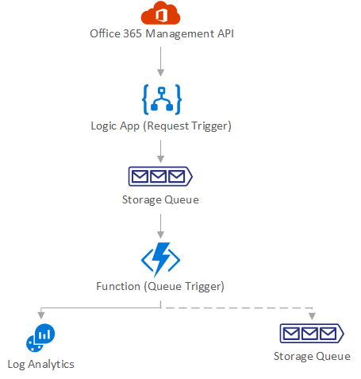

## Prepare resources

Before we build out the function create some required resources:

- Log Analytics workspace to store data for business units that are not using their own SIEM
- Storage accounts and queues for business units that are using their own SIEM

Create the resources and copy the ID/key for Log Analytics and the connection strings for the storage accounts. We need those later on. Refer do the respective documentation on how to create the resources.

## Function App

I've opted to use a Function App with a queue trigger that acts when new items are put on the queue. 

In the Azure portal go to *Create a resource,* Type in `function app` and select *Function App* and hit *Create:*

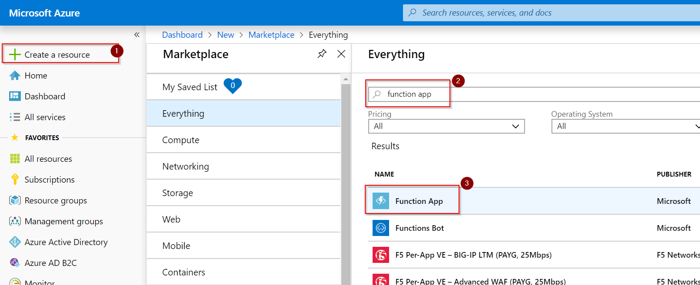

Give the new function a name and hit *Create*:

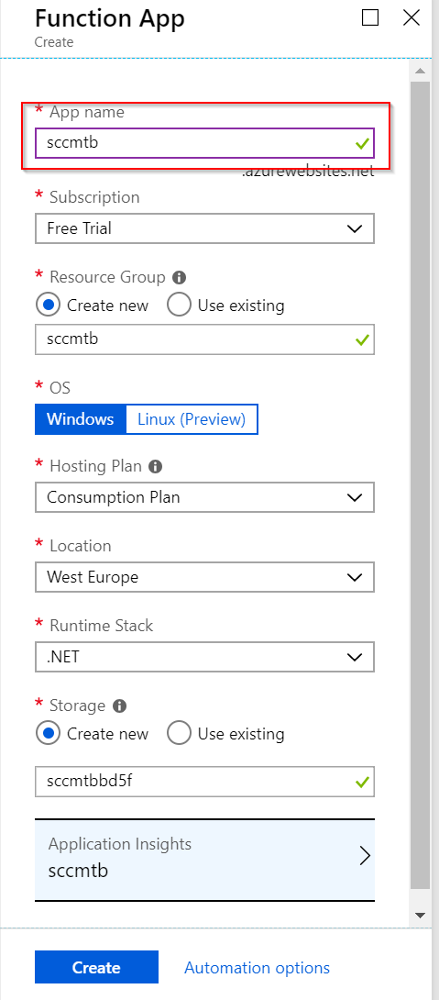

Deployment of the new Function App will take a few minutes. Once deployment has finished you can create the actual function.

Navigate to *All services,* Type in `function apps` and select *Function Apps*:

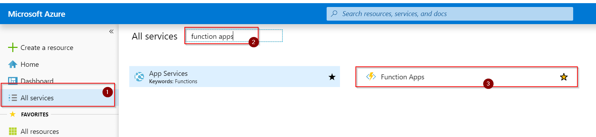

Before we create the first function though, we need to configure some settings. As a best practice we do not want to store credentials or settings in code but want to make it configurable from the outside. Within a Function App this is done by specifying application properties that are then exposed as process specific environmental variables to the function. 

We need to store a few parameters that will get used during runtime:

- Storage account the function is bound to
- Credentials to access Office 365 Management APIs
- Log Analytics credentials (workspace ID and key)
- Storage configuration for business units that have their own SIEM

Let's explain some of these settings. The function will get triggered on data that is stored in the queue. We need to tell the function which storage account to listen to and pass along the credentials to access that storage account.

The queue item itself is just a URI reference to the actual content within the Office 365 Management APIs. To retrieve the content we need to first authenticate against Azure Active Directory. In the first part of this blog series we created a service principal (or App Registration) and we can re-use that or create a new one to exert more granular control. 

When the content is retrieved we need to decide based on the user object with which business unit this record is associated. We simply take the domain part of the UPN, remove all special characters and check if there is a configuration for that business unit. If there is no configuration set the record is written to Log Analytics otherwise the record is put on a queue for processing within that business unit.

Let's get started by creating the necessary settings. Select *Application settings* from the overview page:

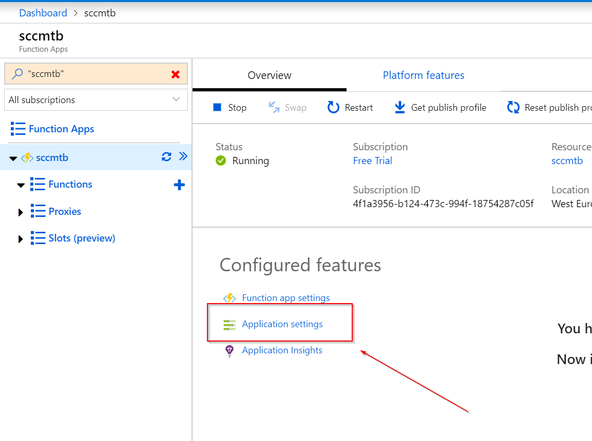

Scroll down to the *Application Settings* section and add the following settings:

- Name: `SCCMT_STORAGE`\
Value: *Connection string to storage account created in part one of this series*
- Name: `SCCMT_TENANTID`\
Value: *Tenant ID for service principal from part one of this series*
- Name: `SCCMT_CLIENTID`\
Value: *Application ID for service principal from part one of this series*
- Name: `SCCMT_CLIENTSECRET`\
Value: *Secret for service principal from part one of this series*
- Name: `PROCESSOR_LOGANALYTICSID`\
Value: *Workspace ID of Log Analytics workspace created earlier*
- Name: `PROCESSOR_LOGANALYTICSKEY`\
Value: *Workspace key of Log Analytics workspace created earlier*
- (optional)\
Name: `PROCESSOR_TARGETACCOUNT_<domain>`\
Value: *Connection string to the storage account used by the business unit identified by `<domain>`*\
(make sure to remove any special chars from the domain name e.g. blogpeterschende)
- (optional)\
Name: `PROCESSOR_TARGETQUEUE_<domain>`\
Value: *Name of the queue used by the business unit identified by `<domain>`*\
(make sure to remove any special chars from the domain name e.g. blogpeterschende)

This was all the hard work. Now we can create the function and get started.

Hit the *+* sign to create a new function within this Function App instance:

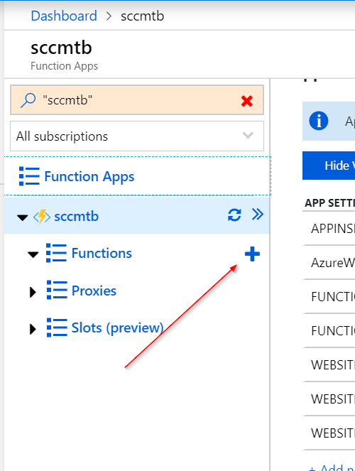

Select *In-portal *and hit *Continue:*

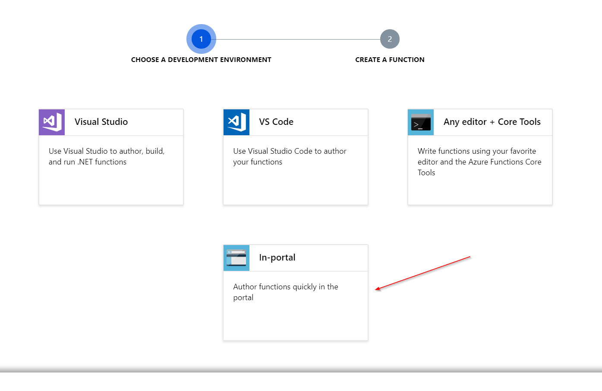

Select *More templates...* and click *Finish and view templates:*

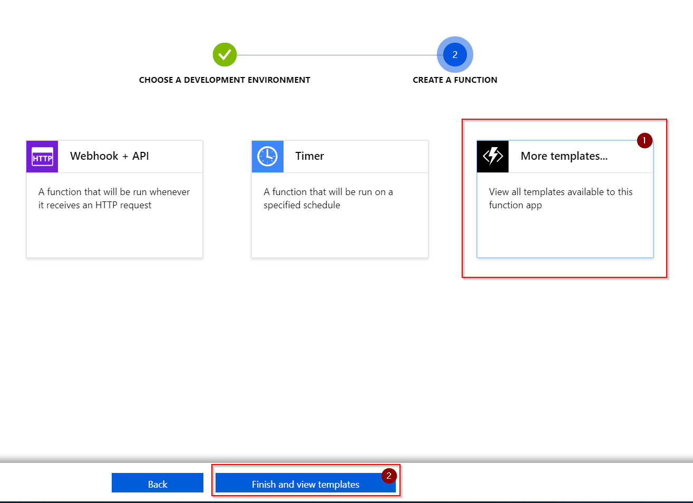

Select the *Azure Queue Storage trigger*:

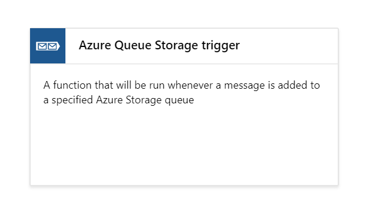

If this is the first time that you use this trigger, an extension needs to be installed in this environment. Select *Install* and wait for a few minutes:

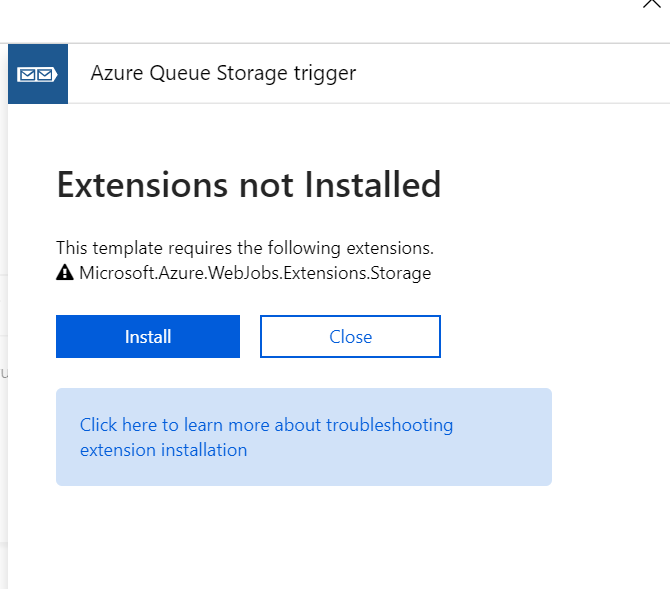

After a few minutes hit close and re-select *Azure Queue trigger*. If the installation was completed you'll be taken to the function create wizard. If the installation is still ongoing, wait some more and check back in a few moments by repeating the previous step.

Provide a name for the function and the name of the queue you are writing to. The storage account can left as-is as we are configuring that later:

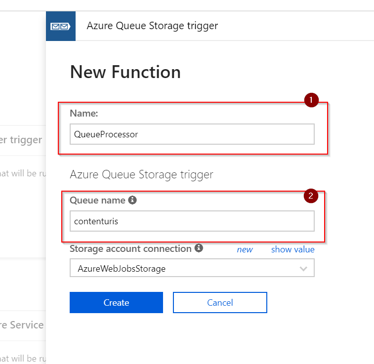

Open the file explorer on the right side of the screen:

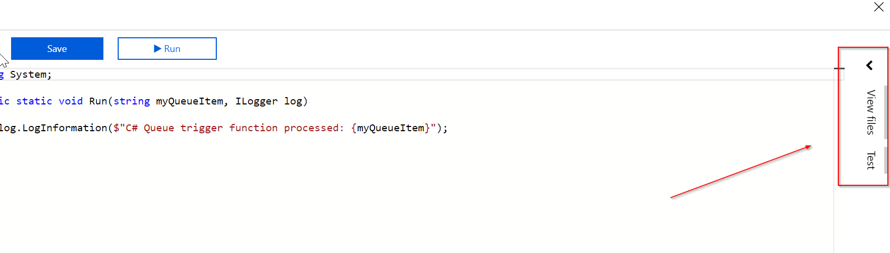

Click *+ Add* and create a new file with the name `function.proj`:


Add the following content to that file and hit *Save*:

```xml
<Project Sdk="Microsoft.NET.Sdk">
    <PropertyGroup>
        <TargetFramework>netstandard2.0</TargetFramework>
    </PropertyGroup>

    <ItemGroup>
        <PackageReference Include="Microsoft.IdentityModel.Clients.ActiveDirectory" Version="4.5.1" />
        <PackageReference Include="Microsoft.Azure.WebJobs.Extensions.Storage" Version="3.0.3" />
    </ItemGroup>
</Project>
```

Once saved this automatically triggers the Function App to download required assemblies:

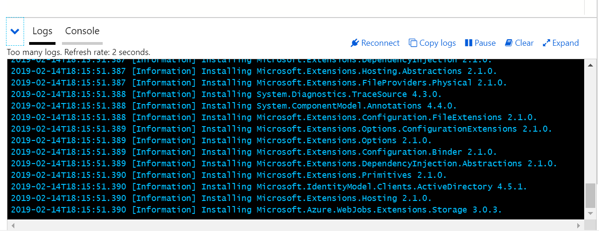

From the file explorer on the right side select `function.json` and set the content to the following:

```json
{
  "disabled": false,
  "bindings": [
    {
      "name": "data",
      "type": "queueTrigger",
      "direction": "in",
      "queueName": "contenturis",
      "connection": "SCCMT_STORAGE"
    }
  ]
}
```

This configures the binding to the correct storage account and the name of the parameter in the function.

From the file explorer on the right side select `run.csx` and update the content to the following. Confirm by hitting *Save*:

Once saved, the function is reloaded and should compile successfully:

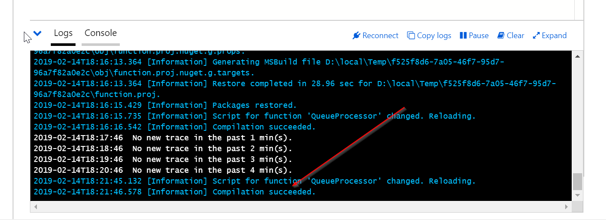

Done. The function will be triggered when something ends up in the queue. Two possibilities for testing: use Postman to publish something to the queue and see the processing result in the function or Azure Storage Explorer to add something to the queue.

## Conclusion

Once data is posted by the office 365 Management APIs the Logic App that was built in part one of this blog series puts the URI reference to the storage queue and the function we just build is called.
