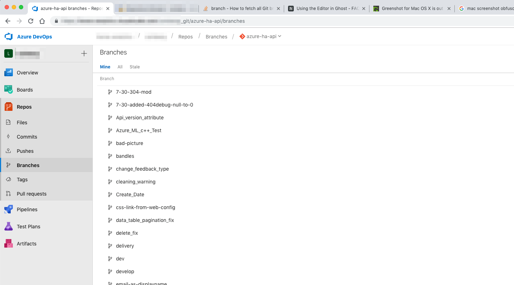

In my first days at [HorseAnalytics](https://www.horseanalytics.com), one of the first tasks was to review the codebase and streamline the build and release process. That meant to move all repositories over to Azure DevOps so that we can use the pipelines to build and release new versions of our products.

With Git moving repositories is rather easy but if you want to move everything over including branches and tags there are some things you need to consider. Luckily [Stack Overflow](https://stackoverflow.com/a/10312587) had all the answers you could wish for.

My process looks like the following:

1. Clone the source repository
2. Setup  branches to track their remote counterpart: `git branch -r | grep -v '\->' | while read remote; do git branch --track "${remote#origin/}" "$remote"; done`
3. Fetch everything: `git fetch --all`
4. Add new remote: `git remote add azure <Azure DevOps Git URI>`
5. Push everything: `git push --all azure`
6. Push tags: `git push --tags azure`

One done I now have everything including branches and tags in the new repository:

