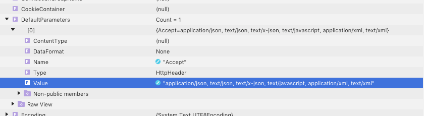

We are using RestSharp for functional testing of our backend services. As part of this process we need to upload images and compare the uploaded bytes against the expected result.

RestSharp comes with a default parameter which sets the `Accept` header. The default is set to something like this:



Whenever you try to request data that sports a different content-type you'll receive [a `406` return code](https://developer.mozilla.org/en-US/docs/Web/HTTP/Status/406) from the server but not the actual response you're looking for.

For our example we need to download image data (in most cases either JPEG or PNG). It is pretty simple to change the default parameter and add additional content types that you need:

```csharp
var client = new RestClient();
client.DefaultParameters.Single(p => p.Name == "Accept").Value += ", image/*";
```
    
In this example I'm adding `image/*` as acceptable content type and downloading images from the server works like a charm.
