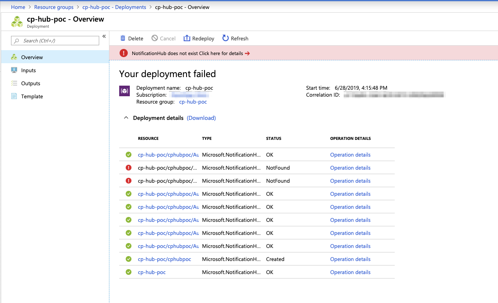

Both development and production environments are deployed in a fully automated fashion using ARM templates. As part of these deployments we also create Notification Hubs and related authorization rules.

I noticed today that some of our deployments were failing due to the fact that the Notification Hub resource provider was not able to find a related resource although the necessary dependencies were defined.



With a little testing I was able to narrow it down to a race condition between the resource creation and resource operations such as `listKey` that act on the resource. I've put together the following brief template that will intermittently fail:

```json
{
    "$schema": "http://schema.management.azure.com/schemas/2015-01-01/deploymentTemplate.json",
    "contentVersion": "1.0.0.0",
    "parameters": {
        "Name": {
            "type": "string"
        }
    },
    "variables": {
        "location": "[resourceGroup().location]",
        "locationHub": "[variables('location')]",
        "name": "[parameters('Name')]",
        "nameHubNamespace": "[variables('name')]",
        "nameHubHub": "[replace(variables('name'), '-', '')]",
        "nameHubAuthorization1": "Auth1",
        "nameHubAuthorization2": "Auth2",
        "nameHubAuthorization3": "Auth3",
        "nameHubAuthorization4": "Auth4"
    },
    "resources": [
        {
            "type": "Microsoft.NotificationHubs/namespaces",
            "apiVersion": "2017-04-01",
            "name": "[variables('nameHubNamespace')]",
            "location": "[variables('locationHub')]",
            "sku": {
                "name": "Free"
            },
            "kind": "NotificationHub",
            "properties": {
                "namespaceType": "NotificationHub"
            }
        },
        {
            "type": "Microsoft.NotificationHubs/namespaces/notificationHubs",
            "apiVersion": "2017-04-01",
            "name": "[concat(variables('nameHubNamespace'), '/', variables('nameHubHub'))]",
            "location": "[variables('locationHub')]",
            "dependsOn": [
                "[resourceId('Microsoft.NotificationHubs/namespaces', variables('nameHubNamespace'))]"
            ],
            "properties": {}
        },
        {
            "type": "Microsoft.NotificationHubs/namespaces/NotificationHubs/authorizationRules",
            "apiVersion": "2017-04-01",
            "name": "[concat(variables('nameHubNamespace'), '/', variables('nameHubHub'), '/', variables('nameHubAuthorization1'))]",
            "dependsOn": [
                "[resourceId('Microsoft.NotificationHubs/namespaces/notificationHubs', variables('nameHubNamespace'), variables('nameHubHub'))]"
            ],
            "properties": {
                "rights": [
                    "Send"
                ]
            }
        },
        {
            "type": "Microsoft.NotificationHubs/namespaces/NotificationHubs/authorizationRules",
            "apiVersion": "2017-04-01",
            "name": "[concat(variables('nameHubNamespace'), '/', variables('nameHubHub'), '/', variables('nameHubAuthorization2'))]",
            "dependsOn": [
                "[resourceId('Microsoft.NotificationHubs/namespaces/notificationHubs', variables('nameHubNamespace'), variables('nameHubHub'))]"
            ],
            "properties": {
                "rights": [
                    "Send"
                ]
            }
        },
        {
            "type": "Microsoft.NotificationHubs/namespaces/NotificationHubs/authorizationRules",
            "apiVersion": "2017-04-01",
            "name": "[concat(variables('nameHubNamespace'), '/', variables('nameHubHub'), '/', variables('nameHubAuthorization3'))]",
            "dependsOn": [
                "[resourceId('Microsoft.NotificationHubs/namespaces/notificationHubs', variables('nameHubNamespace'), variables('nameHubHub'))]"
            ],
            "properties": {
                "rights": [
                    "Listen"
                ]
            }
        },
        {
            "type": "Microsoft.NotificationHubs/namespaces/NotificationHubs/authorizationRules",
            "apiVersion": "2017-04-01",
            "name": "[concat(variables('nameHubNamespace'), '/', variables('nameHubHub'), '/', variables('nameHubAuthorization4'))]",
            "dependsOn": [
                "[resourceId('Microsoft.NotificationHubs/namespaces/notificationHubs', variables('nameHubNamespace'), variables('nameHubHub'))]"
            ],
            "properties": {
                "rights": [
                    "Listen"
                ]
            }
        }
    ],
    "outputs": {
        "connectionHub1": {
            "type": "string",
            "value": "[listKeys(resourceId('Microsoft.NotificationHubs/namespaces/notificationHubs/authorizationRules', variables('nameHubNamespace'), variables('nameHubHub'), variables('nameHubAuthorization1')), '2017-04-01').primaryConnectionString]"
        },
        "connectionHub2": {
            "type": "string",
            "value": "[listKeys(resourceId('Microsoft.NotificationHubs/namespaces/notificationHubs/authorizationRules', variables('nameHubNamespace'), variables('nameHubHub'), variables('nameHubAuthorization2')), '2017-04-01').primaryConnectionString]"
        },
        "connectionHub3": {
            "type": "string",
            "value": "[listKeys(resourceId('Microsoft.NotificationHubs/namespaces/notificationHubs/authorizationRules', variables('nameHubNamespace'), variables('nameHubHub'), variables('nameHubAuthorization3')), '2017-04-01').primaryConnectionString]"
        },
        "connectionHub4": {
            "type": "string",
            "value": "[listKeys(resourceId('Microsoft.NotificationHubs/namespaces/notificationHubs/authorizationRules', variables('nameHubNamespace'), variables('nameHubHub'), variables('nameHubAuthorization4')), '2017-04-01').primaryConnectionString]"
        }
    }
}
```

## Workaround

I was not able to find a workaround contained to the ARM template. The only way to fix this intermittent error for us was to update the script that executes the template deployment and do a retry if the deployment fails.
