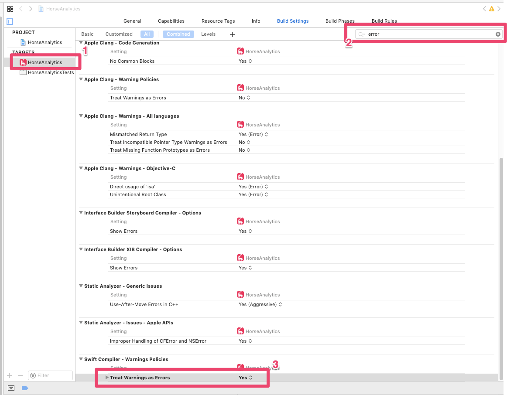

Migrating the build pipeline for one of our apps to Azure DevOps turned out to be a rather lengthy process. Building on my local machine with the same version [Xcode](https://developer.apple.com/xcode/) and [CocoaPods](https://cocoapods.org/) ran through seamlessly, but the CI build was failing continuously.

The fact that the command line build utility `xcodebuild` does not actually print out the error does not help the issue.

After hours of trial and error it came to me that the [hosted MacOS build agent](https://docs.microsoft.com/en-us/azure/devops/pipelines/agents/hosted?view=azure-devops) treats Swift compiler warnings as errors, regardless what has been configured for the project or workspace.

To make sure that you project builds fine on the hosted MacOS build agent, make sure that you do not have any Swift compiler warnings. You can replicate the settings in Azure DevOps by also treating Swift compiler warnings as errors.

In Xcode, select your target, search for `error` and change the setting *Treat Warnings as Errors* to **Yes**.

