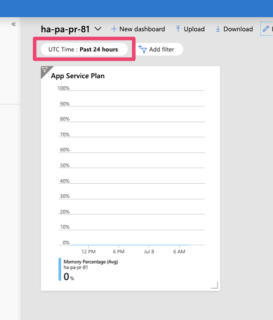
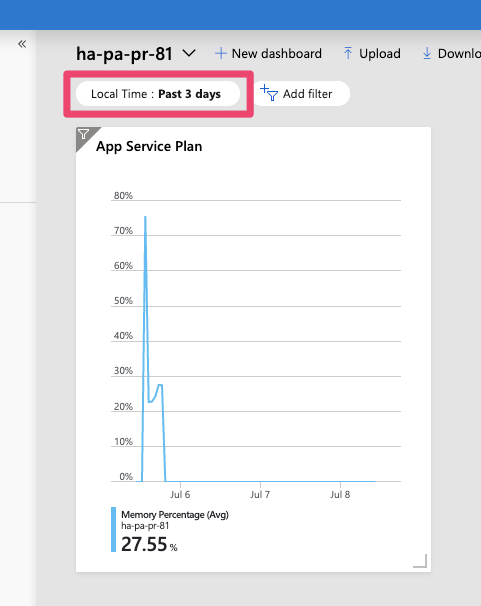

When you begin to operationalize your deployments and want to add monitoring one of the things you might do is to create shared dashboards as part of your deployment. A shared dashboard is basically the same as a non-shared dashboard except it is a full Azure resource, lives in a resource group and can be created through ARM.

Dashboards help to quickly nail down on issues with operations when incident response get triggered by an outside event like an alert or through continuous monitoring. What is really helpful is to have the widgets display metrics in the local timezone so that putting things into temporal context is easy.

If you create a shared dashboard through ARM without specifying metadata the time will be displayed in UTC. The following resource adds a single metrics widget for the memory utilization for an App Service Plan to demonstrate the logic:

```json
{
  "type": "Microsoft.Portal/dashboards",
  "name": "[variables('nameDashboard')]",
  "apiVersion": "2015-08-01-preview",
  "location": "[variables('locationDashboard')]",
  "tags": {
    "hidden-title": "[variables('nameDashboard')]"
  },
  "dependsOn": [
    "[resourceId('Microsoft.Web/serverFarms', variables('nameFarm'))]"
  ],
  "properties": {
    "lenses": {
      "0": {
        "order": 0,
        "parts": {
          "0": {
            "position": {
              "x": 0,
              "y": 0,
              "colSpan": 4,
              "rowSpan": 5
            },
            "metadata": {
              "inputs": [
                {
                  "name": "options",
                  "isOptional": true
                },
                {
                  "name": "sharedTimeRange",
                  "isOptional": true
                }
              ],
              "type": "Extension/HubsExtension/PartType/MonitorChartPart",
              "settings": {
                "content": {
                  "options": {
                    "chart": {
                      "metrics": [
                        {
                          "resourceMetadata": {
                            "id": "[resourceId('Microsoft.Web/serverFarms', variables('nameFarm'))]"
                          },
                          "name": "MemoryPercentage",
                          "aggregationType": 4,
                          "namespace": "Microsoft.Web/serverFarms",
                          "metricVisualization": {
                            "displayName": "Memory Percentage"
                          }
                        }
                      ],
                      "title": "App Service Plan",
                      "visualization": {
                        "chartType": 2,
                        "legendVisualization": {
                          "isVisible": true,
                          "position": 2,
                          "hideSubtitle": false
                        },
                        "axisVisualization": {
                          "x": {
                            "isVisible": true,
                            "axisType": 2
                          },
                          "y": {
                            "isVisible": true,
                            "axisType": 1
                          }
                        }
                      },
                      "filterCollection": {
                        "filters": []
                      }
                    }
                  }
                }
              }
            }
          }
        }
      }
    }
  }
}
```

Notice that the default time filter is set to the last 24 hours in UTC:



You can change the time span and the adjustment to local time by specifying metadata for the dashboard resource in your ARM template:

```json
{
  "type": "Microsoft.Portal/dashboards",
  "name": "[variables('nameDashboard')]",
  "apiVersion": "2015-08-01-preview",
  "location": "[variables('locationDashboard')]",
  "tags": {
    "hidden-title": "[variables('nameDashboard')]"
  },
  "dependsOn": [
    "[resourceId('Microsoft.Web/serverFarms', variables('nameFarm'))]"
  ],
  "properties": {
    "lenses": {
      // removed for brevity
    },
    "metadata": {
      "model": {
        "filters": {
          "value": {
            "MsPortalFx_TimeRange": {
              "model": {
                "format": "local",
                "granularity": "auto",
                "relative": "3d"
              },
              "displayCache": {
                "name": "Local Time",
                "value": "Past 3 days"
              }
            }
          }
        }
      }
    }
  }
}
```

When you add metadata to the dashboard definition like in the example above. You can define the time span that should be displayed in the dashboard in addition to enable adjusting the time to local time.


