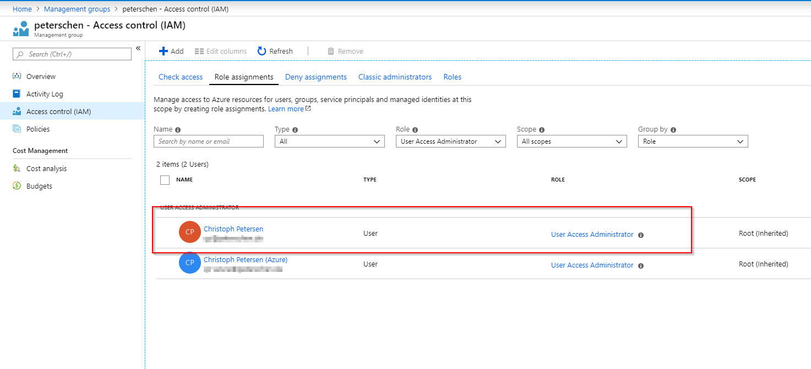
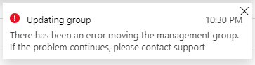
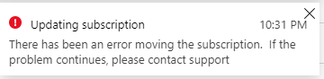
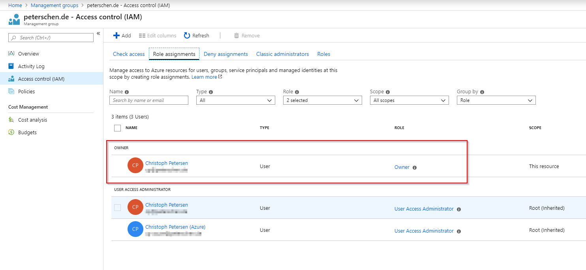
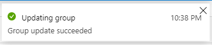

If you have not been working with Management Groups to manage Azure at scale, I recommend to review [the documentation](https://docs.microsoft.com/en-us/azure/governance/management-groups/). You should also take a look at the [Microsoft Cloud Adoption Framework](https://docs.microsoft.com/en-us/azure/architecture/cloud-adoption/) (which was just recently updated).

When you start using Management Groups you might want to change the display name of the root management group or do other changes to the hierarchy. To get started you need to have access to the root management group. If you have global administrator permissions, follow the [documentation ](https://docs.microsoft.com/en-us/azure/governance/management-groups/index#root-management-group-for-each-directory)([especially this](https://docs.microsoft.com/en-us/azure/role-based-access-control/elevate-access-global-admin)) on how to set that up. 

You now have the User Access Administrator role assigned for the root management group and its descendants. 

But when you go and try to rename the root management group this happens:

Similar when you try to move a subscription:

You can, on the other hand, create a new management group and affect changes on it. This is because when creating a new management group you are by default the owner and thus can change every aspect.

This is also the solution to the problem. [Elevating access to manage all Azure subscriptions and management groups](https://docs.microsoft.com/en-us/azure/role-based-access-control/elevate-access-global-admin) just assigns the User Access Administrator role and not Owner or Contributor permissions. Thus while you can access the root management group, you need to first assign yourself Owner or Contributor permissions to actually changes its properties.

Once you have made the assignment:

Changing properties such as the name of the root management group (and management groups you are not the owner of) works like a charm:

**Be careful:** Managment Groups is a vehicle to manage at scale. If you assign roles they are inherited in the hierarchy and unless you have deny assignments the assignment will affect all subscriptions, resource groups and resources under management.
