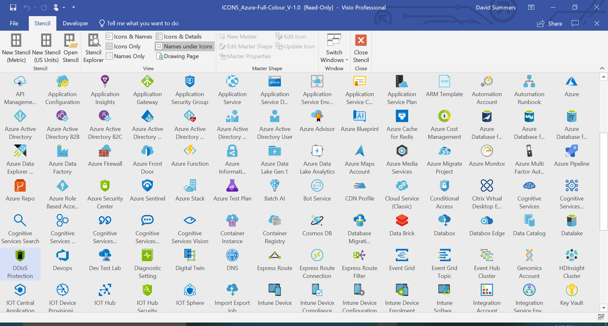

Yes. Visio is still a thing. To draw expressive diagrams with the correct visual representation of the underlying services you need to have access to quality stencils.

There is the [Microsoft Azure Cloud and AI Symbol / Icon Set - SVG](https://www.microsoft.com/en-us/download/details.aspx?id=41937) from Microsoft of course but I stumbled across a [LinkedIn post from David Summers](https://www.linkedin.com/feed/update/urn:li:activity:6560072160889671680) today where he shared his own additional set of stencils for Azure. 

[Head to his GitHub account and check it out](https://github.com/David-Summers/Azure-Design):
Visio stencils for Azure services
