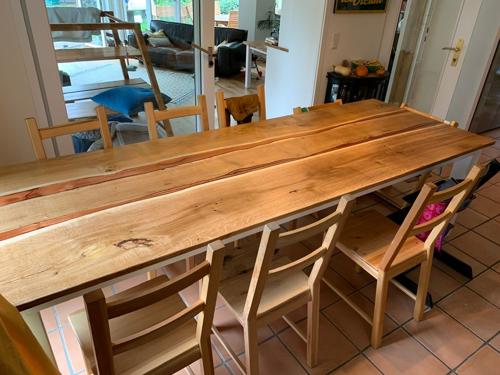

## Rethink.

In May I started my journey with HorseAnalytics serving as their CTO. Just a couple of weeks into my tenure the unthinkable happened: money ran out and we were not able to secure bridge funding to see the motion we already set into motion to an end.

I learned a lot from this experience. Not only about how to manage the paperwork with government institutions, applying for social benefits or how to write a good CV. The most important resources a company has are its people. Looking back to the past couple of weeks much is to say to communication and I now recognize that even in the ridiculously hard situation of dissolving a company we are still people and should be treated with respect. In retrospect this experience made me to a better person having learned these lessons the hard way by experiencing them on my own. 

## Reset.

I've spent the last couple of weeks in intense discussions with prospect new employers. While draining this gave me the chance to really focus on what I want my job to be and what I'm driving for.

In addition to that I got to spent some time home with my family which is great considering I'm starting a new position in October which will entail increased business travel. And I was able to do some projects that were in the back of my head for quite a while like this oak epoxy resin dinner table:

## Restart.

With much reflection I have decided to take on the role of Customer Engineer at Google Cloud for Infrastructure Modernization starting October 1st. Having spent the last couple of years focused on Microsoft technologies there is a lot to learn and familarization with the new platform required.

The onboarding experience was one of the best - if not the best - in my career so far and I'm really excited about starting the new role. There will be lots of opportunities to learn and new things to discover. 
