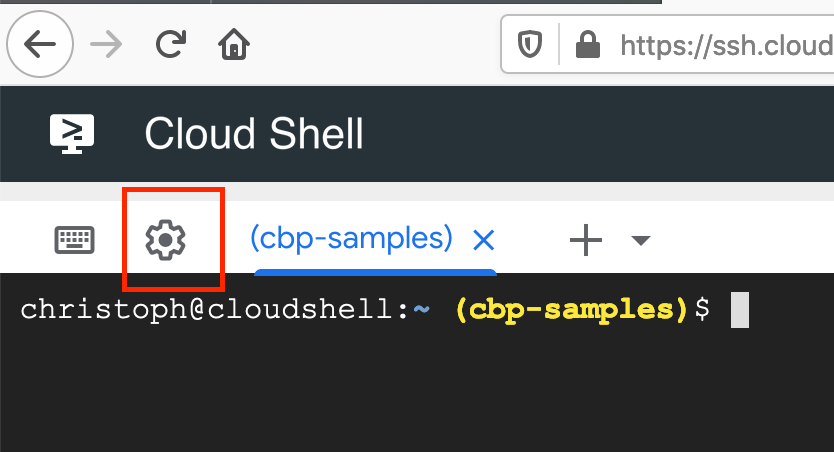
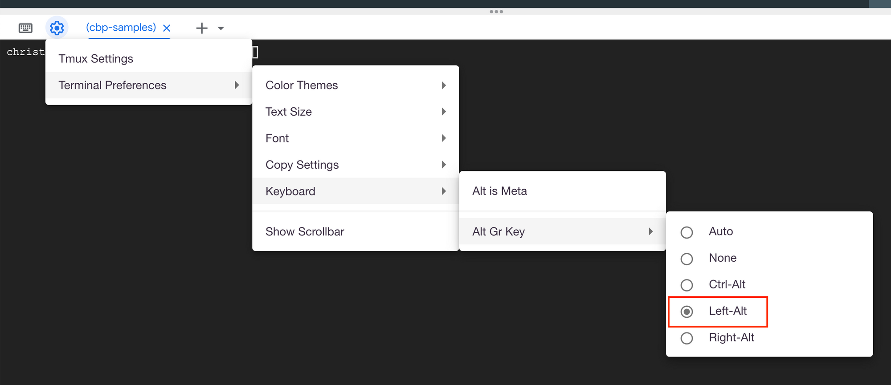

If you happen to use a Mac based keyboard and Google Cloud Shell you might be facing some issues when typing special chars such as `\`, `|`. There is a simple fix, that'll get you going.

Hit the cog on the left upper side in Cloud Shell:

Select *Terminal Preferences* > *Keyboard* > *Alt Gr Key* > *Left-Alt* (or *Right-Alt *depending on your preferences): 

And that should do the trick.
