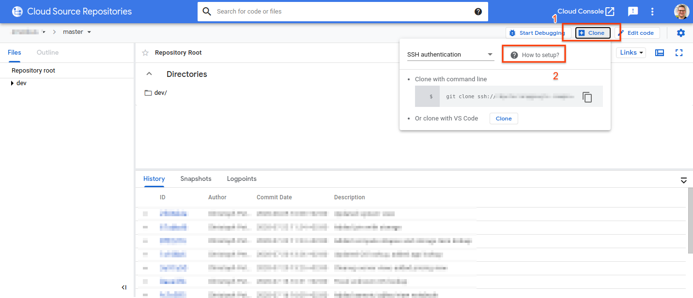
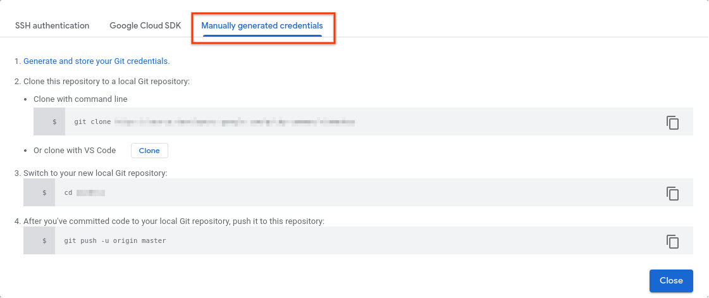
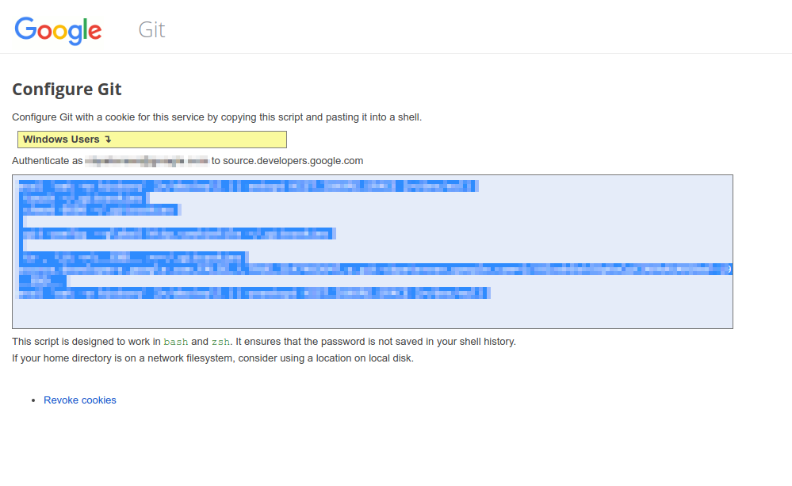
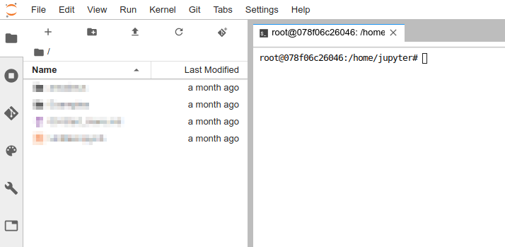

Who doesn't want to version their Jupyter Notebooks? Integrating Cloud Source Repositories and AI Platform Notebooks is not hard but I wasn't able to find documentation to set it up.

Before we get started you need to [create a new repository in Cloud Source Repositories](https://cloud.google.com/source-repositories/docs/creating-an-empty-repository). If you haven't created you notebook instance yet, [you can follow this guide on how to do so.](https://cloud.google.com/ai-platform/notebooks/docs/create-new)

With that out of the way, go to your Cloud Source Repository in a browser, click on *Clone* and then *How to setup?.*

In the overlay that opens click on *Manually generated credentials*. 

Click on *Generate and store your Git credentials*. This will trigger authentication and account that is authenticated now will be used when interacting with the Git repository. So make sure that you use the correct account for this action.

Once authentication as succeeded you are presented with Shell code that creates a Git authentication cookie locally:

How does that help me with Jupyter you ask? Let's look at that now. Navigate to your notebook instance and go to *File > New > Terminal*

Past the Shell code that you create in the previous step. This will store the Git authentication cookie on the server that is driving your Jupyter notebook.

Now you can clone your repository. You will not be challenged for authentication because Git authenticates automatically. All Git operations now work seamlessly.
