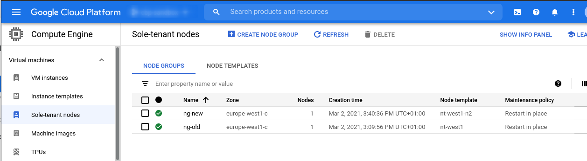

[Sole-tenant nodes](https://cloud.google.com/compute/docs/nodes/sole-tenant-nodes) are being used by customers for workload isolation and also for licensing compliance (e.g. [bringing Window Server licenses](https://cloud.google.com/compute/docs/instances/windows/ms-licensing)). Throughout the life cycle of a sole-tenant node there might be the necessity of moving virtual machines to another node group or even to another machine family (e.g. moving to N2 from N1). [Refer to the documentation, to learn more about Node affinity and anti-affinity options](https://cloud.google.com/compute/docs/nodes/sole-tenant-nodes#node_affinity_and_anti-affinity).

In this article I'll demonstrate how to manually change the affinity of VMs including moving to a node group running with a different machine family.

## Environment

In my environment I have two sole-tenant nodes. One named `ng-old` running on N1 in `europe-west1-c` and another one named `ng-new` running on N2 in `europe-west1-c` :
Sole-Tenant Nodes running in the environment

## Move to a different node group

Updating the node affinity can be done through `gcloud` . Before the scheduling can be modified, the instance needs to be stopped.

```bash
ZONE="europe-west1-c"
VM="st-affinity"
NODEGROUP="ng-new"

# Stop VM
gcloud compute instances stop $VM --zone $ZONE

# Update affinity
gcloud compute instances set-scheduling $VM --zone $ZONE --node-group $NODEGROUP

# Start VM
gcloud compute instances start $VM --zone $ZONE
```

<figcaption>Script showing how to move a VM to a node group with the same machine family</figcaption>

## Move to a node group with a different machine family

Moving a VM to a node group that runs with a different machine family (e.g. N2 instead of N1) is very similar to the previous example. In this case there is only one additional step required that changes the machine type family. 

```bash
ZONE="europe-west1-c"
VM="st-affinity"
MACHINE_TYPE="n2-standard-4"
NODEGROUP="ng-new"

# Stop VM
gcloud compute instances stop $VM --zone $ZONE

# Update machine type
gcloud compute instance set-machine-type $VM --zone $ZONE --machine-type $MACHINE_TYPE

# Update affinity
gcloud compute instances set-scheduling $VM --zone $ZONE --node-group $NODEGROUP

# Start VM
gcloud compute instances start $VM --zone $ZONE
```

<figcaption>Script showing how to move a VM to a node group with a different machine family</figcaption>
