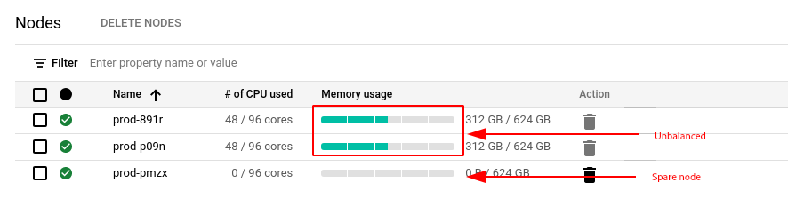
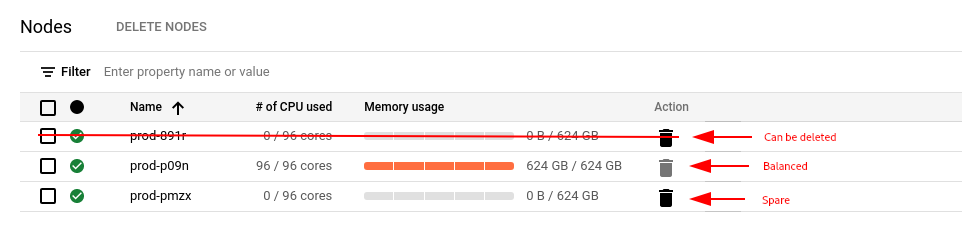

Sole-tenant nodes are an important service on Google Cloud Platform to run workloads that require workload isolation or need to comply to specific licensing requirements that demand dedicated infrastructure. A detailed description what a Sole-Tenant Node is and how it is different from general fleet VMs can be found in the [Compute Engine documentation](https://cloud.google.com/compute/docs/nodes/sole-tenant-nodes).

Sole-tenant nodes supports different maintenance policies which can be selected based on the workload requirements. A maintenance event happens when Google needs to update the underlying infrastructure. 

This article focuses on the **Migrate within node group** maintenance policy which is primarily used for scenarios where a fixed-sized group of nodes is required (e.g. licensing constraints). The sole-tenant node [documentation has more information about the possible maintenance policies](https://cloud.google.com/compute/docs/nodes/sole-tenant-nodes#maintenance_policies) and their use-cases.

## Challenge

As sole-tenant nodes are a good fit for long running workloads due to shifts in resource requirements like the demand for new VMs or other VMs being decommissioned, over time the resource distribution within a node group may not be perfect. While the Compute Engine scheduler aims to achieve the highest possible bin-packing ratio depending on outside factors this might not always be possible.

In rare cases this may lead to situations, where more sole-tenant nodes are deployed than strictly necessary.


While it is possible for node groups that do not have the **Migrate within node group** maintenance policy set [to manually live migrate VMs to other nodes](https://cloud.google.com/compute/docs/nodes/manually-live-migrate) in order to increase density, this is not possible for node groups that use **Migrate within node group** policy. This is due to the fact that manual live migration uses affinity labels to target individual nodes which can't be used in conjunction with this policy.

## Workaround

When a VM is either shutdown and restarted or even only [suspended and resumed](https://cloud.google.com/compute/docs/instances/suspend-resume-instance), the scheduler will make new decisions for placement and aim to maximize bin-packing.

While both of these actions come with downtime, suspend and resume will retain the VMs state and unavailability will be in the span of seconds.


## Proof of concept

The following script creates a sole-tenant node group with **Migrate within node-group** maintenance policy. It creates three nodes (two for running VMs and one to satisfy the maintenance policy requirements).

```bash
# Create node template
gcloud compute sole-tenancy node-templates create prod --node-type=n1-node-96-624

# Create node group
gcloud compute sole-tenancy node-groups create prod --node-template=prod --target-size=3 --maintenance-policy=migrate-within-node-group
```
<figcaption>Create node template and sole-tenant node group</figcaption>

The nodes running VMs are subsequently filled with VMs after which artificial gaps are created on both sole-tenant nodes. 

```bash
# Create smaller VMs
for number in 01 02 03 04 05 06 07 08 09 10 11 12; do
    gcloud compute instances create small-vm-$number --machine-type=n1-highmem-16 --node-affinity-file affinity.json --enable-display-device --image=debian-11-bullseye-v20210817 --image-project=debian-cloud --boot-disk-size=10GB --boot-disk-type=pd-balanced --boot-disk-device-name=small-vm-$number --shielded-secure-boot --shielded-vtpm --shielded-integrity-monitoring
done

# Create some holes by deleting some VMs
for number in 01 02 03 10 11 12; do
    gcloud compute instances delete small-vm-$number --quiet
done
```
<figcaption>Schedule VMs on both sole-tenant nodes then create artificial holes</figcaption>

Finally the VMs on the second node are paused and then resumed causing the Compute Engine scheduler to resume the VMs on the first node to maximize resource utilization.

```bash
# Pause VMs
for number in 07 08 09; do
    gcloud beta compute instances suspend small-vm-$number
done

# Resume VMs
for number in 07 08 09; do
    gcloud beta compute instances resume small-vm-$number
done
```
<figcaption>Pause and resume VMs to show consolidation by the Compute Engines scheduler</figcaption>

## Code
[The full script is available on GitHub.](https://github.com/peterschen/blog/tree/master/gcp/samples/stn-manual-failover)
