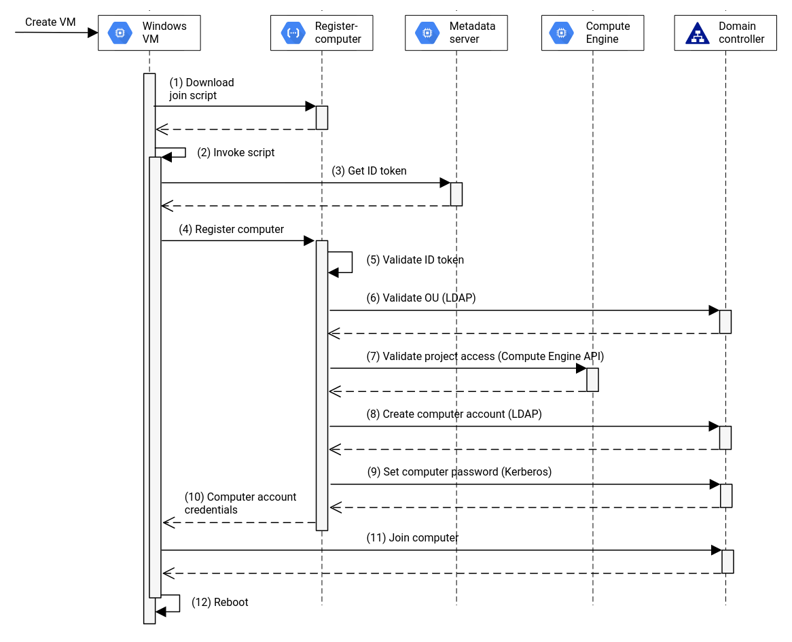

Many enterprises that migrate their IT estate to cloud will face the question on how to continue to support operations across workloads that remain on-premises and workloads that are migrated to cloud.

While virtual machines (VMs) behave largely the same in cloud from a data plane (what is happening on the inside of the VM), control plane functions can differ significantly.

Examples for this are operating system (OS) patch management or OS configuration management or group policy management. Having Active Directory deployed for the latter is very common for customers running Windows desktops/servers independently of the size of the estate whether it is 100 servers or 10.000 servers.

While bringing Active Directory to cloud either as a self-managed solution by manually installing a couple of domain controllers or using managed offerings like [Managed Microsoft AD from Google Cloud](https://cloud.google.com/managed-microsoft-ad/docs/overview) is pretty straight forward, the integration with features like [Managed Instance Groups (MIG)](https://cloud.google.com/compute/docs/instance-groups) or [Group Managed Service Accounts (gMSA) for GKE](https://cloud.google.com/architecture/deploying-aspnet-with-windows-authentication-in-gke-windows-containers) is tricky. 

## The challenge: Domain join

So what is the tricky part? Control plane actions that are triggered by the platform such as adding new VMs to a MIG, autoscaling or autorepairing the GKE cluster require that the newly added VM is joined to the domain. Otherwise critical functions like group policy, gMSA, Kerberos authentication, ... are not functional and ultimately the application will no longer be functioning.

While there are multiple ways of joining a domain,  when doing this at scale it needs to be in a **secure way** (we don't want to leak domain join credentials!), interaction needs to be **authorized** (not everybody should be able to join VMs), a certain** level of governance** needs to be provided (we can't have machines joined to random OUs) and it should still be **self-service**.

With these constraints some of the available ( `unattend.xml` , passing credentials to the VM, storing credentials in [Secret Manager](https://cloud.google.com/secret-manager) but allowing the service account access to it) are no longer valid options.

## The solution: adjoin service

[We have come up with a solution](https://github.com/GoogleCloudPlatform/gce-automated-ad-join) that ticks all the boxes mentioned above but is still relatively easy to use. We introduce an indirection service which can be hosted in [Cloud Run](https://cloud.google.com/run) or Docker (but must run on Compute Engine). This service provides authorization to validate if the request using Google Cloud Oauth tokens. It will also validate if the project the VM is deployed to is allowed to join VMs to the domain providing simple governance. 

Instead of simply returning the password for the Active Directory join it will pre-stage the computer account in Active Directory and set a password for it using a specific service account in Active Directory for which the password is stored in Secret Manager and to which only the service account that runs the Cloud Run application has access to.

The VM that attempts to join the domain will receive the computer account (the name might have changed as it may be too long for Active Directory) and the associated password. This happens during the 
*sysprep* phase of the deployment and once this phase is completed the VM is rebooted and the password no longer stored anywhere.



So what about self-service? A user that wants to use this service only needs to add a [*sysprep* specialize scriptlet](https://cloud.google.com/compute/docs/instances/startup-scripts/windows) similar to this:

```powershell
iex((New-Object System.Net.WebClient).DownloadString('https://[DOMAIN]'))
```
<figcaption>PowerShell scriptlet for sysprep specialize phase</figcaption>

This triggers the Compute Engine agent to download a PowerShell script from the adjoin service during the *sysprep* phase, containing all the instructions that are required to complete the join operation.

## Kick the tires

The solutions has been open sourced and is [available on GitHub as part of the Google Cloud Platform organization](https://github.com/GoogleCloudPlatform/gce-automated-ad-join). You can use the provided code as-is or fork it and modify it to suit your needs. 

We also have [a guide in our Cloud Architecture Center](https://cloud.google.com/architecture/configuring-active-directory-for-vms-to-automatically-join-the-domain) that walks through deploying the solution end-to-end and will get you started on adopting it for your environment.
