One of the most requested features from customers that deploy [Cloud SQL for SQL Server (Cloud SQL)](https://cloud.google.com/sql/docs/sqlserver) has been [Active Directory integration](https://cloud.google.com/sql/docs/sqlserver/configure-ad) which was released last year. Since then Google Cloud has [added cross-project capability](https://cloud.google.com/sql/docs/sqlserver/configure-ad#enable-cross-project-auth) which allows you to connect your Cloud SQL instance into a project that is different than the one hosting [Managed Microsoft AD (Managed AD)](https://cloud.google.com/managed-microsoft-ad/docs/overview).

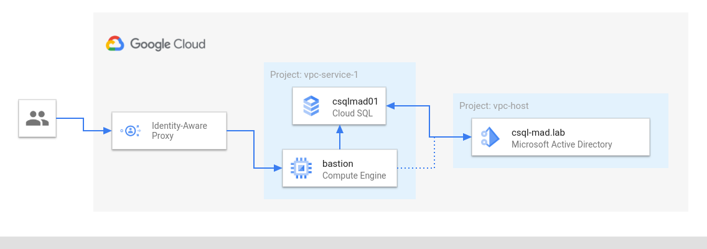

In this article I will go through the steps to deploy Cloud SQL and connect it with a Managed AD living in a different project.

## Prerequisites

For this walk-through I'm using two separate projects called `vpc-host` and `vpc-service-1` . As the name indicates the former has [Shared VPC](https://cloud.google.com/vpc/docs/shared-vpc) configured to share a VPC ( `csql-mad` ) with attached projects. It will host the Managed AD domain so that it can be consumed throughout the organization by all projects attached to the host VPC.

Creating the project structure and setting up Shared VPC is out of the scope for this article. Please refer to the documentation for [guidance on project creation](https://cloud.google.com/resource-manager/docs/creating-managing-projects) and [how to provision Shared VPC](https://cloud.google.com/vpc/docs/provisioning-shared-vpc).

Later in this article I will use a domain joined bastion host (a VM that is [only reachable through Identity Aware Proxy](https://cloud.google.com/iap/docs/using-tcp-forwarding)) with SQL Server Management Studio installed to connect to Cloud SQL. The setup and configuration of that bastion host is also not part of this article.

In order to configure Windows authentication for SQL Server a principal (user or group) needs to exists in Active Directory. Provisioning of the principal is a prerequisite and not part of this write-up.

## Deploy Managed AD

There are plenty of options to deploy a Managed Microsoft AD domain: Cloud Console, `gcloud` or IaC tools like Terraform. As creating a new domain through Cloud Console is pretty straight forward, I'll use this route.

> **Note:** Before you start, make sure that you have selected the correct project in Cloud Console. We will deploy the domain to `vpc-host` .

In Cloud Console select the[**burger menu > Security > Managed Microsoft AD**](https://console.cloud.google.com/security/cloud-ad).

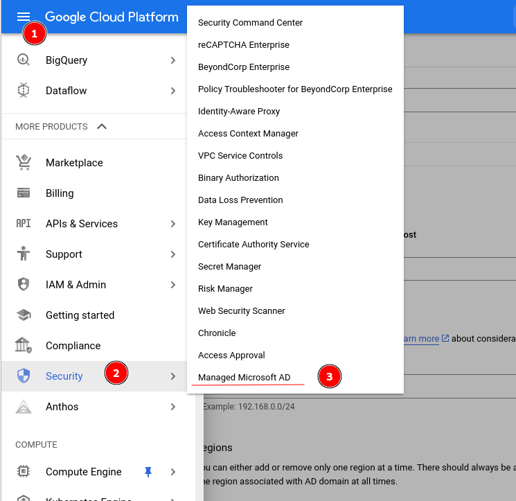

Select [**Create new AD domain**](https://console.cloud.google.com/security/cloud-ad/create) from the top menu:

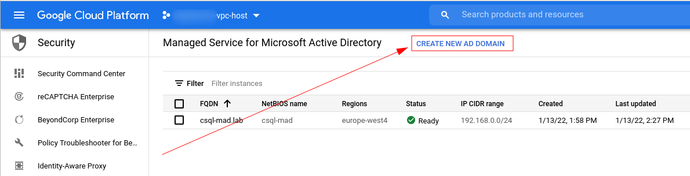

In the wizard provide the name for the domain (I'll call it `csql-mad.lab` ) select the network, provide a CIDR range that **is not used anywhere yet**, select the appropriate region and hit **Create domain**.

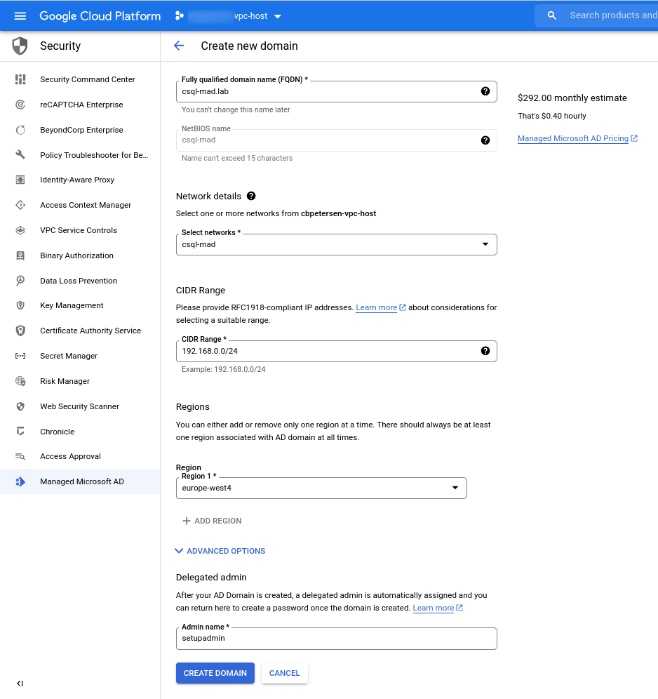

The new domain is now being deployed. The deployment usually takes around 25 Minutes to complete.

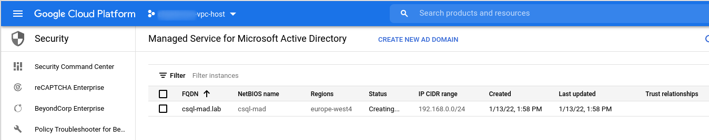

And that's it. Now this wasn't too hard and once the deployment has completed you can continue with the next step.

## Deploy Cloud SQL

As with Managed Microsoft AD domains Cloud SQL can be deployed using various methods. As the deployment is somewhat more complex using Cloud Console, I'll use `gcloud` to facilitate this step.

> **Note:** Before you start, make sure that you have selected the correct project in Cloud Console. We will deploy the Cloud SQL to `vpc-service-1` .

In Cloud Console, select [**burger menu > SQL**](https://console.cloud.google.com/sql):

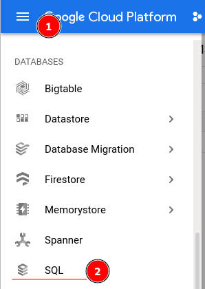

Launch Cloud Shell from the top right corner:

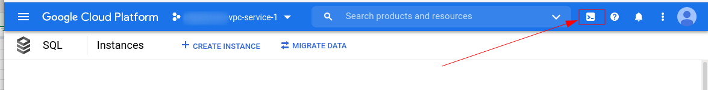

Once Cloud Shell is activated it will launch a shell for you and pre-select the currently selected project. This is a good time to make sure you are working in the right project...

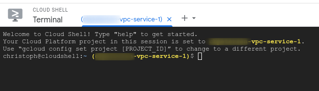

### Service Account & permissions

So let's deploy Cloud SQL with Active Directory integration. But before we can actually deploy SQL Server we need to provide to the platform so that operations involving Active Directory (such as domain join) can be facilitated. To that end we will create a service account that has access to the `sqladmin.googleapis.com` service:

```bash
gcloud beta services identity create \
  --service=sqladmin.googleapis.com \
  --project=vpc-service-1
```

<figcaption> `gcloud` command to create a service account for `sqladmin.googleapis.com` service</figcaption>

The service account naming follows the schema `service-[PROJECT NUMBER]@gcp-sa-cloud-sql.iam.gserviceaccount.com` and the output from running this command looks similar to the following screenshot:


Now we need to give this account access on the project where our Managed AD domain is running:

```bash
projectNumber=$(gcloud projects describe vpc-service-1 --format='value(projectNumber)')
gcloud projects add-iam-policy-binding vpc-host \
  --member=serviceAccount:service-$projectNumber@gcp-sa-cloud-sql.iam.gserviceaccount.com \
  --role=roles/managedidentities.sqlintegrator
```

<figcaption> `gcloud` command assigning the required roles to the service account for the project running the Managed AD domain</figcaption>

The output will look similar to this:


### Private Service Access

As the Managed AD domain is only accessible through a private IP address hosted in a VPC network we need to setup private service access to allow Cloud SQL to communicate with our domain.

> **Note:** The private service access needs to be created for the project that hosts the VPC. This is `vpc-host` in our case. For this reason the following commands explicitly specify the project.

Firstly we need to create an address range that does not overlap with any existing networks:

```bash
gcloud compute addresses create csql-mad-psa \
  --global \
  --purpose=VPC_PEERING \
  --addresses=192.168.1.0 \
  --prefix-length=24 \
  --network=csql-mad \
  --project=vpc-host
```    
<figcaption>`gcloud` command to create address range for private service access</figcaption>

This will produce an output similar to the following screenshot:


With the address range configured we need to create the private connection to services:

```bash
gcloud services vpc-peerings connect \
  --service=servicenetworking.googleapis.com \
  --ranges=csql-mad-psa \
  --network=csql-mad \
  --project=vpc-host
```

<figcaption> `gcloud` command to setup Private Service Access</figcaption>


### Deploy Cloud SQL instance

With this this out of the way we can trigger the SQL Server deployment. The following command will deploy an instance of Cloud SQL running SQL Server 2019 Standard ( `--database-version=SQLSERVER_2019_STANDARD` ) with 4 vCPU ( `--cpu=4` ), 16 GiB ( `--memory=16` ) of memory.  It is integrated with the `csql-mad.lab` domain running in `vpc-host` ( `--active-directory-domain=projects/vpc-host/locations/global/domains/csql-mad.lab` ) and uses the Shared VPC `csql-mad` ( `--network=projects/vpc-host/global/networks/csql-mad` ). The instance will not have assigned a public IP address ( `--no-assign-ip` ) and will not have integrated backups ( `--no-backup` ).

```bash
gcloud beta sql instances create csqlmad01 \
  --active-directory-domain=projects/vpc-host/locations/global/domains/csql-mad.lab \
  --availability-type=zonal \
  --database-version=SQLSERVER_2019_STANDARD \
  --root-password=MySuperSecureRootPassword! \
  --cpu=4 \
  --memory=16 \
  --no-assign-ip \
  --no-backup \
  --network=projects/vpc-host/global/networks/csql-mad \
  --zone=europe-west4-a
```

<figcaption> `gcloud` command deploying Cloud SQL</figcaption>

Deployment of the Cloud SQL instance will take a couple of moments.


## Enable Windows authentication

Once the deployment of the Cloud SQL instance has completed it is now integrated into Active Directory. By default no accounts with Windows authentication are enabled and you need to either use Cloud SQL Proxy or a private connection to connect to SQL Server. 

In this last step you'll create a new login for SQL Server that uses a group in Active Directory allowing all members of that group to connect to this SQL Server instance.

Login to your bastion host through RDP, open SQL Server Management Studio (SSMS) and connect to your instance (in our case `private.csqlmad01.europe-west4.vpc-service-1.cloudsql.csql-mad.lab` ) using the default account ( `sqlserver` ) with the password that you have used when deploying your Cloud SQL instance:

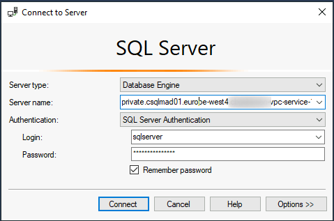

Once connected navigate to **Security > Logins**. Right-click **Logins** and select **New Login...**

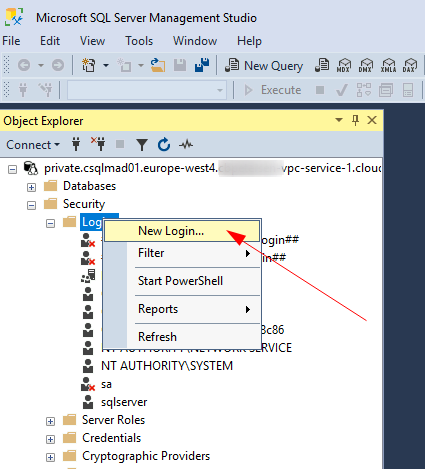

In the dialog that opens select **Windows authentication** and then provide the principal name in the **Login name** field. In this example I have created a group called `g-SqlAdmins` and use this to provide access to all SQL Server administrators. Alternatively a user principal could be given access here.

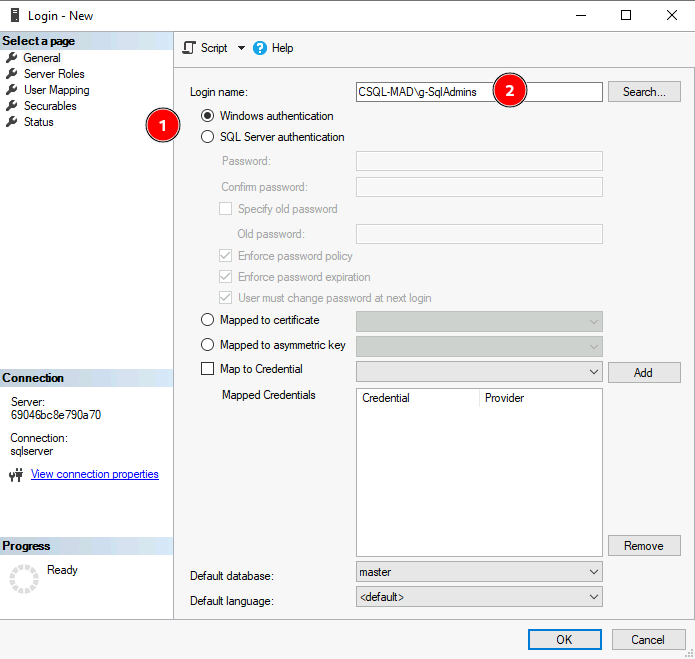

## Summary

That's it! Following these steps will allow you to use a centrally managed Managed Microsoft AD deployment for authentication needs across many projects. Additionally the authentication can be extended to on-premises by establishing a trust relationship between Managed AD and your Active Directory instance on-premises.
