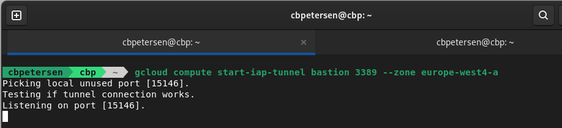
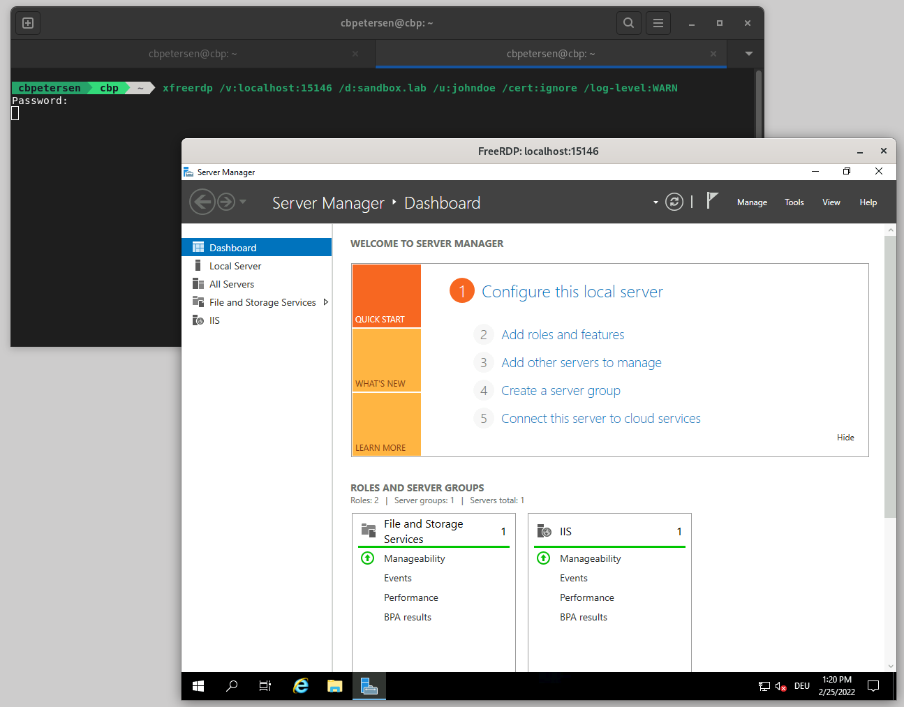

[Identity-Aware Proxy (IAP)](https://cloud.google.com/iap) is a powerful tool in the tool chain of Google Cloud administrators and users. It can be used to control access to cloud-based and on-premises applications and VMs running on Google Cloud.

IAP adds *common *authentication and authorization infrastructure based on Cloud IAM to connections without the need for a change to program or protocol logic. By removing the need to expose connection endpoints to the public internet, IAP works from all networks without the need for a VPN connection. 

## Using IAP (for RDP)

IAP works by establishing a tunnel between the local machine and a managed endpoint in Google Cloud (no setup required, works out of the box). The tunnel is opened through [gcloud](https://cloud.google.com/sdk/gcloud/reference/compute/start-iap-tunnel):

```bash
    gcloud compute start-iap-tunnel bastion 3389 --zone europe-west4-a
```

This will open the tunnel and will, by default, pick a dynamic free local port:



In order to now connect to the service that is now exposed locally, you then start the respective app to consume it. Staying with the scenario above you'd use a RDP client (I've found that [freerdp](https://www.freerdp.com/) works best for me) and connect to the local port

```bash
xfreerdp /v:localhost:15146 /d:sandbox.lab /u:johndoe /cert:ignore /log-level:WARN
```

Connecting to RDP through IAP

Which establishes the RDP connection through IAP:



## So what is the challenge?

Whenever a service is exposed through IAP, the tunnel needs to be established first in order to be able to access the service. In a normal workflow this may only be a nuisance but for automation this is a non-starter.

## Enter `iap-chain.sh`

`iap-chain.sh` ([available on GitHub](https://github.com/peterschen/blog/tree/master/gcp/scripts/iap-chain)) is a Bash script that chains IAP and an arbitrary local command together. The command is executed when the tunnel has been established. As the port is dynamically allocated a special variable can be used in the command syntax which is replaced before execution.

This enables all kinds of scenarios. While my primary work environment is Linux I work a lot with Windows systems and need to connect to RDP fairly often. Following the 2-step process to get to a VM is cumbersome at times so I have a helper function around `iap-chain.sh` and [freerdp](https://freerdp.com):

```bash
#!/usr/bin/env bash

rdp()
{
  POSITIONAL_ARGS=()

  instance=
  port=3389

  if [ "${ZONE-}" != "" ]; then
    zone=$ZONE
  fi

  if [ "${GOOGLE_CLOUD_PROJECT-}" != "" ]; then
    project=$GOOGLE_CLOUD_PROJECT
  fi
  
  disable_connection_check=
  extra=

  while [[ $# -gt 0 ]]; do
    case $1 in
      -p|--project)
        project="$2"
        shift
        shift
      ;;
      -z|--zone)
        zone="$2"
        shift
        shift
      ;;
      -d|--disable-connection-check)
        disable_connection_check="--disable-connection-check"
        shift
      ;;
      --)
        shift;
        break
      ;;
      -*|--*)
        echo "Unknown option $1"
        return 1
      ;;
      *)
        POSITIONAL_ARGS+=("$1")
        shift
      ;;
    esac
  done

  instance=${POSITIONAL_ARGS[0]}
  extra="$@"

  iap-chain.sh $instance $port --project $project --zone $zone $disable_connection_check -- xfreerdp +clipboard +home-drive /kbd:0x00000407 /kbd-lang:0x0407 /dynamic-resolution /scale:180 /scale-desktop:140 /log-level:WARN /v:%SERVER% $extra
}
```

Exposed through `.bash_profile` this makes the example from above really easy:

```bash
rdp bastion -- /d:sandbox.lab /u:johndoe /cert:ignore
```

Et Voilà, IAP tunnel established and chained command executed:


## Alternative considerations

`iap-chain.sh` aims to generically applicable to many use cases. In this section I present some use-cases for which purpose built tools are available.

### SSH through IAP

For SSH'ing into a VM running on Google Cloud there is a neat shortcut: 

```bash
gcloud compute ssh my-linux-box --tunnel-through-iap
```

Not only will this establish the IAP tunnel and subsequently start SSH but also automatically manages the key according to your GCE project settings.

### RDP/SSH through IAP on Windows

For Windows [Johannes Passing](https://jpassing.com/) has written [IAP Desktop](https://github.com/GoogleCloudPlatform/iap-desktop). Among others it provides RDP and SSH through IAP, connection management, project browsing for VMs. In short the swiss army knife for remote management on Windows.


