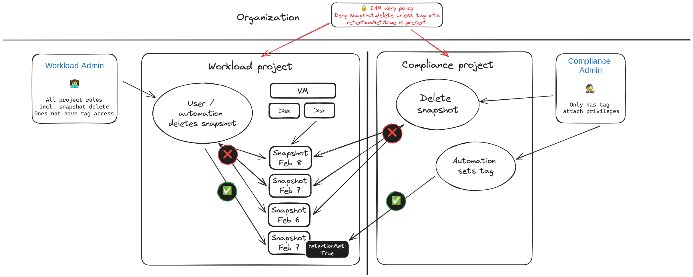

It could happen. Total mahem. An administrative pricipal for a project was accidentally leaked. An attacker has taken you projects hostage. You need to recover and fast. Restoring project access is the least of your worries your concern is to restore services. Luckily you have all workloads protected with snapshots! All deleted by the attacker! This is an exaggerated and hypothetical scenario but I have seen similar things happening. In this article I'm exploring an approach to protect against such a scenario.

# Solution design

To protect against scenarios as described above, prevent operator error and ensure that enteprises can meet their string data protection requirements can be met, additional security should be enabled for backups and snapshots in particular. Where traditionally backups would have been store off-site in a secure vault this this concept is not entirely transferrable to cloud environments. While many services offer multi-regional capabilities or storing data in a different location than the primary workload this helps with protecting against local disaster but is not a good defense against malicious actors intentionally damaging or deleting data.

In this article I will explore an approach which focuses on snapshots and protects them against deletion (and potentially other modifications too!). The following diagram describes the solution design at a high level:



The following chapters describe the individual components and how they fit together.

## IAM deny policies

One of the core building blocks for this solution are IAM deny policies and resource tags. By using IAM deny policies we can prevent the execution of API calls on resources irrespective of of the configured IAM permissions. Deny policies always superseed allow policies and prevent evaluation of any allow policies if a deny policy has been configured for the requested action (for more information see the [policy evaluation section in the IAM documentation](https://cloud.google.com/iam/docs/deny-overview#policy-eval)).

Deny policies can be scoped to principals (including and/or excluding users, groups or service accounts) and can have an optional condition. Conditions can be used to match against a certain resource type or a *resource tag*. We will make use of the latter to protect all snapshots within a project.

## Resource tags

Tags are key-value pairs attached to resources. These pairs can be defined on the project or organizational level and are passed to descendants of the resource (the [Tag inheritance section of the Resource Manager documentation](https://cloud.google.com/resource-manager/docs/tags/tags-overview#inheritance) has a nice visualization). They also have their own IAM permissions which allows fine grained control over tags and the principals that can use them.

While tag values are inherited, an assignment on a descendant will override the inherited value and be the effective value. The following picture illustrates this concept where on the left the inherited tag from the project is also the effective tag for the snapshot. Whereas for the right the snapshot has its own tag binding effectively overriding the project assignment.


## Protecting snapshots

The easiest way to protect snapshots would be to put a deny policy in place and limit the principals which can modify and delete these resources. The following simplyfied policy definition would deny the `snapshot.delete` permission for `christoph@example.com`:

```json
{
  "displayName": "Denies snapshot.delete with tag set",
  "rules": [
    {
      "denyRule": {
        "deniedPermissions": [
          "compute.googleapis.com/snapshots.delete"
        ],
        "deniedPrincipals": [
          "principalSet://goog/subject/christoph@example.com"
        ]
      }
    }
  ]
}
```

### Selectively allowing modifications 

But what if there are automated processes like snapshot schedules with auto-delete or Google Cloud Backup & DR acting on those snapshots? We could include the principals (e.g. service accounts) that these services operate under to the deny policy. This would not allow us to excert fine-grained access control and enforce strict seggragation of duties.

To workaround this, we will make use of tags and how tag inheritance works. We adapt our deny policy like this:

```json
{
  "displayName": "Denies snapshot.delete() with tag set",
  "rules": [
    {
      "denyRule": {
        "denialCondition": {
          "expression": "resource.matchTagId('tagKeys/123456789012345', 'tagValues/123456789012345')"
        },
        "deniedPermissions": [
          "compute.googleapis.com/snapshots.delete"
        ],
        "deniedPrincipals": [
          "principalSet://goog/public:all"
        ]
      }
    }
  ]
}
```

So instead of just denying a single user account, we deny all principals (`public:all`) the `snapshot.delete` permission except when a specific tag value has been set (tag keys and tag values are tightly coupled!). The deny policy is explicit as it matches the tag key and its value.

### Unlocking snapshots

Now that we have all our snapshots protected... But wait is that actually true as we haven't set any tags yet? Yes! Even though there is not a tag set anywhere in the resource hierarchy for our snapshots, our deny policy only permits deletion for any principal *when a specific tag is set*.

You may wonder how we can unlock snapshots so that they can cleaned up when their retention time has been reached. Obviously this could be done manually by removing the tag binding:

```bash
project_id="workload-project"
snapshot_id="1234567890"
tag_value_id="tagValues/123456789012345"

gcloud resource-manager tag bindings delete --parent //compute.googleapis.com/projects/$project_id/global/snapshots/$snapshot_id --tag-value $tag_value_id
```

But that doesn't work well for automated processes like snapshot schedules with removal enabled or if you use services like Google Cloud Backup and DR. For this scenario we want to enable automatic unlocking of snapshots for a given retention time.

### Automating unlock with Cloud Workflows

There are a multitude of ways to facilitate this process. I have opted to use Cloud Workflows that are triggered by Cloud Scheduler to implement this logic. Workflows provide a serverless no-code integration environemnt with connectors to the necessary APIs required for our purposes. The following flow diagram sketches out what the workflow does:


Let's dig a little deeper what these steps actually do:

* **Check creationTimestamp**: Due to a limitation of the Compute Engine API it is currently not possible to retrieve a filtered list based on the `creationTimestamp` field. The first steps is thus required to only process snapshots that are at or have exceeded the configured retention time.
* **Check whether the tag has been set already**: We need to account for the scenario where a snapshot was already in a previous execution of the workflow but was not removed by a 3rd party process yet. To prevent any errors we check whether the tag binding has been set on the snapshot.
* **Set tag**: In this step we simply create the tag binding on the snapshot.

I've added the full code for the workflow to my [GitHub repository](https://github.com/peterschen/blog/blob/master/gcp/samples/protect-snapshots/workflow.yaml).

## Seggregation of duties

We now have a way to lock snapshots aginst deletion. We also have automation in place that will lift that lock according to business rules. It needs to be ensured that VM admins, operators or users are not able to escalate their priviliges. For instance a user being able to create a workflow with their own logic removing the tag binding or an administrator being able to directly remove the tag binding.

In order to prevent these scenarios we operate with strict seggregation of duties. The automation project in which the workflows are kept and executed is separated from the workload project(s). A service account from the automation project is given permission to operate in the workload project. Additionally permissions to use the tag are scoped only to the same service account.

Specifically the following measures were considered:

* Tag is ideally created at the organizationl level for isolation
* No principal in the `workload` project has the `iam.denyAdmin` role to prevent editing or removing of the deny policy
* No principal in the `workload` project has the `resourcemanager.tagUser` role to prevent manual creation of tag bindings
* No principal with access to the `workload` project has access to the `automation` project to prevent editing of the workflow or creation of new workflows that would have access to the snaphots
* A service account for the workflow is created and narrowly scoped to access the tag in the `workload` project (`iam.tagUser`), manage storage in the `workload` project (`compute.storageAdmin`), and invoke workflows in the `automation` project (`workflows.invoker`)

## Summary / Terraform sample

The article shows how to protect snapshots from malicious tampering or accidental deletion. While only specifc permissions are denied this can be extended to other operations and other resources to fit organizational needs.

A fully working sample can be [found in my GitHub repository](https://github.com/peterschen/blog/tree/master/gcp/samples/protect-snapshots) which implements this solution including standing up projects and the creation of of all required resources like tags, disk, resource poliy (to schedule snapshot creation), service account and workflow.

## Caveats

While the IAM deny policy will deny all matching API calls, there is one scenario that is not covered: [Scheduled snapshots](https://cloud.google.com/compute/docs/disks/scheduled-snapshots). As this service is using another API path it won't be affected by the IAM deny policy described in this article. Scheduled snapshot policy execution only acts on snapshots that were created with the active configuration of the policy (that means no retroactive deletion of snapshots) and only snapshots that were created by the same policy configuration. While a caveat to the approach described in this article, it wont offer an attack surface for the scenario outline in the introduction.
