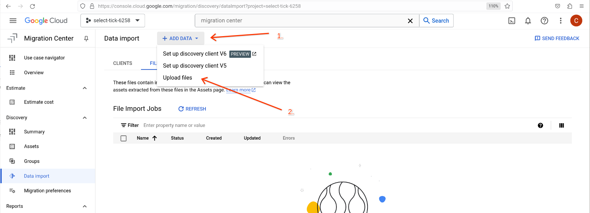
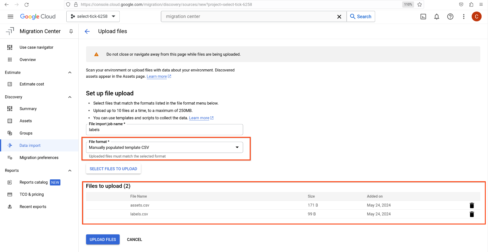
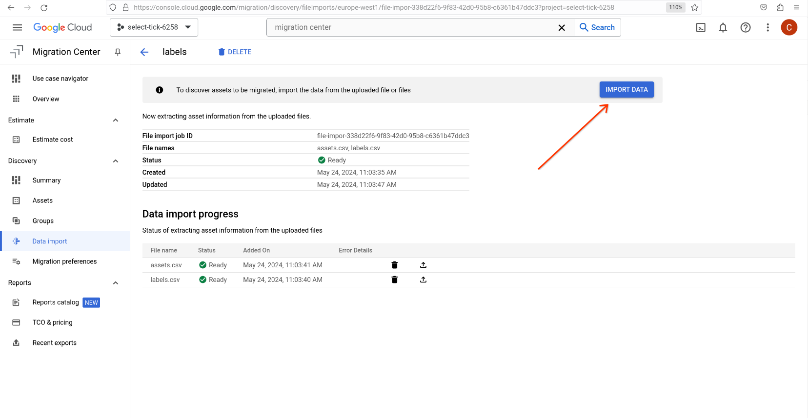
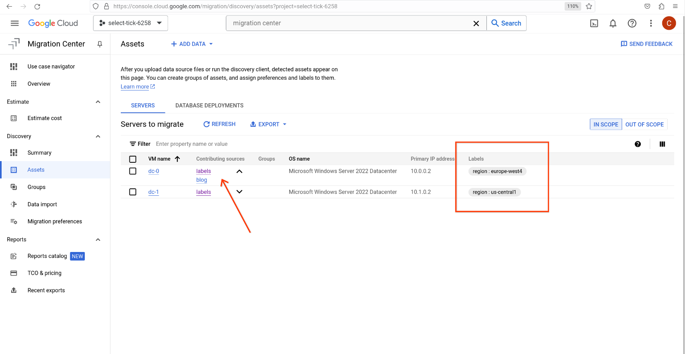

Google Cloud Migration Center is a great way to understand the total cost of ownership (TCO) for a migration to Google Cloud by running automatic assessments or uploading information about an estate using the output of tools such as [RVTools](https://www.robware.net/).

## The power of groups

IT environments can be quite complex and may have grown over the years. Line of businesses may have different requirements in terms of the compute platform or locality of their workloads. In order to accurately model these requirements, Migration Center uses Groups to logically group discovered assets.

Groups can be built by using common attributes associated will all assets such as its name, operating system family and others. Another way is to assign labels (key/value pairs using the [same semantics as resource labels](https://cloud.google.com/compute/docs/labeling-resources#requirements)) to assets and use these as another attribute for grouping.

## Adding labels (at scale)

Adding labels to assets through Google Cloud Console works well as long as the number of assets is manageable. But for environments with 100s if not 1000s of assets, this becomes untenable. 

Migration Center provides an API that *could* be leveraged to programmatically add labels to the assets in question. That programming logic must be implemented first though and more often than not you need to add labels in a time crunch quickly.

Luckily there is a neat way to add labels at scale by using the [data import functionality with manually populated files](https://cloud.google.com/migration-center/docs/import-data-tables).

### Create asset sheet

Start by populating an asset sheet (template can be [found in the documentation](https://cloud.google.com/migration-center/docs/import-data-tables#available_data_templates)). While the assets you want to add labels to are already imported, Migration Center requires a list of assets to be provided for the data import. Essentially, this file will just hold the identifiers of the machines, that we want to add labels for but no further metadata.

**Important:** When associating labels with existing assets that were imported with automatic discoveries or RVTools, the identifier needs to represent the original data source to allow Migration Center to correlate these resources:

* Discovery Client: Use the asset export feature to retrieve a list of all assets; use `VM UUID` as identifier
* RVTools: Use `VM UUID` found in `vInfo` as identifier

The following snippet creates the asset sheet and populates it with a few sample entries:

```shell
echo "MachineId,MachineName,TotalDiskAllocatedGiB,TotalDiskUsedGiB,AllocatedProcessorCoreCount,MemoryGiB,OsName,IsPhysical" > assets.csv
echo "6160266098198287760,,,,,,," >> assets.csv
echo "8064767013718693264,,,,,,," >> assets.csv
```

### Create labels sheet

The second step is to create a sheet that holds the key/value association for the assets. This file will hold the asset identifier the label name and its value. **Note:** the label key name and value must adhere to the [semantics for resource labels](https://cloud.google.com/compute/docs/labeling-resources#requirements)! 

Multiple labels can be added by adding multiple rows for the same asset. If an asset does not need to have a label assigned it can be omitted from this file.

The following snippet assigns a `region` label to the assets to show the concept:

```shell
echo "MachineId,Key,Value" >> labels.csv
echo "6160266098198287760,region,us-central1" >> labels.csv
echo "8064767013718693264,region,europe-west4" >> labels.csv
```

## Import data

Open Cloud Console and navigate to Migration Center. From the menu select [Data Import](https://console.cloud.google.com/migration/discovery/dataImport). Select **+ ADD DATA** and **Upload files**:



Provide a name for the import job, select **Manually populated template CSV** as file format and upload the two files crated in the previous steps:



Select **UPLOAD FILES** and once the upload and validation has completed continue by clicking **IMPORT DATA**:



Depending on the number of assets that were included in the files, processing can take a few moments to complete. Once that backend process has finished the previously discovered or added assets will now show labels and it is visible that two data sources contributed to the information known to Migration Center:



## Summary

Adding labels privides an easy and extensible way to add additional metadata to assets at scale. This helps to organize assets into logical groups and will make it easier to manage large environments with 100s or 1000s of assets.
